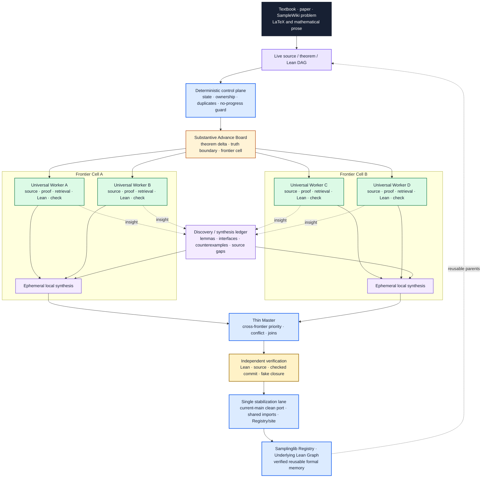

<div align="center">

# Auto-Sampling-Theory-In-Sleep

### A Substantive-Advance Automated Theorem Proving System for Sampling Theory

[](https://dakebu.github.io/Auto-Sampling-Theory-In-Sleep/)
[](https://lean-lang.org/)
[](https://mathlib.org/)
[](https://github.com/DakeBU/Auto-Sampling-Theory-In-Sleep/actions/workflows/blueprint-site.yml)

[**Samplinglib**](https://dakebu.github.io/Auto-Sampling-Theory-In-Sleep/)
· [**Lean Registry**](AutoSamplingTheory/TechnicalLemmas/Registry.lean)
· [**Harness**](docs/multi_agent_orchestration.md)

</div>

ASTIS represents sampling-theory proofs as source-backed, reusable Lean
dependency graphs. Its active work unit is a **Substantive Advance Unit (SAU)**:
one bounded mathematical DAG delta, owned end to end by a Universal Worker and
admitted to Samplinglib only after independent Lean/source verification and a
serialized stabilization pass.

Nearby advances are grouped into dynamic **frontier cells**. Any Worker may
temporarily synthesize one cell, while deterministic reducers compact structured
evidence before a thin global arbiter sees it. The arbiter handles only genuine
cross-frontier priority, conflict, route-reset, and stabilization decisions;
it does not replay every Worker transcript or re-prove every local theorem.

The first major program reconstructs Sinho Chewi's
[*Log-Concave Sampling*](https://chewisinho.github.io/main.pdf), while the
SampleWiki lane tracks frontier sampling results against the same reusable
formal graph.

**Samplinglib is the verified library; the larger purpose of ASTIS is to help us
see the mathematics of sampling theory as a structure.** The formal graph makes
shared proof mechanisms, hidden regularity assumptions, backbone lemmas, and
dependencies inspectable. For a new result, it gives a sharper question than
“is this theorem new?”: does it add a terminal leaf, build a bridge between
previously separate branches, shorten an important route, create a reusable
interface, or reorganize a substantial part of the proof graph? This is meant
to help beginners find the conceptual spine and help experts distinguish
marginal extensions from genuinely new mechanisms. As the graph matures, its
compression may also suggest cleaner natural-language proofs and more structural
or algebraic formulations.

Samplinglib source correspondence is pinned to the canonical **August 9,
2026** edition. The checked table of contents, book/PDF page offset, semantic
anchors, and edition checksum are validated before every site build.

---

## News 🔥

- **August 2026** — Reworked the ASTIS Harness around theorem-sized substantive
  advances, Universal Workers, Frontier Cells, a durable Discovery Ledger,
  independent verification, deterministic no-progress control, and one
  stabilization lane for shared library truth.
- **July 2026** — Released the first user-facing
  [**Samplinglib**](https://dakebu.github.io/Auto-Sampling-Theory-In-Sleep/),
  connecting the textbook route, rigorous analytic details, Lean declarations,
  and source-backed verification.
- **June 2026** — Completed the first end-to-end ASTIS formalization workflow
  for sampling theory.

---

## Core Contributions ◆

### 1. ASTIS Harness: Universal Workers on a Frontier Mesh

ASTIS does not score progress by how many agents wrote artifacts. It asks
whether the verified theorem graph changed in a mathematically useful way.

A deterministic control plane reads the live source/theorem/Lean DAG and
maintains a board of independent **Substantive Advance Units**. Each proposal
records the exact source anchor, theorem delta, target declarations, truth
boundary, DAG parents, frontier cell, owned files, and focused acceptance
checks. Semantic fingerprints suppress duplicate active work even when two
branches differ in naming or harmless formatting.

A Universal Worker owns one SAU end to end. Source audit, proof design,
Samplinglib/Mathlib retrieval, counterexample search, Lean implementation,
focused compiler diagnosis, refactoring, and exposition are temporary modes—not
permanent handoff layers. The Worker either closes a theorem edge, reusable
interface, or integration node, or returns a strict obstruction that retires a
route or provably shrinks the remaining boundary.

The lifecycle is explicit:

```text
PROPOSED
  -> CLAIMED
  -> EXPLORING
  -> PROVED_LOCAL
  -> VERIFIED
  -> STABILIZING
  -> MERGED
```

`BLOCKED` and `QUARANTINED` preserve exact non-success boundaries.
`PROVED_LOCAL` must name the result kind, theorem delta, Lean declarations,
files, focused checks, and remaining truth boundary. `VERIFIED` must be
published by an independent verifier with the checked commit, source audit, and
fake-closure scan.

#### Frontier Cells instead of an overloaded Master

Several SAUs that share DAG parents, source statements, interfaces, or a later
join form a dynamic **Frontier Cell**. Any Universal Worker may temporarily
publish a cell-level synthesis containing the graph delta, conflicts, retired
routes, reusable findings, and next independent SAUs. This is an ephemeral
action, not a fixed managerial role.

The Thin Master consumes compact cell evidence first and opens deeper evidence
only for a named cross-frontier conflict or stabilization decision. It handles
priority, ownership conflicts, cross-frontier joins, frozen-route resets, and
the verified integration queue; it does not reproduce local proofs.

#### No-progress and truth controls

A bounded Worker checkpoint records a route fingerprint, progress signature,
mathematical delta, exact residual, and context size. Repeated unchanged routes
are frozen for diagnosis rather than allowed to consume indefinite context.

A separate **Discovery Ledger** preserves useful lemmas, interfaces,
counterexamples, source gaps, refactors, conjectures, process improvements, and
frontier syntheses. Discoveries have validation/scheduling states and semantic
deduplication, so useful ideas survive Worker termination without silently
becoming formal truth.

Exactly one integration owner may occupy the **single stabilization lane**.
That owner clean-ports verified results to current `main` and updates shared
imports, root tests, Registry evidence, source correspondence, graph metadata,
and site status together.

The earlier Upper/Middle/Lower/Reviewer artifacts remain readable as historical
and compatibility memory. Their useful guarantees—source fidelity, explicit
evidence, typed failure memory, and independent review—remain. What is no longer
required is that every theorem traverse a fixed role ladder or that an agent stop
when a role-local responsibility ends.

#### Why not simply use AI to write proofs?

AI-generated proof prose can be a valuable research aid, but prose alone is not
a mechanically checked theorem. Hidden assumptions, type mismatches, invalid
boundary steps, or a subtly different statement can survive a fluent answer.
It also does not automatically become a named, verified interface that later AI
or human proofs can safely retrieve and reuse.

ASTIS adds three things: **Lean verification of exact declarations**, **reusable
checked formal memory**, and **placement in the existing dependency graph**.
That last layer matters for understanding new mathematics: a result can be
examined as a new leaf, bridge, shortcut, reusable node, or structural
reorganization of the graph, rather than only as another isolated proof text.

### 2. Samplinglib: Verified Memory for Sampling Theory

**Samplinglib** is the public Lean library, learning environment, and
verification surface maintained by ASTIS. It begins with a formal
reconstruction of *Log-Concave Sampling*, but organizes measure theory,
probability, functional inequalities, stochastic processes, SDEs, optimal
transport, Langevin dynamics, and sampler interfaces for reuse beyond one
textbook.

The intended object is a graph rather than a pile of isolated formal files:
textbook results, SampleWiki frontier theorems, and reusable technical lemmas
share explicit Lean parents and consumers. The public **Underlying Lean Graph**
lets readers inspect those dependencies and provides the substrate for later
graph compression and mathematical purification.

---

## System Architecture ◇



The conversion window remains bidirectional:

```text
natural mathematics  ⇄  typed theorem state  ⇄  verified Lean
```

Compiled declarations, exact residual obligations, strict counterexamples, and
validated cell syntheses flow back into the theorem DAG and future Worker
packets. Lean compilation never substitutes for semantic or source review.

---

## What ASTIS Measures

Harness efficiency is evaluated against formal progress, not activity:

```text
theorem-DAG deltas / million tokens

theorem-DAG deltas / active-agent hour

Thin-Master context / total Worker context

validated discoveries reused / validated discoveries published

stabilization wait / total wall time
```

ASTIS does not assume speedups reported by another harness automatically transfer
to sampling-theory formalization. The architecture is judged by these metrics
together with source fidelity and independent verification.

---

## Samplinglib Learning Surface 📚

<p align="center">
  
</p>

Readers can move through the library at three linked depths:

1. **Calculation Route** — original statements, formulas, intuition, and the
   source proof route.
2. **Rigorous Details** — measurability, integrability, representatives,
   approximation, limits, boundaries, regularity, and operator domains.
3. **Lean Foundations** — exact declarations, imports, dependencies, source
   lines, Registry evidence, tests, and the current Lean gate.

The [Live Formalization workspace](https://dakebu.github.io/Auto-Sampling-Theory-In-Sleep/live/)
adds reviewed examples, LaTeX rendering, Samplinglib/Mathlib retrieval, local
Lean diagnostics, and export into the substantive-advance workflow. Candidate
translation, compilation, semantic review, proof, independent verification, and
public admission remain separate states.

---

## Organizers ✦

**Dake Bu, Ji Cheng, Atsushi Nitanda, Hau-San Wong, and Qingfu Zhang**

Contributions are welcome through the [four-stage contributor
guide](https://dakebu.github.io/Auto-Sampling-Theory-In-Sleep/contribute/) and
the repository's [submission checklist](CONTRIBUTING.md). Focused corrections
can go directly to a pull request; new theorem routes or module boundaries
should be coordinated against the live proof graph first.

## Related Systems ⟡

| System | What informs ASTIS | ASTIS boundary |
|---|---|---|
| [FrontierAgent](https://github.com/ApodexAI/FrontierAgent) | Bounded task boards, parallel generalist sub-agents, structured report collection, checkpoint/resume, fanout guards, and coordinator no-progress detection. | ASTIS schedules source-backed theorem-DAG advances; local synthesis is ephemeral, and Lean evidence, truth boundaries, discovery provenance, independent verification, and the single stabilization lane are authoritative. |
| [Learning Beyond Gradients](https://github.com/Trinkle23897/learning-beyond-gradients) | Durable trial memory, rejected-route records, and role-separated exploration informed the earlier harness. | ASTIS retains durable memory while removing mandatory role boundaries and measuring theorem-level output. |
| [EoH](https://github.com/FeiLiu36/EoH) | Population initialization, variation, selection, and archive pressure for competing solution routes. | Population search is allowed only for fixed Lean-checkable targets in exploratory modes; source theorems and assumptions cannot mutate to make a proof easier. |
| [ARIS](https://github.com/wanshuiyin/Auto-claude-code-research-in-sleep) | Long-running research loops, plain-file recovery, and separate reviewer passes. | ASTIS specializes the loop for formal theorem state, exact source anchors, analytic obligations, and reusable Samplinglib memory. |
| [LeanMarathon](https://github.com/YuanheZ/LeanMarathon) | Blueprint-driven target selection, proof-DAG leaves, bounded workers, and deterministic gates. | ASTIS keeps a local source-backed harness and makes theorem-graph memory, strict obstructions, and reader-facing source correspondence first-class outputs. |
| [StatsMLlib](https://github.com/Lean-MoDS/StatsMLlib) | Subject-owned Lean modules, reuse-first development, complete proofs, source attribution, and staged contribution. | Samplinglib adds textbook-route correspondence, SampleWiki frontier ingestion, substantive-advance scheduling, and graph-level evidence surfaces. |

The complete design and mathematical provenance ledger is maintained in
[Attribution and Design Lineage](docs/attribution.md).

## Citation 📝

```bibtex
@misc{bu2026astis,
  title        = {Auto-Sampling-Theory-In-Sleep: A Substantive-Advance
                  Automated Theorem Proving System for Sampling Theory},
  author       = {Dake Bu and Ji Cheng and Atsushi Nitanda and
                  Hau-San Wong and Qingfu Zhang},
  year         = {2026},
  howpublished = {GitHub repository and Samplinglib formalization website},
  url          = {https://github.com/DakeBU/Auto-Sampling-Theory-In-Sleep}
}
```

ASTIS is the research system and proving Harness. Samplinglib is its public Lean
library and learning interface. External libraries, textbooks, papers, and
repositories are cited as mathematical or design provenance and do not imply
endorsement.
