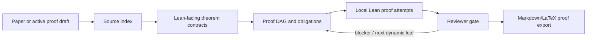
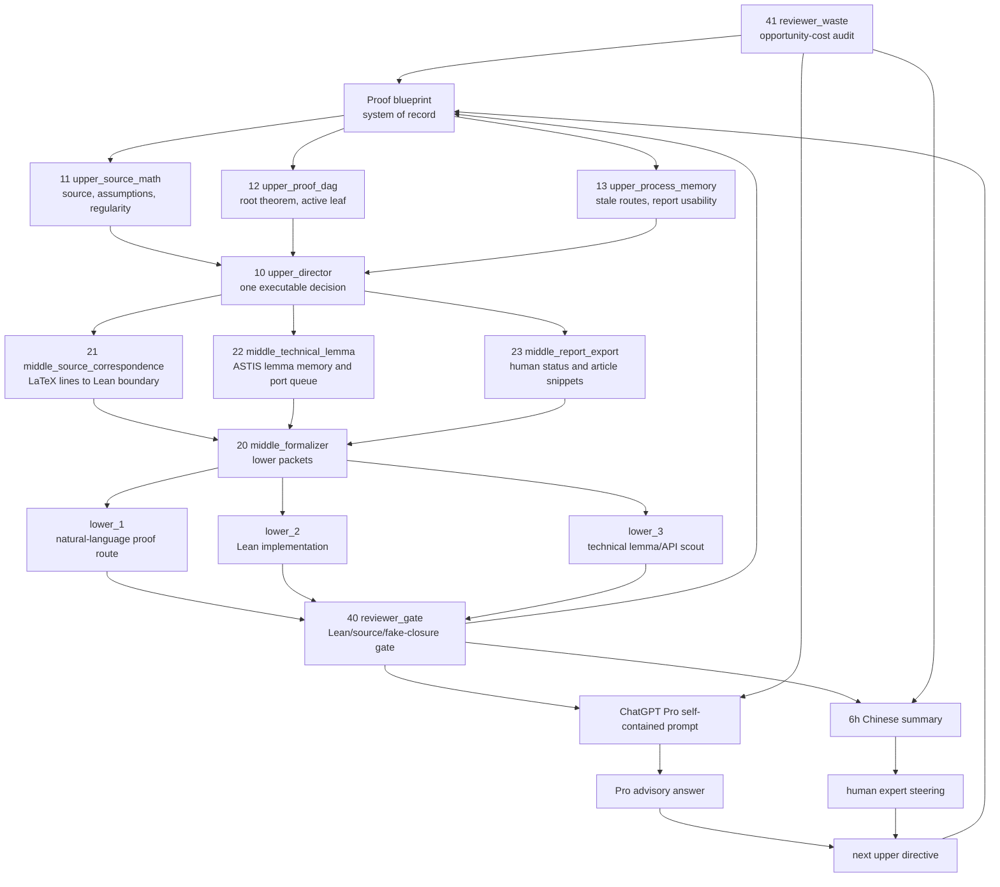
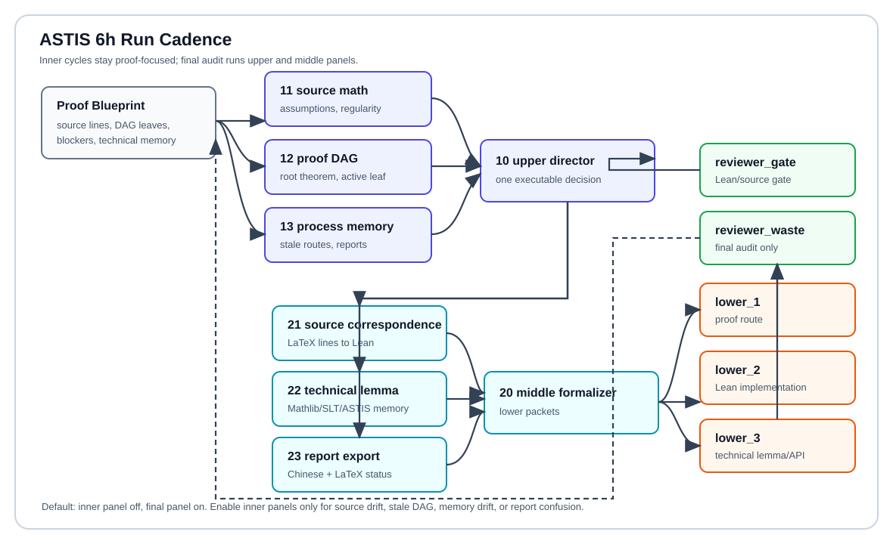

# Auto-Sampling-Theory-In-Sleep

**ASTIS** is a Lean-first automation project for SDE, sampling, diffusion, and
guided-generation theory.  Its purpose is not to be a wrapper around another
automation repository.  The core problem is domain-specific:

```text
Can we turn long, analysis-heavy SDE/Sampling proofs into Lean-facing theorem
contracts, proof DAGs, cited-result ledgers, and eventually checked Lean code?
```

ASTIS is designed for two research situations:

- reproducing an existing paper faithfully, without changing the theorem or
  proof target;
- validating an evolving proof draft while the research is still being
  developed.

The current case-study corpus includes the SALD/VA-SALD theory in
[Slowly Annealed Langevin Dynamics: Theory and Applications to
Training-Free Guided Generation](https://arxiv.org/abs/2605.07950)
([PDF](https://arxiv.org/pdf/2605.07950)), but the public ASTIS objective is
larger: build a reusable SDE/Sampling Lean technical-lemma arsenal that can
support many papers.  The exploratory corpus includes the RMFLD proof program,
used to test ASTIS on live sampling-theory arguments whose final theorem
boundaries are still evolving.

Every analytic fact must be one of:

- a compiled Lean declaration;
- a named `ProofObligation`;
- a cited-result ledger entry with an explicit formalization status.

ASTIS does not close mathematical content with `axiom`, `sorry`, `admit`,
`Prop := True`, or `:= trivial`.

## Why SDE/Sampling Needs Its Own System

SDE and sampling proofs have a different shape from finite algebraic
formalization tasks.  They depend on laws of stochastic processes,
time-indexed measures, Fokker--Planck equations, KL/FI/LSI/PI inequalities,
Euler--Maruyama interpolation, conditional laws, and approximation error
decompositions.  A useful automation system must therefore track:

- source-paper labels, equations, assumptions, and proof paragraphs;
- Lean-facing versions of measures, kernels, densities, drifts, scores,
  transport velocities, and stochastic updates;
- cited analysis results that are too large to prove immediately;
- exact theorem boundaries when a proof step is not yet formalized;
- human-readable Markdown/LaTeX exports for collaborators.

ASTIS treats these as first-class project artifacts rather than incidental
chat history.

## System Flow



The current acceptance gate is:

```bash
lake exe cache get
lake build
lake build Tests
python3 tools/astis.py check
```

## Lean Arsenal Map

The public Lean module graph is generated from the current ASTIS source tree,
not from a hand-drawn concept sketch:


Regenerate it with:

```bash
python3 tools/astis.py module-graph-refresh
```

The corresponding ledger is
[`research-wiki/sampling-sde-library/lean-leaf-module-graph.md`](research-wiki/sampling-sde-library/lean-leaf-module-graph.md).
It shows only the canonical Mathlib-ready technical lemma surface: compiled
ASTIS-owned reusable leaves and their parent import surfaces.  The following
are deliberately documented outside the main graph so the arsenal stays easy
to scan:

- compatibility source files such as `TechnicalLemmas/Gaussian.lean` and
  `TechnicalLemmas/Taylor.lean`;
- paper-extracted quarantine files such as `TechnicalLemmas/SALDExtracted.lean`;
- paper or exploratory consumers such as `SALD.lean` and `RMFLD.lean`;
- external references such as Mathlib, `lean-stat-learning-theory`,
  `lean-rademacher`, and the Chewisinho stochastic-process notes.

## Two Modes

| Mode | Use case | Rule |
|---|---|---|
| `faithfulPaper` | Reproduce an existing paper, such as the original VA-SALD paper. | Do not change theorem statements, assumptions, constants, schedules, proof targets, or source attribution. |
| `exploratoryProof` | Validate a proof draft under development, such as RMFLD. | Candidate routes may compete only after the acceptance predicate and assumptions are explicit. |

In `faithfulPaper` mode, failed proof attempts are useful memory, but they must
not mutate the paper.  In `exploratoryProof` mode, ASTIS can maintain
candidate proof-route populations under `candidate-populations/`, but Lean plus
source correspondence remains the acceptance criterion.

## Sibling System Comparison

| System | Mathematical domain | Domain-specific proof object | Paper mode | New-problem mode |
| --- | --- | --- | --- | --- |
| [ABEIS/QBE](https://github.com/DakeBU/Quantum-Computing-Block-Encoding) | Quantum block encoding | matrices, circuits, oracles, block-encoding invariants | Reproduce block-encoding papers and preserve paper-level operators. | Search for new block encodings and verified oracle constructions. |
| [ASTIS](https://github.com/DakeBU/Auto-Sampling-Theory-In-Sleep) | Sampling theory and stochastic analysis | SDEs, distributions, KL/FI/LSI/PI chains, convergence bounds | Reproduce sampling papers with Lean statements and source-aligned proof maps. | Prove new sampling or diffusion claims from the accumulated library. |
| [AGTIS](https://github.com/DakeBU/Auto-Colored-Graph-Theory-In-Sleep) | Colored graph theory | labels/SRLGs, labelled cuts, dual walks, winding, algorithmic obstruction certificates | Reproduce WDV2023 first, then label-cut and multigraph papers. | Prove new labelled-cut, SRLG, coloring, or labelled-matching statements with Lean verification. |

The shared rule is: the repository must contain both the Lean code and the
human-readable mathematical proof translation.  Lean verifies correctness;
the natural-language proof keeps the result inspectable by humans.

## Agent Panels And Blueprint Loop

ASTIS keeps the upper/middle/lower/reviewer hierarchy, but the recent SALD
logs showed that one upper agent and one middle agent were too easy to turn
into passive handoff copyists.  The current harness therefore uses bounded
panels when needed.





The proof blueprint is the compact state that prevents long runs from
replaying broad history:

```bash
python3 tools/astis.py blueprint-refresh ASTIS-SALD-001
```

For the current SALD target, the generated blueprint files are:

```text
research-wiki/blueprints/ASTIS-SALD-001.md
research-wiki/blueprints/ASTIS-SALD-001-blueprint-status.md
research-wiki/blueprints/ASTIS-SALD-001-blueprint-status.json
```

A lower agent should work on one dynamic leaf or one named illness area, not on
a broad theorem-route replay.  Reviewer acceptance requires the gate above and
an explicit source-correspondence account.

The default 6h cadence is intentionally asymmetric:

- inner proof-search cycles stay cheap: `upper_director -> middle_formalizer -> lower_1/lower_2/lower_3 -> reviewer_gate`;
- final audit runs the upper and middle panels: source-math, proof-DAG,
  process-memory, source-correspondence, technical-lemma retrieval, and
  report/export synchronization;
- `reviewer_waste` runs at final audit by default and only runs inside inner
  cycles when explicitly enabled.
- lower agents run as independent Codex processes in parallel by default
  during `launch-sald-6h`; active-agent accounting sums each lower process,
  so three 20-minute lower calls count as roughly one hour of agent usage.

This is domain-specific.  For Sampling/SDE, many failures are not caused by
the SALD theorem itself but by background facts about laws, conditional
representatives, measurability, integrability, Ito/Taylor expansion,
Fokker--Planck weak forms, and boundary terms.  `middle_technical_lemma` and
`lower_3` exist to stop the system from repeatedly asking the Lean worker to
rediscover those facts from scratch.

Human and external-review entry points after a long run:

- Chinese status: `paper-notes/SALD/markdown/cycle-summaries/latest.md`.
- ChatGPT Pro prompt: `runs/pro-prompts/ASTIS-SALD-001-latest.md`.
- Policy: [`docs/pro_prompt_policy.md`](docs/pro_prompt_policy.md).
- Blueprint/workflow formalization notes:
  [`docs/agent_blueprint_formalization.md`](docs/agent_blueprint_formalization.md).

The Pro prompt is self-contained because ChatGPT Pro cannot read local files.
It includes public paper links when available, open paper-contribution
obligations, open technical lemmas, typed verifier feedback, and the exact
answer shape needed for the next Lean run.
The human expert entry point is separate.  After reading the Chinese status
and any Pro answer, the user can accept, reject, or redirect the next
source-aligned proof leaf.  The next upper-director cycle must translate both
inputs into an explicit theorem target, source anchor, or technical-lemma
obligation before any lower agent acts on it.

## Lean And Mathlib

ASTIS currently uses:

```text
leanprover/lean4:v4.29.1
mathlib4 tag v4.29.1
```

### Mathlib-Ready Leaf Lemmas

ASTIS now treats reusable Sampling/SDE background facts as future
Mathlib-ready leaf lemmas.  This does not mean every SALD-specific theorem is
meant for Mathlib.  It means the generic facts underneath the paper proof
should be stated at a reusable granularity: law-map integral rewrites,
conditional-kernel pairings, dominated derivative transfer, weak
Fokker--Planck bridges, KL/FI algebra, Gaussian moments, Ito/Taylor
remainders, and integration-by-parts identities.

The rule for lower agents is deliberately strict:

- one packet targets one small theorem;
- the packet must include local Mathlib/ASTIS APIs, hidden regularity
  contracts, and an intended proof route;
- repeated failure is treated as a mathematical signal, not an invitation to
  keep changing the script;
- paper-specific contribution memory and reusable technical lemma memory stay
  separate.

Generated entry points:

```bash
python3 tools/astis.py lemma-dag-refresh
```

Key artifacts:

```text
docs/mathlib_ready_leaf_protocol.md
research-wiki/lemma-dags/SDE_Sampling_skill_tree.md
research-wiki/lemma-dags/SALD_weak_fp_leaf_dag.md
research-wiki/lemma-dags/Pro_assimilated_leaf_targets.md
research-wiki/technical-lemmas/mathlib_ready_leaf_template.md
research-wiki/technical-lemmas/hidden_regularities.md
```

The practical meaning is simple: if a paper says "by a standard
Fokker--Planck argument", ASTIS does not let the agent use that phrase as a
proof.  The system must either find the existing Mathlib/local theorem, prove
the smallest missing reusable lemma locally, or record a precise proof
obligation with the hidden regularity assumptions exposed.

The root library is:

```text
AutoSamplingTheory
```

Core Lean modules:

- `AutoSamplingTheory/Core.lean`: source anchors, proof obligations, theorem
  contracts, proof DAG blocks, and forbidden-pattern policy.
- `AutoSamplingTheory/Probability.lean`: KL/FI/LSI/PI interfaces,
  conditional-distribution and measure/integral proof infrastructure.
- `AutoSamplingTheory/SDE.lean`: Ito diffusion, Fokker--Planck, and
  Euler--Maruyama statement layer.
- `AutoSamplingTheory/TechnicalLemmas.lean`: parent import surface for
  reusable, ASTIS-owned technical lemmas intended for Mathlib-style cleanup.
- `AutoSamplingTheory/TechnicalLemmas/Probability.lean`: parent import
  surface for law-map and conditional-kernel technical lemmas.
- `AutoSamplingTheory/TechnicalLemmas/Probability/LawMap.lean` and
  `ConditionalKernel.lean`: focused Mathlib-style search surfaces for
  pushforward-law and conditional-distribution leaves.
- `AutoSamplingTheory/TechnicalLemmas/ProbabilityDistributions/Gaussian.lean`:
  preferred Mathlib-style surface for Gaussian coordinate-law, moment,
  integrability, and variance-normalization leaves.
- `AutoSamplingTheory/TechnicalLemmas/Analysis/Calculus/Taylor.lean`:
  preferred Mathlib-style surface for Hessian, Taylor/Ito local-error, and
  quadratic-normalization leaves.
- `AutoSamplingTheory/TechnicalLemmas/InformationTheory/DonskerVaradhan.lean`:
  focused surface for DV/KL energy leaves.
- `AutoSamplingTheory/TechnicalLemmas/FunctionalInequalities/LogSobolev.lean`:
  focused surface for LSI-to-KL/FI bookkeeping leaves.
- `AutoSamplingTheory/TechnicalLemmas/Gaussian.lean` and
  `Taylor.lean`: compatibility source files kept stable for older imports;
  new proof packets should use the family-specific modules above.
- `AutoSamplingTheory/SALD.lean`: VA-SALD faithful-paper proof skeleton,
  theorem dependency registry, and compiled local proof blocks.
- `AutoSamplingTheory/RMFLD.lean`: exploratory RMFLD proof targets.
- `AutoSamplingTheory/Automation.lean`: compiled task, role, artifact, and
  gate contracts.
- `AutoSamplingTheory/Literature.lean`: source and external-reference
  registry.

## Repository Layout

```text
AutoSamplingTheory/                 Lean source of truth
Tests/                              Lean smoke tests
tools/astis.py                      local automation CLI
tasks/                              task contracts
conversion-windows/                 synchronized source/Lean/proof maps
proof-obligations/                  explicit unproved analytic gaps
proof-attempts/                     failed and successful fixed-target routes
candidate-populations/              exploratory proof-route populations
research-wiki/source-index/         generated source labels
research-wiki/cited-results/        external theorem and port-status ledgers
research-wiki/blueprints/           proof blueprints and compact status JSON
research-wiki/sampling-sde-library/ module/leaf atlas and cards for the Lean arsenal
research-wiki/external-lean-libraries reference cards for Mathlib and external Lean/text sources
runs/                               prompt decks, logs, context packs, trials
reviews/                            reviewer artifacts
paper-notes/AutoLeanInSleepSampling LaTeX/Markdown project article export
docs/                               design notes, attribution, efficiency rules
```

Shared external references are intentionally kept outside ASTIS:

```text
../outer_repos/automation_systems/
  Auto-claude-code-research-in-sleep
  EoH
  LeanMarathon
  learning-beyond-gradients
  mathcode

../outer_repos/sampling_theory_sde/
  lean-stat-learning-theory

../outer_papers/automation_systems/
  LeanMarathon-2606.05400.pdf

../outer_papers/sampling_theory_sde/
  Statistical Learning Theory in Lean 4 Empirical Processes from Scratch
  Uniform-in-Time Weak Propagation-of-Chaos in Shallow Neural Networks
  ...
```

Public project documents should cite upstream GitHub repositories, arXiv URLs,
source labels, or bundled paper notes.  They should not rely on a
machine-specific absolute path.

## Quick Start

```bash
git clone https://github.com/DakeBU/Auto-Sampling-Theory-In-Sleep.git
cd Auto-Sampling-Theory-In-Sleep

python3 tools/astis.py init
python3 tools/astis.py list-literature
python3 tools/astis.py list-tasks
python3 tools/astis.py check
```

Refresh the current SALD proof blueprint:

```bash
python3 tools/astis.py blueprint-refresh ASTIS-SALD-001
```

Refresh the public SDE/Sampling Lean arsenal graph:

```bash
python3 tools/astis.py module-graph-refresh
```

Write a compact context pack for the next cycle:

```bash
python3 tools/astis.py write-context-pack ASTIS-SALD-001 --cycle <next-cycle>
```

Run a short dry cycle:

```bash
python3 tools/astis.py run-cycle ASTIS-SALD-001 --cycle 1 --lower-count 1
```

Run a graceful long batch:

```bash
python3 tools/astis.py launch-sald-6h
```

By default, `launch-sald-6h` lets the final completed cycle finish and then
runs the batch-end writing pass.  This updates both the internal proof-note
article under `paper-notes/AutoLeanInSleepSampling/` and, when configured, the
external ASTIS technical-report checkout selected by `ASTIS_TECH_REPORT_ROOT`.
Use `--no-after-latex` only for a proof-only run.

To regenerate the latest Pro prompt manually:

```bash
python3 tools/astis.py cycle-pro-prompt ASTIS-SALD-001 --run-id latest
```

ABEIS-style panel controls are available through flags or environment
variables:

```bash
ASTIS_HOURS=6 \
ASTIS_LOWER_COUNT=3 \
ASTIS_PARALLEL_LOWER=1 \
ASTIS_UPPER_PANEL_FINAL=1 \
ASTIS_UPPER_PANEL_INNER=0 \
ASTIS_MIDDLE_PANEL_FINAL=1 \
ASTIS_MIDDLE_PANEL_INNER=0 \
ASTIS_REVIEWER_WASTE_FINAL=1 \
bash tools/astis_run_sald_closure.sh
```

Use inner panels only when the run is repeatedly losing source correspondence,
proof-DAG focus, technical-lemma memory, or human-report clarity.  Routine
inner cycles should spend the budget on proof work.

Export the human-readable project article and technical-report snippets
manually:

```bash
python3 tools/astis.py export-latex
python3 tools/astis.py export-technical-report
```

## First Targets

### `ASTIS-SALD-001`

Faithfully reproduce the SALD and VA-SALD proof corpus from
[arXiv:2605.07950](https://arxiv.org/abs/2605.07950), without changing the
paper's theorem statements, proof targets, or source attribution.

Initial proof DAG:

- `lem:gronwall`
- `lem:dv_variation`
- LSI/KL/FI definitions
- `thm:forward-KL`
- `thm:forward-KL-discrete`
- `prop:guided_path_residual`
- `thm:general-moving-target-SALD`
- `thm:unified-forward-KL`
- `thm:general-moving-target-SALD-discrete`

Current long-run checkpoint: after cycle 173, the active blocker has been
narrowed from the broad EM conditional-law/Fokker--Planck backend to the
source-facing selected weak-test Hessian fields `hSourceHasHessian` and
`hSourceHessianBound`, which support the compiled bridge
`SALD.selectedWeakTestHessianOpNormOfSourceHessianField`.  The useful packet
classifications are:

- `discharges-supplied-hypothesis`
- `narrows-source-cited-boundary`
- `rejected-wrapper-churn`

### `ASTIS-RMFLD-001`

Index and validate RMFLD exploratory proof routes.  This mode may use
candidate proof populations, but only after the target predicate and
assumptions are explicit.

## Counter-Design Relative To Related Work

ASTIS is not a generic reuse wrapper around prior automation systems.  Its
counter-design starts from the bottlenecks of SDE/Sampling formalization:
hidden regularity, conditional laws, weak generator identities, KL/FI/LSI
chains, and discretization error.  Related projects supply pressure tests and
design contrasts; ASTIS keeps only the mechanisms that serve this domain.

| Reference | Counter-design absorbed by ASTIS | ASTIS-specific boundary |
|---|---|---|
| [ARIS / Auto-claude-code-research-in-sleep](https://github.com/wanshuiyin/Auto-claude-code-research-in-sleep) | Durable plain-file long-window loops are valuable only when the artifacts remain inspectable. | ASTIS makes Lean proof state, source correspondence, and proof obligations the inspected artifacts. |
| [Learning Beyond Gradients](https://github.com/Trinkle23897/learning-beyond-gradients) | Iterative feedback should improve the system itself, not only one proof attempt. | ASTIS splits feedback into upper/middle/lower/reviewer agents and memory gates for theorem proving. |
| [EoH](https://github.com/FeiLiu36/EoH) | Candidate populations are useful for exploration. | Faithful proof reproduction cannot mutate theorem statements; populations are confined to `exploratoryProof`. |
| [LeanMarathon](https://github.com/YuanheZ/LeanMarathon) and [arXiv:2606.05400](https://arxiv.org/abs/2606.05400) | Blueprint/DAG control prevents long Lean work from drifting. | ASTIS adapts the blueprint to measure theory, stochastic processes, and SDE technical lemmas. |
| [MathCode](https://github.com/math-ai-org/mathcode) | Theorem-reuse memory and diagnostics reduce redundant Lean work. | Diagnostics are advisory; `python3 tools/astis.py check` remains the acceptance gate. |
| [LeanSearch v2](https://github.com/frenzymath/LeanSearch-v2) and [REAL-Prover](https://github.com/frenzymath/REAL-Prover) | Global premise retrieval and retrieval-augmented Lean proving are essential when probability lemmas are scattered across Mathlib. | ASTIS uses retrieval as a lemma-candidate source; a retrieved theorem must still match the exact measure/SDE hypotheses. |
| [Matlas](https://arxiv.org/abs/2604.17484) | Literature-scale semantic theorem retrieval can locate classical analytic facts and source variants. | Matlas results become cited obligations or source leads, not local theorem closure. |
| [Chain-of-States](https://arxiv.org/abs/2512.10317) and [Herald](https://arxiv.org/abs/2410.10878) | Intermediate proof states and NL annotations improve informal-to-Lean translation. | Middle agents should expose the analytic state chain before lower agents attack KL/FI/LSI or Fokker--Planck leaves. |
| [Iteris](https://arxiv.org/abs/2606.02484) | Computational-math research loops need distinct experiment, proof, and route-review modes. | ASTIS keeps numerical intuition separate from Lean proof obligations and source-cited analytic contracts. |
| [AlphaProof Nexus](https://arxiv.org/abs/2605.22763) and [results](https://github.com/google-deepmind/alphaproof-nexus-results) | Parallel Lean agents and evolutionary coordination can reduce hard-proof search cost. | ASTIS borrows the cost-awareness, not AlphaProof's competition/open-problem target distribution. |
| [Goedel-Architect](https://arxiv.org/abs/2606.06468) | Solved-node preservation and failed-node diagnosis are stronger than transcript replay. | ASTIS applies this to source leaves, technical lemmas, Mathlib portability gaps, and stale proof routes. |
| [Lean4Agent](https://arxiv.org/abs/2606.06523) | Agent workflows can themselves become formal objects. | ASTIS records orchestration contracts without replacing theorem closure by process closure. |
| [Exponential separation for hierarchical agentic theorem provers](https://arxiv.org/abs/2602.10512) | Reusable cuts are more efficient than flat proof traces. | ASTIS turns KL/FI identities, weak Fokker--Planck bridges, measurability facts, and EM local-error lemmas into named memory nodes. |
| [Statistical provability theory](https://arxiv.org/abs/2602.10538) | Finite-budget success probability matters. | ASTIS scores cycles by whether they retire blockers or shorten future proof work. |
| [Conjecturing-Proving Loop](https://arxiv.org/abs/2509.14274) and [LeanConjecturer](https://arxiv.org/abs/2506.22005) | Statement generation must be separated from proof search. | Generated statements become candidate analytic lemmas only after syntax, assumption, and non-triviality filters. |
| [lean-rademacher](https://github.com/auto-res/lean-rademacher) and [arXiv:2503.19605](https://arxiv.org/abs/2503.19605) | Large probability formalizations should stage concentration and separability as separate blocks. | ASTIS stores this as external Lean reference memory before porting any theorem. |
| [lean-stat-learning-theory](https://github.com/YuanheZ/lean-stat-learning-theory) and [arXiv:2602.02285](https://arxiv.org/abs/2602.02285) | Mathlib-oriented SLT formalization gives nearby probability/concentration patterns. | Toolchain mismatch forces ASTIS to audit and port into ASTIS-owned declarations. |
| [ABEIS/QBE](https://github.com/DakeBU/Quantum-Computing-Block-Encoding) | A mature auto-proof system should expose a public module/leaf atlas. | ASTIS replaces quantum matrices/oracles with laws, kernels, drifts, densities, KL/FI/LSI/PI, Fokker--Planck, and Euler--Maruyama objects. |

The LeanMarathon-style blueprint layer does not replace the LBG-style
upper/middle/lower/reviewer hierarchy or the EoH-style exploratory population
layer.  It makes those loops more reliable by forcing each long run to start
from the current proof blueprint and by retiring stale dynamic leaves.
The Sonoda--Akiyama--Uezato cut/DAG lesson adds a sharper reviewer rule:
do not eliminate reusable analytic cuts.  If a weak-Fokker--Planck identity,
conditional-law lemma, Hessian bound, or concentration inequality appears in
several places, promote it to a named DAG node and context-pack example rather
than asking lower agents to rediscover it in each theorem.

ASTIS absorbs external automation ideas only when they address an SDE/Sampling
failure mode.  SALD runs showed that agents can waste time by rewriting theorem
wrappers while the real blocker is a background analytic bridge such as a
conditional-law identity, weak Fokker--Planck statement, measurability lemma,
or discretization error bound.  ASTIS therefore keeps the following boundary:

| Observed ASTIS failure | Absorbed mechanism | Not absorbed |
| --- | --- | --- |
| Long proofs repeatedly need the same KL/FI, LSI, weak-FP, or Gronwall subargument. | Hierarchical proof-DAG cuts and LeanMarathon-style active leaves. | Flattening the whole analytic proof into one giant theorem attempt. |
| Large Mathlib/probability dependencies are hard to locate. | MathCode/AI4SLT/lean-rademacher-style theorem-reuse memory and technical-lemma staging. | Treating an external theorem as locally proved before it builds in ASTIS. |
| Faithful paper reproduction and new-theorem exploration have different failure semantics. | LBG-style mode discipline plus EoH/CPL-style populations only in exploratory mode. | Mutating SALD source theorems, constants, or assumptions during faithful reproduction. |
| Six-hour runs generate too much prose without retiring blockers. | Statistical-provability metrics: finite-budget closure chance, verifier calls, repeated-state failures, and future proof length. | Counting narrative volume as progress. |

The ASTIS-specific workflow is:

```text
paper theorem or new sampling claim
-> analytic object map: laws / kernels / drifts / densities / KL-FI-LSI
-> source-aligned proof DAG with reusable analytic cuts
-> technical-lemma retrieval or explicit cited obligation
-> one lower Lean leaf
-> Lean gate
-> human summary, Pro prompt, and report appendix update
```

## For SDE/Sampling Authors

Use ASTIS when your paper or draft contains proof steps such as:

- "by the Fokker--Planck equation";
- "by standard KL derivative arguments";
- "using LSI and the Donsker--Varadhan variational formula";
- "the Euler--Maruyama interpolation satisfies";
- "the conditional law has drift";
- "the predicted-clean guide changes the target by a controlled residual";
- "the SMC approximation adds a particle error term".

ASTIS turns these into Lean-facing theorem contracts and explicit obligations.
It does not hide the missing analysis.  If the background theorem is too large
to prove immediately, ASTIS records the exact source-cited boundary and the
local statement that future Lean work must discharge.

## Paper Notes

The current project article export lives under:

```text
paper-notes/AutoLeanInSleepSampling/latex/main.tex
```

The SALD reproduction is treated as a case study appendix inside the larger
ASTIS article.  The exported paper notes are for collaborator inspection; the
Lean files and proof-obligation ledgers remain the source of truth.

The public-facing technical report source is maintained as a separate paper
checkout.  Set `ASTIS_TECH_REPORT_ROOT` when the report lives outside this
repository.

Each 6h batch updates generated report snippets:

```text
sections/generated_run_status.tex
sections/generated_middle_rules.tex
```

## GitHub

Private repository target:

```text
https://github.com/DakeBU/Auto-Sampling-Theory-In-Sleep
```

Project author name for public reports and README citation:

```text
Anonymous ASTIS Contributors
```

Before pushing, run:

```bash
python3 tools/astis.py check
```

Then review changed files carefully.  The repository contains long-run logs and
paper notes; only mature, intentional artifacts should be committed.
