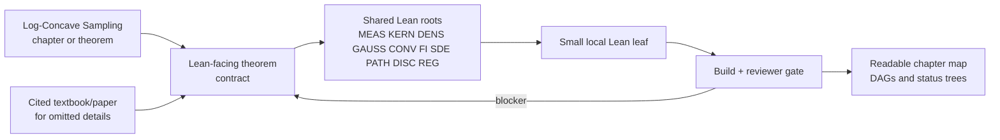
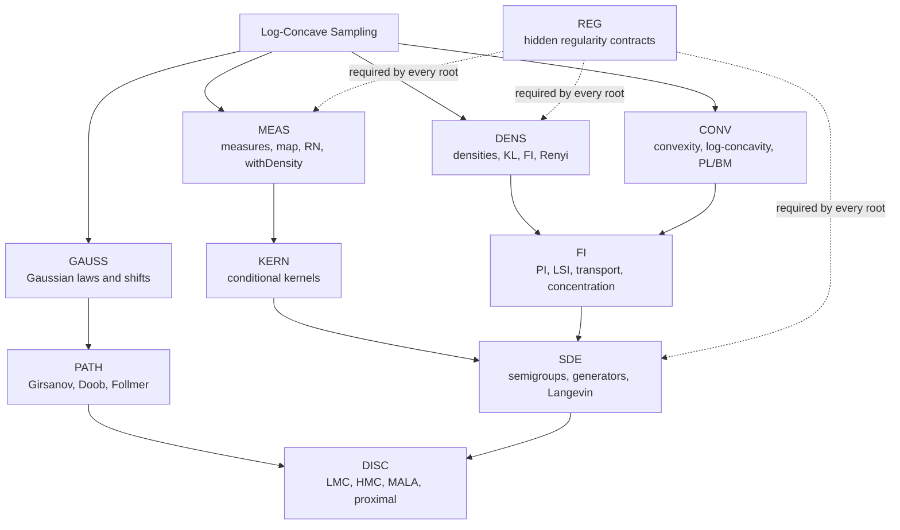
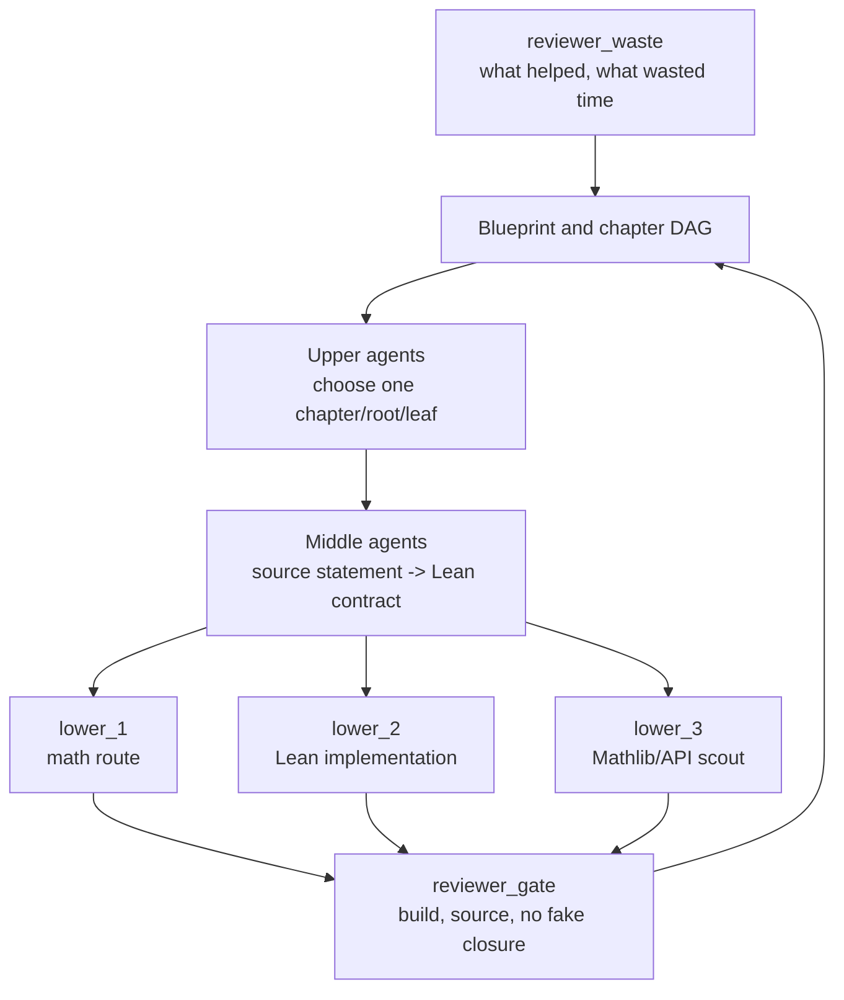

# Auto-Sampling-Theory-In-Sleep

**ASTIS** is a Lean-first project for faithfully reproducing the mathematics of
log-concave sampling.  The current public target is Sinho Chewi's
[`Log-Concave Sampling`](https://chewisinho.github.io/main.pdf) notes.

The goal is not to formalize a single downstream paper.  The goal is to
reconstruct the textbook as a scientifically organized Lean library: every
chapter is decomposed into reusable theorem roots, and every informal analytic
step is either proved locally, found in Mathlib, ported from an audited source,
or recorded as an explicit proof obligation.

## One-Screen Map

| Item | Current ASTIS meaning |
|---|---|
| Primary source | `Log-Concave Sampling` textbook |
| Lean target | Mathlib-ready SDE/Sampling technical-lemma tree |
| Faithfulness rule | Preserve textbook statements; expose hidden regularity instead of silently strengthening assumptions |
| Background sources | Mathlib first, then cited textbooks/papers, then audited external Lean projects as porting references |
| Main task id | `ASTIS-CHEWI-001` |
| Main run command | `python3 tools/astis.py launch-log-concave-6h --hours 6 --wall-hours 24 --lower-count 3` |
| Acceptance gate | `python3 tools/astis.py check` |



## Textbook Scope

The README and generated documentation are organized around the textbook's
mathematical content, not around ASTIS's older SALD/RMFLD pressure tests.

| Part | Textbook topic | Lean organization |
|---|---|---|
| I.1 | Langevin diffusion in continuous time | Markov semigroups, generators, Gibbs invariance, KL/FI dissipation |
| I.2 | Functional inequalities | PI, LSI, transport, concentration, isoperimetry, preservation |
| I.3 | Stochastic analysis topics | Ito, quadratic variation, Girsanov, Doob transform, Follmer drift, bridges |
| II.4 | Langevin Monte Carlo | Interpolation, weak Fokker--Planck, coupling, Girsanov, discretization error |
| II.5 | Faster low-accuracy samplers | HMC, underdamped Langevin, randomized midpoint, transition kernels |
| II.6 | Renyi convergence | Renyi density calculus, interpolation, path-space change of measure |
| II.7 | High-accuracy samplers | Rejection, Metropolis-Hastings, detailed balance, MALA |
| II.8 | Proximal sampler | Restricted Gaussian oracles, proximal kernels, functional inequalities |
| II.9 | Lower bounds | Oracle models, Gaussian comparisons, information lower bounds |
| II.10 | Structured sampling | Stochastic gradients, coordinate methods, mirror geometry |
| II.11 | Non-log-concave sampling | Approximate stationarity, Fisher information, nonconvex applications |
| II.12 | Diffusion generative models | Score matching, reverse-time dynamics, discretization analysis |

The generated chapter ledger is:

```text
research-wiki/sampling-sde-library/log_concave_sampling_overview.md
```

## Shared Lean Roots

Most chapters reuse the same foundation.  ASTIS therefore does not create a
separate Lean mini-library for every theorem.  It builds common roots first and
lets algorithm chapters consume those roots later.



| Root | Purpose | Current status |
|---|---|---|
| `CONV/DENS` | log-concavity, negative-log potentials, Gibbs geometry | partly compiled |
| `MEAS/KERN` | law maps, kernels, conditional representatives | partly compiled |
| `GAUSS` | product Gaussians, MGF, Esscher shifts, finite change of measure | partly compiled |
| `FI` | KL/FI/LSI bookkeeping and preservation targets | partly compiled |
| `SDE/PATH` | weak generators, weak-FP algebra, Girsanov and path transforms | partly compiled |
| `DISC` | algorithmic samplers after analytic roots compile | mostly todo |

## Visual Ledgers

The main generated dependency graph:


Blue nodes in the status tree are locally compiled Lean leaves or modules.
Red nodes are named todo branches:


The source files behind these images are:

```text
research-wiki/lemma-dags/log_concave_sampling_foundation.md
docs/assets/log_concave_sampling_foundation.mmd
docs/assets/log_concave_sampling_status.mmd
```

## Faithful Textbook Contract

ASTIS treats textbook reproduction as a strict contract.

| Rule | Meaning |
|---|---|
| Preserve the statement | Do not change theorem meaning, constants, assumptions, or conclusion to make Lean easier |
| Expose hidden regularity | Measurability, integrability, differentiability, domination, boundary decay, positivity, and representative choices must be explicit |
| Use sources in order | Mathlib first; then the textbook's cited background; then audited external Lean code as provenance only |
| Keep obligations typed | If a theorem is too large now, record the exact Lean-facing statement and source boundary |
| Build locally | A node is blue only after it is an ASTIS-owned declaration covered by the local build |

The active public source is the textbook and its cited background material.

## Agent Loop

ASTIS uses a hierarchical loop because the hard part is not just Lean syntax;
it is choosing the right mathematical leaf.



Main execution pack:

```text
agent-briefs/log_concave_sampling_6h_execution_pack.md
```

## Quick Start

```bash
git clone https://github.com/DakeBU/Auto-Sampling-Theory-In-Sleep.git
cd Auto-Sampling-Theory-In-Sleep

python3 tools/astis.py init
python3 tools/astis.py check
```

Refresh the log-concave sampling documentation:

```bash
python3 tools/astis.py module-graph-refresh
python3 tools/astis.py lemma-dag-refresh
python3 tools/astis.py blueprint-refresh ASTIS-CHEWI-001
```

Write a compact context pack:

```bash
python3 tools/astis.py write-context-pack ASTIS-CHEWI-001 --cycle <next-cycle>
```

Run one short cycle:

```bash
python3 tools/astis.py run-cycle ASTIS-CHEWI-001 --cycle 1 --lower-count 1
```

Run a six-hour active-agent batch:

```bash
python3 tools/astis.py launch-log-concave-6h --hours 6 --wall-hours 24 --lower-count 3
```

GNU screen variant:

```bash
screen -dmS astis_log_concave_6h bash -lc 'python3 tools/astis.py sleep-run-window ASTIS-CHEWI-001 --hours 24 --agent-hours-budget 6 --max-cycles 64 --lower-count 3 --parallel-lower --upper-panel-final --middle-panel-final --reviewer-waste-final --agent-cmd "bash tools/astis_codex_faithful.sh {root} {prompt}" --execute --check-each-cycle'
```

## Lean Sources

Core modules:

| Module | Role |
|---|---|
| `AutoSamplingTheory/Core.lean` | source anchors, proof obligations, theorem contracts, forbidden-pattern policy |
| `AutoSamplingTheory/TechnicalLemmas.lean` | parent import surface for reusable technical lemmas |
| `AutoSamplingTheory/TechnicalLemmas/Geometry/LogConcavity.lean` | positive log-concavity, negative-log potentials, level sets, products, powers, pullbacks, quadratic Gibbs geometry |
| `AutoSamplingTheory/TechnicalLemmas/Measure/Gibbs.lean` | Gibbs densities, finite-measure envelopes, normalized probability bridges |
| `AutoSamplingTheory/TechnicalLemmas/Analysis/Integrability.lean` | integrability and normalizer support lemmas |
| `AutoSamplingTheory/TechnicalLemmas/ProbabilityDistributions/Gaussian.lean` | Gaussian coordinate laws, MGF, shifts, finite-dimensional change of measure |
| `AutoSamplingTheory/TechnicalLemmas/InformationTheory/*` | KL, Donsker--Varadhan, Renyi support |
| `AutoSamplingTheory/TechnicalLemmas/StochasticProcesses/*` | weak generators, weak-FP algebra, finite Girsanov cylinders |
| `AutoSamplingTheory/Automation.lean` | task, role, artifact, and gate contracts |
| `AutoSamplingTheory/Literature.lean` | source and reference registry |

The full generated module atlas is:

```text
research-wiki/sampling-sde-library/lean-leaf-module-graph.md
```

## Repository Layout

```text
AutoSamplingTheory/                  Lean source of truth
Tests/                               Lean smoke tests
tools/astis.py                       local automation CLI
tasks/                               task contracts
proof-blueprints/                    active blueprint summaries
proof-obligations/                   explicit unproved analytic gaps
proof-attempts/                      fixed-target proof attempts
research-wiki/lemma-dags/            theorem/root dependency graphs
research-wiki/sampling-sde-library/  module atlas, cards, chapter overview
research-wiki/external-lean-libraries/ reference cards for Mathlib and source projects
research-wiki/retrieval-index/       compact machine-readable context
runs/                                prompt decks, logs, context packs, trials
docs/                                diagrams, workflow notes, attribution
```

## External References

External Lean repositories and PDFs are reference memory, not trusted local
dependencies.  The useful fact must be ported or reproved inside ASTIS before
it can close a local theorem.

| Reference | Use |
|---|---|
| Mathlib | first API search surface and intended upstream target |
| `Log-Concave Sampling` notes | textbook roadmap and theorem ordering |
| `junwei-lu/Lean-Asymptotic-Statistical-Theory` | hypothesis discipline, dependency graphs, Gaussian/Prekopa-style `ForMathlib` references |
| `YuanheZ/lean-stat-learning-theory` | nearby probability, concentration, entropy, and SLT proof patterns |
| `auto-res/lean-rademacher` | concentration, symmetrization, separability, large-proof staging |

Reference cards live under:

```text
research-wiki/external-lean-libraries/
```

## Downstream Consumers

The repository still contains older downstream tasks because they are useful
tests for whether the textbook foundation is genuinely reusable:

| Consumer | Role |
|---|---|
| `AutoSamplingTheory/SALD.lean` | downstream guided-generation proof skeleton and pressure test |
| `AutoSamplingTheory/RMFLD.lean` | exploratory sampling-theory proof target |
| `TechnicalLemmas/SALDExtracted.lean` | quarantined paper-extracted support leaves, not the public foundation |

These files should not determine the README's organization.  They consume the
log-concave sampling/SDE library once the relevant roots are available.

## Acceptance Gate

Before treating any branch as formal progress, run:

```bash
python3 tools/astis.py check
```

This executes:

```text
lake exe cache get
lake build
lake build Tests
```

ASTIS does not close mathematical content with `axiom`, `sorry`, `admit`,
`Prop := True`, or `:= trivial`.

Before pushing, review generated files carefully.  Long-run logs and generated
paper notes can be noisy; only mature, intentional artifacts should be
committed.
