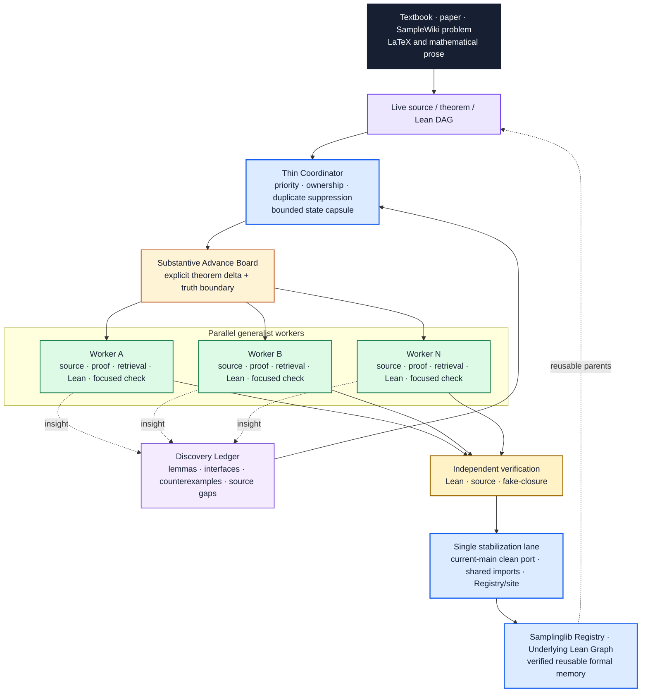

<div align="center">

# Auto-Sampling-Theory-In-Sleep

### A Substantive-Advance Automated Theorem Proving System for Sampling Theory

[](https://dakebu.github.io/Auto-Sampling-Theory-In-Sleep/)
[](https://lean-lang.org/)
[](https://mathlib.org/)
[](https://github.com/DakeBU/Auto-Sampling-Theory-In-Sleep/actions/workflows/blueprint-site.yml)

[**Samplinglib**](https://dakebu.github.io/Auto-Sampling-Theory-In-Sleep/)
· [**Lean Registry**](AutoSamplingTheory/TechnicalLemmas/Registry.lean)
· [**Harness vNext**](docs/multi_agent_orchestration.md)

</div>

ASTIS represents sampling-theory proofs as source-backed, reusable Lean
dependency graphs. Its active work unit is a **Substantive Advance Unit**: one
bounded mathematical DAG delta, owned end to end by a generalist worker and
admitted to Samplinglib only after explicit Lean/source verification and a
serialized stabilization pass.

The first major program reconstructs Sinho Chewi's
[*Log-Concave Sampling*](https://chewisinho.github.io/main.pdf), while the
SampleWiki lane tracks frontier sampling results against the same reusable
formal graph. The long-term goal is not only theorem verification: once the
graph is sufficiently mature, ASTIS can expose which new work adds a marginal
leaf, which work creates a new formal connection, and which proof techniques
actually reorganize the field.

Samplinglib source correspondence is pinned to the canonical **August 9,
2026** edition. The checked table of contents, book/PDF page offset, semantic
anchors, and edition checksum are validated before every site build.

---

## News 🔥

- **August 2026** — Introduced **Harness vNext**, replacing fixed role handoffs
  with theorem-sized substantive advances, a thin coordinator, a durable
  discovery ledger, and one stabilization lane for shared library truth.
- **July 2026** — Released the first user-facing version of
  [**Samplinglib**](https://dakebu.github.io/Auto-Sampling-Theory-In-Sleep/),
  connecting the textbook route, rigorous analytic details, Lean declarations,
  and source-backed verification.
- **June 2026** — Completed the first version of
  **Auto-Sampling-Theory-In-Sleep (ASTIS)** for sampling-theory formalization.

---

## Core Contributions ◆

### 1. Harness vNext: Substantive Advances

ASTIS does not score progress by how many agents wrote artifacts. It asks
whether the verified theorem graph changed in a mathematically useful way.

A thin coordinator reads the live source/theorem/Lean DAG and proposes
independent **Substantive Advance Units (SAUs)**. Each proposal records the
exact source anchor, theorem delta, truth boundary, DAG parents, owned files,
and focused acceptance checks. Semantic fingerprints suppress duplicate active
work even when two branches use different names.

A generalist worker owns one SAU end to end. Source audit, proof design,
Samplinglib/Mathlib retrieval, counterexample search, Lean implementation, and
focused compiler diagnosis are temporary modes—not permanent handoff layers.
The worker either closes the proposed theorem edge or returns a strictly
smaller evidenced blocker.

The lifecycle is explicit:

```text
PROPOSED
  -> CLAIMED
  -> EXPLORING
  -> PROVED_LOCAL
  -> VERIFIED
  -> STABILIZING
  -> MERGED
```

`PROVED_LOCAL` must contain the theorem delta, Lean files, focused checks, and
remaining truth boundary. `VERIFIED` is still not public library truth. Exactly
one integration owner may occupy the **single stabilization lane**, where a
verified result is clean-ported to current `main` and shared imports, root
tests, Registry evidence, source correspondence, graph metadata, and site
status are updated together.

A separate **Discovery Ledger** preserves useful lemmas, interfaces,
counterexamples, source gaps, refactors, and conjectures found while proving
another theorem. Discoveries have their own validation/scheduling lifecycle, so
they survive worker termination without silently becoming formal truth.

The previous Upper/Middle/Lower/Reviewer typed artifacts remain supported as
historical and compatibility memory. Harness vNext reuses their reliable
storage substrate—canonical-path locks, fsync-backed JSONL, interrupted-tail
recovery, immutable proof branches, and exact-field memory—but no longer forces
every theorem through that role ladder.

### 2. Samplinglib: Verified Memory for Sampling Theory

**Samplinglib** is the public Lean library, learning environment, and
verification surface maintained by ASTIS. It begins with a formal
reconstruction of *Log-Concave Sampling*, but organizes measure theory,
probability, functional inequalities, stochastic processes, SDEs, optimal
transport, Langevin dynamics, and sampler interfaces for reuse beyond one
textbook.

The intended object is a graph rather than a pile of isolated formal files:
textbook results, SampleWiki frontier theorems, and reusable technical lemmas
share explicit Lean parents and consumers. The public **Underlying Lean Graph**
lets readers inspect those dependencies and eventually provides the substrate
for graph compression and mathematical purification.

---

## System Architecture ◇



The conversion window remains bidirectional:

```text
natural mathematics  ⇄  typed theorem state  ⇄  verified Lean
```

Compiled declarations and exact residual obligations flow back into the theorem
DAG and future worker packets. Lean compilation never substitutes for semantic
or source review.

---

## Samplinglib Learning Surface 📚

<p align="center">
  
</p>

Readers can move through the library at three linked depths:

1. **Calculation Route** — original statements, formulas, intuition, and the
   source proof route.
2. **Rigorous Details** — measurability, integrability, representatives,
   approximation, limits, boundaries, regularity, and operator domains.
3. **Lean Foundations** — exact declarations, imports, dependencies, source
   lines, Registry evidence, tests, and the current Lean gate.

The [Live Formalization workspace](https://dakebu.github.io/Auto-Sampling-Theory-In-Sleep/live/)
adds reviewed examples, LaTeX rendering, Samplinglib/Mathlib retrieval, local
Lean diagnostics, and export into the substantive-advance workflow. Candidate
translation, compilation, semantic review, proof, and public admission remain
separate states.

---

## Organizers ✦

**Dake Bu, Ji Cheng, Atsushi Nitanda, Hau-San Wong, and Qingfu Zhang**

Contributions are welcome through the [four-stage contributor
guide](https://dakebu.github.io/Auto-Sampling-Theory-In-Sleep/contribute/) and
the repository's [submission checklist](CONTRIBUTING.md). Focused corrections
can go directly to a pull request; new theorem routes or module boundaries
should be coordinated against the live proof graph first.

## Related Systems ⟡

| System | What informs ASTIS | ASTIS boundary |
|---|---|---|
| [FrontierAgent](https://github.com/ApodexAI/FrontierAgent) | Thin coordinator/task board, bounded parallel workers, resumable state, and explicit report collection. | ASTIS schedules source-backed theorem-DAG advances rather than generic file tasks; Lean evidence, truth boundaries, discovery provenance, and the single stabilization lane are authoritative. |
| [Learning Beyond Gradients](https://github.com/Trinkle23897/learning-beyond-gradients) | Durable trial memory, rejected-route records, and role-separated exploration informed the earlier harness. | vNext retains durable memory while replacing mandatory role handoffs with end-to-end theorem ownership. |
| [EoH](https://github.com/FeiLiu36/EoH) | Population initialization, variation, selection, and archive pressure for competing solution routes. | Population search is allowed only for fixed Lean-checkable targets in exploratory modes; source theorems and assumptions cannot mutate to make a proof easier. |
| [ARIS](https://github.com/wanshuiyin/Auto-claude-code-research-in-sleep) | Long-running research loops, plain-file handoffs, and separate reviewer passes. | ASTIS specializes the loop for formal theorem state, exact source anchors, analytic obligations, and reusable Samplinglib memory. |
| [LeanMarathon](https://github.com/YuanheZ/LeanMarathon) | Blueprint-driven target selection, proof-DAG leaves, bounded workers, and deterministic gates. | ASTIS keeps a local source-backed harness and makes theorem-graph memory and reader-facing source correspondence first-class outputs. |
| [StatsMLlib](https://github.com/Lean-MoDS/StatsMLlib) | Subject-owned Lean modules, reuse-first development, complete proofs, source attribution, and staged contribution. | Samplinglib adds textbook-route correspondence, SampleWiki frontier ingestion, substantive-advance scheduling, and graph-level evidence surfaces. |

The complete design and mathematical provenance ledger is maintained in
[Attribution and Design Lineage](docs/attribution.md).

## Citation 📝

```bibtex
@misc{bu2026astis,
  title        = {Auto-Sampling-Theory-In-Sleep: A Substantive-Advance
                  Automated Theorem Proving System for Sampling Theory},
  author       = {Dake Bu and Ji Cheng and Atsushi Nitanda and
                  Hau-San Wong and Qingfu Zhang},
  year         = {2026},
  howpublished = {GitHub repository and Samplinglib formalization website},
  url          = {https://github.com/DakeBU/Auto-Sampling-Theory-In-Sleep}
}
```

ASTIS is the research system and proving harness. Samplinglib is its public Lean
library and learning interface. External libraries, textbooks, papers, and
repositories are cited as mathematical or design provenance and do not imply
endorsement.
