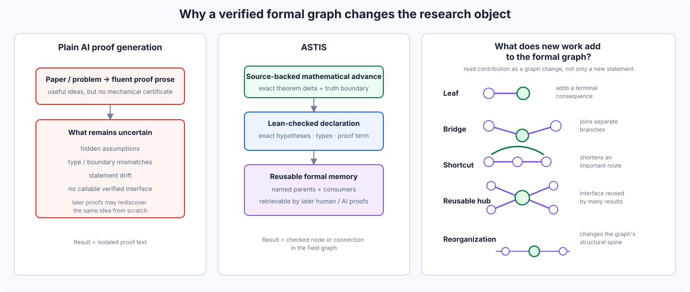
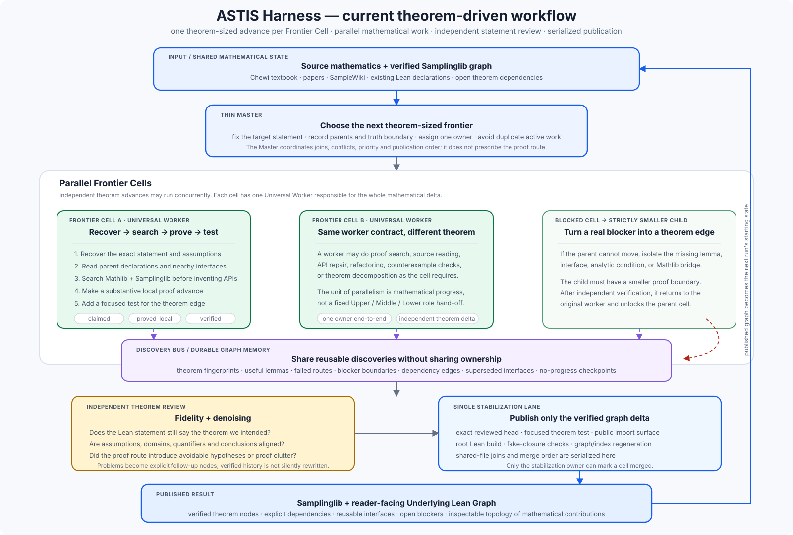

<div align="center">

# Auto-Sampling-Theory-In-Sleep

### Samplinglib: a source-backed Lean graph for sampling and optimization

[](https://dakebu.github.io/Auto-Sampling-Theory-In-Sleep/)
[](https://lean-lang.org/)
[](https://github.com/DakeBU/Auto-Sampling-Theory-In-Sleep/actions/workflows/blueprint-site.yml)

[**Home**](https://dakebu.github.io/Auto-Sampling-Theory-In-Sleep/)
· [**Libraries**](https://dakebu.github.io/Auto-Sampling-Theory-In-Sleep/libraries/)
· [**Current Progress**](https://dakebu.github.io/Auto-Sampling-Theory-In-Sleep/progress/)
· [**Underlying Lean Graph**](https://dakebu.github.io/Auto-Sampling-Theory-In-Sleep/underlying-lean-graph/)
· [**Harness**](https://dakebu.github.io/Auto-Sampling-Theory-In-Sleep/workflow/)

</div>

ASTIS builds **Samplinglib**: natural-language mathematics, source anchors, Lean declarations, and theorem dependencies in one inspectable graph. Primary sources, official supplements, background textbooks, and formal upstream libraries have different roles and are recorded separately; frontier papers are inserted into the same graph so that their actual mathematical contribution can be compared, verified, and reused.

## Research aim

```text
formalize → verify → connect → reuse
```

A paper may add a **LEAF**, **BRIDGE**, **SHORTCUT**, **HUB**, or **RE-ORGANIZATION**; these are overlapping structural signatures, not an automatic paper ranking. “A+B” is not inherently marginal: a reusable bridge that transports many later results can be major. A shallow A+B result instead leaves A and B as independent black boxes, joins them only in a terminal application, and creates little reusable transport, shortening, assumption relief, or downstream reach.

<p align="center">
  
</p>

## ASTIS Harness

The three formalization routes use the same theorem-driven verification workflow. A **Frontier Cell** is one theorem-sized advance with an exact target, known parents, a truth boundary, and a focused test. Parallel work may discover shared foundations, but shared declarations are reused or coordinated before publication; independent review and a single stabilization lane decide what becomes Samplinglib truth.

<p align="center">
  
</p>

```text
claimed → proved locally → independently verified → stabilized → merged
              │
              └→ blocked → smaller child theorem → verified → re-entry
```

Lean compilation does not by itself guarantee source fidelity. Source-facing nodes separately audit objects, domains, quantifiers, assumptions, and conclusions; denoising proposals remain explicit rather than silently changing the pinned theorem.

## Attribution & design lineage

| Source | What Samplinglib / ASTIS learns from it | ASTIS-specific boundary |
|---|---|---|
| [Sinho Chewi, *Log-Concave Sampling*](https://chewisinho.github.io/main.pdf) | Primary sampling textbook order, theorem route, calculations, and source-facing statements | Faithful ASTIS paraphrase + exact source anchors + ASTIS-owned Lean declarations; no endorsement implied |
| [Sinho Chewi, *Supplement to Log-Concave Sampling*](https://chewisinho.github.io/supp.pdf) | Official material omitted from the book for space; currently the complete supplement to Chapter 2 | Treated as an additional primary-source layer and mapped after Chapter 2; summarized and formalized rather than republished wholesale |
| Sampling background / rigor references | Karatzas–Shreve, Protter, Revuz–Yor, Shreve, Bakry–Gentil–Ledoux, van Handel, Ledoux, Boucheron–Lugosi–Massart, Villani, Ambrosio–Gigli–Savaré, Santambrogio, Vershynin, and other references explicitly used or recommended around the source | Used to recover standard omitted hypotheses/proof details and cross-check conventions; they never silently replace Chewi's pinned theorem |
| [Nicolas Boumal, *An Introduction to Optimization on Smooth Manifolds*](https://www.nicolasboumal.net/book/) | Riemannian geometry and optimization spine | Chapter/source correspondence; no wholesale republication |
| [Sinho Chewi, *Lectures on Optimization*](https://arxiv.org/pdf/2605.07006) | Public theorem-proof source and chapter spine for the **Optimisation** Library | Formalized section by section from the public arXiv notes; source-facing statements remain pinned to Chewi |
| Bubeck (2015), [Beck (2017)](https://epubs.siam.org/doi/book/10.1137/1.9781611974997), Nesterov (2018) | Principal background sources named by Chewi for the optimization lectures | Background/theorem cross-checks rather than the public formalization spine |
| [Optlib](https://github.com/optsuite/optlib) | Existing convex-analysis, proximal, and optimization-algorithm theorem nodes | Provenance, compatibility, and adapters remain explicit; no silent duplication |
| [CvxLean](https://github.com/verified-optimization/CvxLean) | Formal optimization problems, equivalence, reduction, relaxation, and verified transformations | Reference/integration layer until compatibility is locally audited |
| [Lean-Ridgelet](https://github.com/shosonoda/lean-ridgelet) | Blueprint / implementation-map presentation | Extended from one formalization map to textbooks, frontier results, reusable theorem graphs, and source-aware statement review |
| [ARIS / Auto-claude-code-research-in-sleep](https://github.com/wanshuiyin/Auto-claude-code-research-in-sleep) | Long-running research, durable artifacts, recovery, and separate review | Durable state is source-backed Lean theorem progress rather than plausible research narrative |
| [Learning Beyond Gradients](https://github.com/Trinkle23897/learning-beyond-gradients) | Durable failures, rejected routes, iterative improvement, and system self-improvement | Keeps negative memory without permanent intellectual role boundaries |
| [EoH](https://github.com/FeiLiu36/EoH) | Competing candidate routes | Search is allowed only around fixed Lean-checkable targets; faithful source statements do not mutate |
| [LeanMarathon](https://github.com/YuanheZ/LeanMarathon) | Blueprint, proof-DAG leaves, bounded workers, and deterministic gates | Samplinglib makes theorem-graph memory, source correspondence, statement fidelity, and sampling-analysis obligations first-class |
| [MathCode](https://github.com/math-ai-org/mathcode) | Lean diagnostics and theorem-reuse ideas | Diagnostics are advisory; pinned Lean/source checks and independent verification are authoritative |
| [lean-stat-learning-theory](https://github.com/YuanheZ/lean-stat-learning-theory) | Mathlib probability, concentration, entropy, and functional-inequality proof idioms | External declarations become local truth only after an audited compatible port compiles |
| [StatsMLlib](https://github.com/Lean-MoDS/StatsMLlib) | Subject-owned modules, reuse-first formalization, and staged contribution | Samplinglib adds textbook correspondence, SampleWiki ingestion, statement fidelity, and graph-level contribution views |
| [FrontierAgent](https://github.com/ApodexAI/FrontierAgent) | Parallel generalist agents, bounded task boards, checkpointing, and no-progress control | ASTIS schedules theorem-DAG advances with Lean evidence, truth boundaries, independent verification, and serialized stabilization |
| [Quantum-Computing-Block-Encoding](https://github.com/DakeBU/Quantum-Computing-Block-Encoding) | Experience building automated formalization workflows | ASTIS specializes the machinery for sampling/SDE mathematics and theorem-sized Frontier Cells |

Full mathematical provenance and design lineage: [docs/attribution.md](docs/attribution.md).

## Quick start

```bash
git clone https://github.com/DakeBU/Auto-Sampling-Theory-In-Sleep.git
cd Auto-Sampling-Theory-In-Sleep
python3 tools/astis.py check
```

```bibtex
@misc{bu2026astis,
  title  = {Auto-Sampling-Theory-In-Sleep: A Lean Formal Knowledge Graph
            and Theorem-Driven System for Sampling Theory},
  author = {Dake Bu and Ji Cheng and Atsushi Nitanda and
            Hau-San Wong and Qingfu Zhang},
  year   = {2026},
  url    = {https://github.com/DakeBU/Auto-Sampling-Theory-In-Sleep}
}
```

**Organizers:** Dake Bu, Ji Cheng, Atsushi Nitanda, Hau-San Wong, Qingfu Zhang
