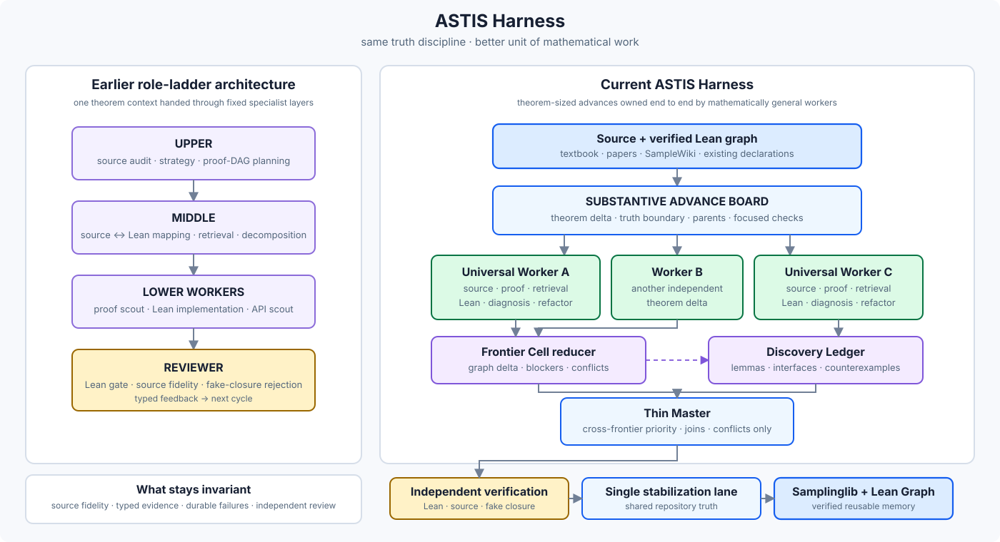
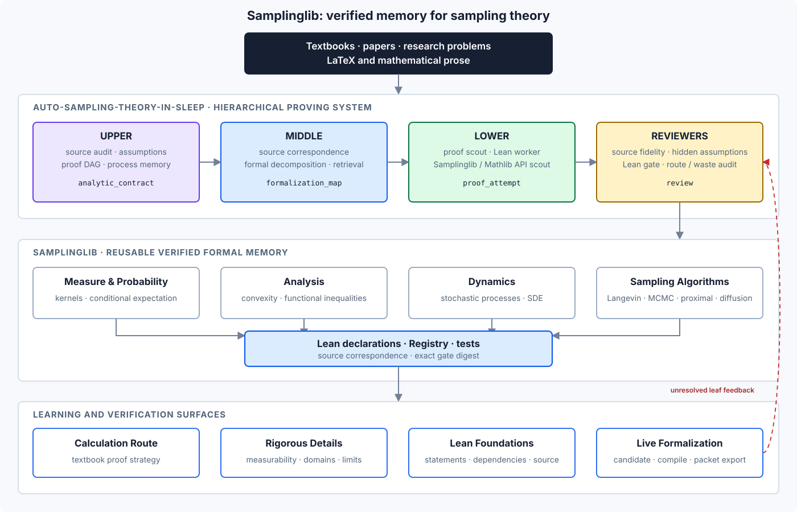

<div align="center">

# Auto-Sampling-Theory-In-Sleep

### A theorem-proving Harness + Samplinglib for verified, structural sampling theory

[](https://dakebu.github.io/Auto-Sampling-Theory-In-Sleep/)
[](https://lean-lang.org/)
[](https://mathlib.org/)
[](https://github.com/DakeBU/Auto-Sampling-Theory-In-Sleep/actions/workflows/blueprint-site.yml)

[**Samplinglib**](https://dakebu.github.io/Auto-Sampling-Theory-In-Sleep/)
· [**Textbook**](https://dakebu.github.io/Auto-Sampling-Theory-In-Sleep/textbook/chapter-01/section-1-2.html)
· [**Underlying Lean Graph**](https://dakebu.github.io/Auto-Sampling-Theory-In-Sleep/underlying-lean-graph/)
· [**Harness**](https://dakebu.github.io/Auto-Sampling-Theory-In-Sleep/workflow/)

</div>

ASTIS turns sampling-theory mathematics into **source-backed Lean declarations, reusable formal memory, and an inspectable theorem graph**. We want both beginners and experts to see not only whether a theorem is correct, but **where it sits in the field and what mathematical structure a new result actually adds**.

## Two contributions

### 1. ASTIS Harness — theorem-sized AI research with Lean truth

Universal Workers own a mathematical advance end to end; dynamic Frontier Cells parallelize nearby proof work; a Thin Master handles only cross-frontier joins and conflicts. Independent Lean/source verification and a single stabilization lane prevent fluent AI reasoning from being mistaken for shared mathematical truth.

<p align="center">
  
</p>

### 2. Samplinglib — verified memory and a structural map of sampling theory

Samplinglib aligns **natural-language mathematics ↔ Lean declarations ↔ dependency graph**. Its first program follows Sinho Chewi's *Log-Concave Sampling*, while the SampleWiki lane attaches frontier results to the same reusable graph; readers can inspect calculation routes, hidden analytic assumptions, exact Lean foundations, and the Underlying Lean Graph.

<p align="center">
  
</p>

## Why a formal graph?

<p align="center">
  
</p>

A new theorem can then be read structurally: **another leaf, a bridge, a shortcut, a reusable hub, or a reorganization of the field's proof spine**. This gives a sharper lens on mathematical contribution than isolated theorem/proof text alone.

## Attribution & design lineage

| Source | What ASTIS learns from it | ASTIS-specific boundary |
|---|---|---|
| [Sinho Chewi, *Log-Concave Sampling*](https://chewisinho.github.io/main.pdf) | Textbook order, theorem route, calculations, background results | Faithful ASTIS paraphrase + exact source anchors + ASTIS-owned Lean declarations; no endorsement implied |
| [Lean-Ridgelet](https://github.com/shosonoda/lean-ridgelet) | Blueprint / implementation-map presentation | Extended from one formalization map to a sampling-theory textbook, frontier results, and reusable theorem graph |
| [ARIS](https://github.com/wanshuiyin/Auto-claude-code-research-in-sleep) | Long-running research, recovery, separate review | The durable state is source-backed Lean theorem progress rather than plausible research narrative |
| [Learning Beyond Gradients](https://github.com/Trinkle23897/learning-beyond-gradients) | Durable failures, rejected routes, system self-improvement | Keeps negative memory without permanent intellectual role boundaries |
| [EoH](https://github.com/FeiLiu36/EoH) | Competing candidate routes | Search is allowed only around fixed Lean-checkable targets; faithful source statements do not mutate |
| [LeanMarathon](https://github.com/YuanheZ/LeanMarathon) | Blueprint, proof-DAG leaves, bounded workers, deterministic gates | ASTIS makes source contracts, theorem-graph memory, and sampling-analysis obligations first-class |
| [MathCode](https://github.com/math-ai-org/mathcode) | Lean diagnostics and theorem-reuse ideas | Diagnostics are advisory; ASTIS's pinned Lean/source gate is authoritative |
| [lean-stat-learning-theory](https://github.com/YuanheZ/lean-stat-learning-theory) | Mathlib probability / concentration / functional-inequality proof idioms | External declarations become ASTIS truth only after a local audited port compiles |
| [StatsMLlib](https://github.com/Lean-MoDS/StatsMLlib) | Subject-owned modules, reuse-first formalization | Samplinglib adds textbook correspondence, SampleWiki ingestion, and graph-level contribution views |
| [FrontierAgent](https://github.com/ApodexAI/FrontierAgent) | Parallel generalist agents, bounded task boards, no-progress control | ASTIS schedules theorem-DAG advances with Lean evidence, truth boundaries, independent verification, and serialized stabilization |
| [Quantum-Computing-Block-Encoding](https://github.com/DakeBU/Quantum-Computing-Block-Encoding) | Earlier Upper/Middle/Lower/Reviewer Harness lineage | ASTIS specializes the machinery for sampling/SDE mathematics and now uses Universal Workers + Frontier Cells |

Full provenance and boundaries: [docs/attribution.md](docs/attribution.md).

## Quick start

```bash
git clone https://github.com/DakeBU/Auto-Sampling-Theory-In-Sleep.git
cd Auto-Sampling-Theory-In-Sleep
python3 tools/astis.py check
```

**Organizers:** Dake Bu, Ji Cheng, Atsushi Nitanda, Hau-San Wong, Qingfu Zhang
