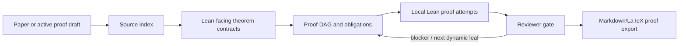
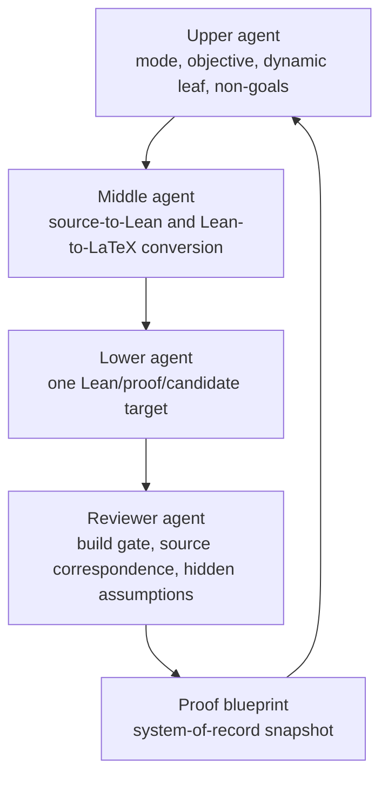

# Auto-Sampling-Theory-In-Sleep

**ASTIS** is a Lean-first automation project for SDE, sampling, diffusion, and
guided-generation theory.  Its purpose is not to be a wrapper around another
automation repository.  The core problem is domain-specific:

```text
Can we turn long, analysis-heavy SDE/Sampling proofs into Lean-facing theorem
contracts, proof DAGs, cited-result ledgers, and eventually checked Lean code?
```

ASTIS is designed for two research situations:

- reproducing an existing paper faithfully, without changing the theorem or
  proof target;
- validating an evolving proof draft while the research is still being
  developed.

The first faithful target is the original VA-SALD paper proof corpus under
`/home/nitanda_sub/mark/repos/sald/paper`, excluding `sald_version_2.tex`.
The first exploratory target is the RMFLD proof draft under
`/home/nitanda_sub/mark/repos/RMFLD/RMFLD_paper`.

Every analytic fact must be one of:

- a compiled Lean declaration;
- a named `ProofObligation`;
- a cited-result ledger entry with an explicit formalization status.

ASTIS does not close mathematical content with `axiom`, `sorry`, `admit`,
`Prop := True`, or `:= trivial`.

## Why SDE/Sampling Needs Its Own System

SDE and sampling proofs have a different shape from finite algebraic
formalization tasks.  They depend on laws of stochastic processes,
time-indexed measures, Fokker--Planck equations, KL/FI/LSI/PI inequalities,
Euler--Maruyama interpolation, conditional laws, and approximation error
decompositions.  A useful automation system must therefore track:

- source-paper labels, equations, assumptions, and proof paragraphs;
- Lean-facing versions of measures, kernels, densities, drifts, scores,
  transport velocities, and stochastic updates;
- cited analysis results that are too large to prove immediately;
- exact theorem boundaries when a proof step is not yet formalized;
- human-readable Markdown/LaTeX exports for collaborators.

ASTIS treats these as first-class project artifacts rather than incidental
chat history.

## System Flow



The current acceptance gate is:

```bash
lake exe cache get
lake build
lake build Tests
python3 tools/astis.py check
```

## Two Modes

| Mode | Use case | Rule |
|---|---|---|
| `faithfulPaper` | Reproduce an existing paper, such as the original VA-SALD paper. | Do not change theorem statements, assumptions, constants, schedules, proof targets, or source attribution. |
| `exploratoryProof` | Validate a proof draft under development, such as RMFLD. | Candidate routes may compete only after the acceptance predicate and assumptions are explicit. |

In `faithfulPaper` mode, failed proof attempts are useful memory, but they must
not mutate the paper.  In `exploratoryProof` mode, ASTIS can maintain
candidate proof-route populations under `candidate-populations/`, but Lean plus
source correspondence remains the acceptance criterion.

## Agent And Blueprint Loop

ASTIS uses a four-role loop over one shared repository.



The proof blueprint is the compact state that prevents long runs from
replaying broad history:

```bash
python3 tools/astis.py blueprint-refresh ASTIS-SALD-001
```

For the current SALD target, the generated blueprint files are:

```text
research-wiki/blueprints/ASTIS-SALD-001.md
research-wiki/blueprints/ASTIS-SALD-001-blueprint-status.md
research-wiki/blueprints/ASTIS-SALD-001-blueprint-status.json
```

A lower agent should work on one dynamic leaf or one named illness area, not on
a broad theorem-route replay.  Reviewer acceptance requires the gate above and
an explicit source-correspondence account.

## Lean And Mathlib

ASTIS currently uses:

```text
leanprover/lean4:v4.29.1
mathlib4 tag v4.29.1
```

The root library is:

```text
AutoSamplingTheory
```

Core Lean modules:

- `AutoSamplingTheory/Core.lean`: source anchors, proof obligations, theorem
  contracts, proof DAG blocks, and forbidden-pattern policy.
- `AutoSamplingTheory/Probability.lean`: KL/FI/LSI/PI interfaces,
  conditional-distribution and measure/integral proof infrastructure.
- `AutoSamplingTheory/SDE.lean`: Ito diffusion, Fokker--Planck, and
  Euler--Maruyama statement layer.
- `AutoSamplingTheory/SALD.lean`: VA-SALD faithful-paper proof skeleton,
  theorem dependency registry, and compiled local proof blocks.
- `AutoSamplingTheory/RMFLD.lean`: exploratory RMFLD proof targets.
- `AutoSamplingTheory/Automation.lean`: compiled task, role, artifact, and
  gate contracts.
- `AutoSamplingTheory/Literature.lean`: source and external-reference
  registry.

## Repository Layout

```text
AutoSamplingTheory/                 Lean source of truth
Tests/                              Lean smoke tests
tools/astis.py                      local automation CLI
tasks/                              task contracts
conversion-windows/                 synchronized source/Lean/proof maps
proof-obligations/                  explicit unproved analytic gaps
proof-attempts/                     failed and successful fixed-target routes
candidate-populations/              exploratory proof-route populations
research-wiki/source-index/         generated source labels
research-wiki/cited-results/        external theorem and port-status ledgers
research-wiki/blueprints/           proof blueprints and compact status JSON
runs/                               prompt decks, logs, context packs, trials
reviews/                            reviewer artifacts
paper-notes/AutoLeanInSleepSampling LaTeX/Markdown project article export
docs/                               design notes, attribution, efficiency rules
```

Shared external references are intentionally kept outside ASTIS:

```text
../outer_repos/
  Auto-claude-code-research-in-sleep
  EoH
  LeanMarathon
  lean-stat-learning-theory
  learning-beyond-gradients
  mathcode

../outer_papers/
  LeanMarathon-2606.05400.pdf
  Statistical Learning Theory in Lean 4 Empirical Processes from Scratch
  Uniform-in-Time Weak Propagation-of-Chaos in Shallow Neural Networks
  ...
```

Public project documents should cite upstream GitHub repositories, arXiv URLs,
source labels, or bundled paper notes.  They should not rely on a
machine-specific absolute path.

## Quick Start

```bash
cd /home/nitanda_sub/mark/repos/Auto-Sampling-Theory-In-Sleep

python3 tools/astis.py init
python3 tools/astis.py list-literature
python3 tools/astis.py list-tasks
python3 tools/astis.py check
```

Refresh the current SALD proof blueprint:

```bash
python3 tools/astis.py blueprint-refresh ASTIS-SALD-001
```

Write the next compact context pack:

```bash
python3 tools/astis.py write-context-pack ASTIS-SALD-001 --cycle 114
```

Run a short dry cycle:

```bash
python3 tools/astis.py run-cycle ASTIS-SALD-001 --cycle 1 --lower-count 1
```

Run a graceful long batch:

```bash
python3 tools/astis.py launch-sald-6h
```

Export the human-readable project article:

```bash
python3 tools/astis.py export-latex
```

## First Targets

### `ASTIS-SALD-001`

Faithfully reproduce the original VA-SALD paper proofs.

Initial proof DAG:

- `lem:gronwall`
- `lem:dv_variation`
- LSI/KL/FI definitions
- `thm:forward-KL`
- `thm:forward-KL-discrete`
- `prop:guided_path_residual`
- `thm:general-moving-target-SALD`
- `thm:unified-forward-KL`
- `thm:general-moving-target-SALD-discrete`

Current long-run checkpoint: after cycle 113, the active blocker is the named
`barB` state-event Bochner set-integral characterization around
`appendix.tex:1368-1377`.  The useful packet classifications are:

- `discharges-supplied-hypothesis`
- `narrows-source-cited-boundary`
- `rejected-wrapper-churn`

### `ASTIS-RMFLD-001`

Index and validate RMFLD exploratory proof routes.  This mode may use
candidate proof populations, but only after the target predicate and
assumptions are explicit.

## Design Lineage And Differences

ASTIS learns from several automation systems, but its center of gravity is
SDE/Sampling formalization.

| Reference | What ASTIS borrows | What ASTIS changes |
|---|---|---|
| [ARIS / Auto-claude-code-research-in-sleep](https://github.com/wanshuiyin/Auto-claude-code-research-in-sleep) | Plain-file long-window research loops, durable handoffs, and reviewer passes. | The loop is aimed at Lean proof state, source correspondence, and proof obligations rather than empirical experiments alone. |
| [Learning Beyond Gradients](https://github.com/Trinkle23897/learning-beyond-gradients) | Role-separated iterative improvement, trial logs, summaries, rejected directions, and maintaining the system as the object being improved. | ASTIS specializes this into upper/middle/lower plus reviewer agents for theorem proving. |
| [EoH](https://github.com/FeiLiu36/EoH) | Population-style candidate search with initialization, variation, selection, and archives. | Used only for `exploratoryProof`; faithful paper reproduction cannot mutate the source theorem. |
| [LeanMarathon](https://github.com/YuanheZ/LeanMarathon) and [arXiv:2606.05400](https://arxiv.org/abs/2606.05400) | Blueprint as system of record, target review, dynamic proof-DAG leaves, refiners, and deterministic gates. | ASTIS keeps a local proof blueprint and adapts the control loop to SDE/Sampling proof obligations. |
| [MathCode](https://github.com/math-ai-org/mathcode) | Lean diagnostics, theorem-reuse memory, hidden-placeholder scans, and tree-of-subgoals planning. | Diagnostics are advisory; `python3 tools/astis.py check` remains the acceptance gate. |
| [lean-stat-learning-theory](https://github.com/YuanheZ/lean-stat-learning-theory) and [arXiv:2602.02285](https://arxiv.org/abs/2602.02285) | Mathlib probability/concentration proof style, entropy duality, log-Sobolev/Poincare references, and discretization statements. | Used as audited reference/port source while toolchains differ. |
| ABEIS/QBE | A mature example of Lean automation project engineering: CLI, prompt decks, conversion windows, proof obligations, and blueprint discipline. | ASTIS is not a quantum/block-encoding derivative; it replaces that domain with laws, kernels, drifts, densities, KL/FI/LSI/PI, Fokker--Planck, and Euler--Maruyama objects. |

The LeanMarathon-style blueprint layer does not replace the LBG-style
upper/middle/lower/reviewer hierarchy or the EoH-style exploratory population
layer.  It makes those loops more reliable by forcing each long run to start
from the current proof blueprint and by retiring stale dynamic leaves.

## For SDE/Sampling Authors

Use ASTIS when your paper or draft contains proof steps such as:

- "by the Fokker--Planck equation";
- "by standard KL derivative arguments";
- "using LSI and the Donsker--Varadhan variational formula";
- "the Euler--Maruyama interpolation satisfies";
- "the conditional law has drift";
- "the predicted-clean guide changes the target by a controlled residual";
- "the SMC approximation adds a particle error term".

ASTIS turns these into Lean-facing theorem contracts and explicit obligations.
It does not hide the missing analysis.  If the background theorem is too large
to prove immediately, ASTIS records the exact source-cited boundary and the
local statement that future Lean work must discharge.

## Paper Notes

The current project article export lives under:

```text
paper-notes/AutoLeanInSleepSampling/latex/main.tex
```

The SALD reproduction is treated as a case study appendix inside the larger
ASTIS article.  The exported paper notes are for collaborator inspection; the
Lean files and proof-obligation ledgers remain the source of truth.

## GitHub

Private repository target:

```text
https://github.com/DakeBU/Auto-Sampling-Theory-In-Sleep
```

Before pushing, run:

```bash
python3 tools/astis.py check
```

Then review changed files carefully.  The repository contains long-run logs and
paper notes; only mature, intentional artifacts should be committed.
