# Log-Concave Sampling Lean Reconstruction

ASTIS is a Lean reconstruction of
[`Log-Concave Sampling`](https://chewisinho.github.io/main.pdf).
The public target is this textbook route: chapter order, theorem statements,
constants, cited background, and the regularity assumptions that the prose
leaves implicit.

Other papers and external Lean repositories are reference material.  They are
used only to clarify a cited background result, borrow a proof pattern, or
identify a Mathlib-ready leaf.  A fact becomes blue only when this repository
owns a compiled Lean declaration and records it in the registry.

| Item | Current status |
|---|---|
| primary source | `https://chewisinho.github.io/main.pdf` |
| local source copy | `outer_papers/sampling_theory_sde/Chewi-Log-Concave-Sampling/main.pdf` |
| compiled local technical leaves | 253 |
| active frontier | Chapter 1, Example 1.2.8 -> Corollary 1.2.9: justify the omitted whole-space integration by parts before claiming the Gibbs invariant law |
| newest closed edge | scale-uniform `O(R^{-1})` radial derivative bound, derivative zero on the closed outer region, PiLp cutoff chain rule, and the cutoff cross-term trace identity |
| next red edge | generic `L¹` cutoff-gradient integral limit from `Integrable G`, then Gibbs-specific domination and whole-space weighted IBP |

## Visual Index

Start with the diagrams, then open the exact Lean file or registry row.

| Need | Diagram/table | Source of truth |
|---|---|---|
| whole project shape | [One-screen map](#one-screen-map) | this README |
| chapter coverage | [Chapter spine](#chapter-spine), [Chapter dashboard](#chapter-dashboard) | roadmap plus lemma DAG |
| reusable Lean roots | [Shared root graph](#shared-root-graph), [Root matrix](#root-matrix) | module cards and imports |
| current proof frontier | [Chapter 1 proof chain](#chapter-1-proof-chain) | `Analysis.Calculus.Divergence`, `StochasticProcesses.Langevin` |
| exact next tasks | [Current red queue](#current-red-queue) | README, DAG, run packet |
| compiled declarations | [File map](#file-map) | `AutoSamplingTheory/TechnicalLemmas/Registry.lean` |

Color rule:

| Color | Meaning | Gate |
|---|---|---|
| blue | compiled local declaration or compiled local module family | `lake build Tests`, registry |
| red | named missing proof obligation | DAG/README until compiled locally |
| yellow | theorem package or downstream consumer | navigation only |
| gray | source/citation contract | textbook and cited sources |

Rendered snapshots:

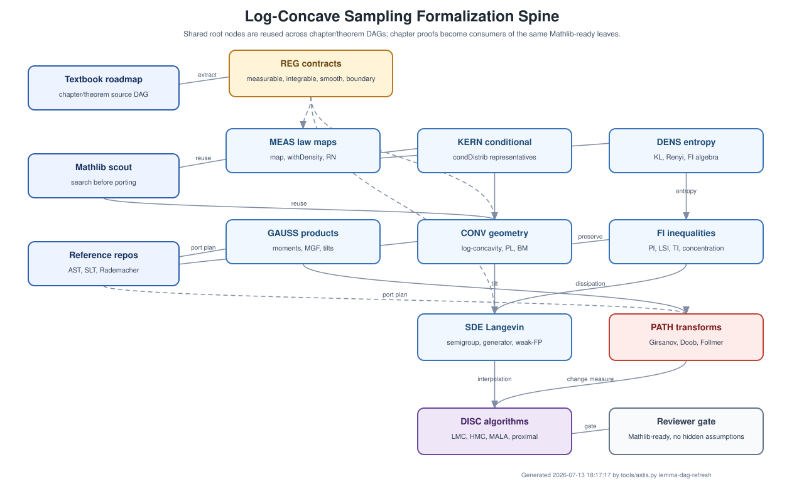

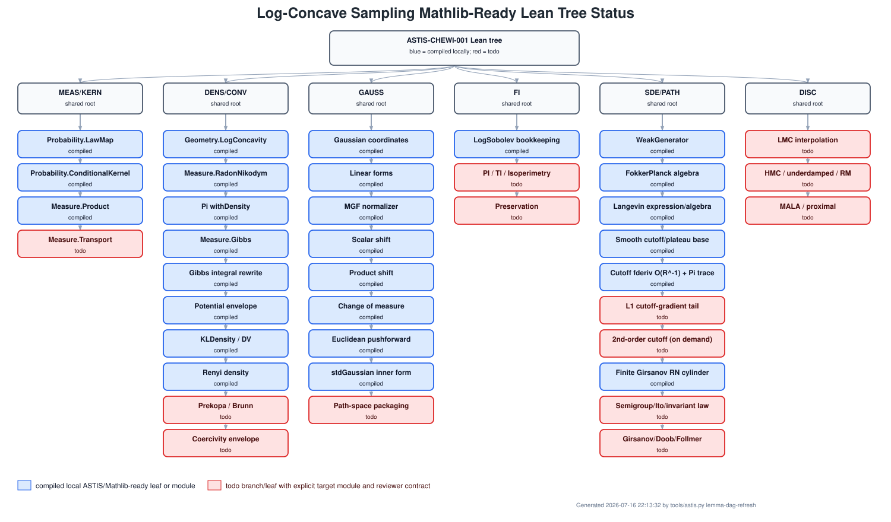

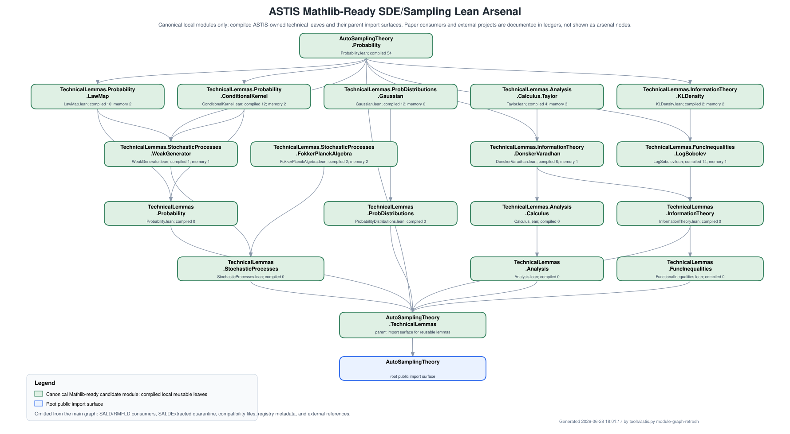

## One-Screen Map

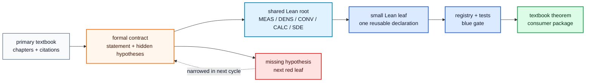

## Chapter Spine

The textbook is reconstructed chapter by chapter.  Later sampler chapters are
kept as consumers until the shared roots they need are blue.

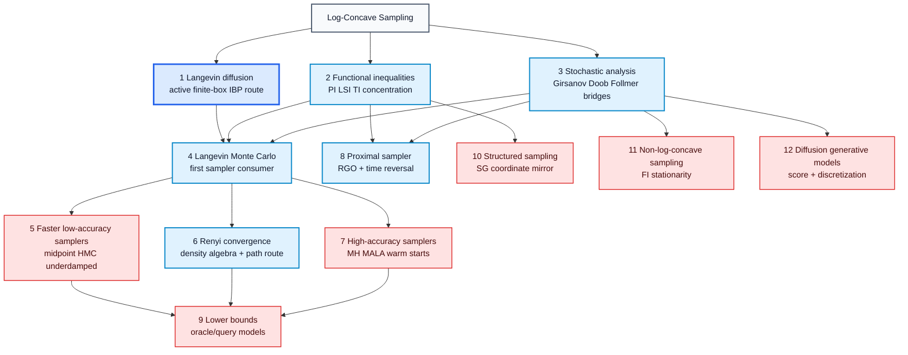

## Chapter Dashboard

| Chapter | Main mathematical package | Blue foundation | Red boundary |
|---|---|---|---|
| 1 Langevin diffusion | Gibbs density, generator display, finite-box IBP, invariant law | Gibbs wrappers, generator algebra, finite-coordinate calculus, finite-box divergence, compact-in-open/Pi-box plateaus, radial exhaustion, `O(R^{-1})` first derivative, closed-outer derivative zero, PiLp/trace consumer bridges | `L¹` cutoff-gradient tail, Gibbs domination, whole-space weighted IBP, generator domains, invariant law |
| 2 Functional inequalities | PI, LSI, TI, isoperimetry, preservation | log-concavity algebra, level sets, products, powers, pullbacks, LSI bookkeeping | Prekopa-Leindler, Brunn-Minkowski, PI/TI/isoperimetry, preservation theorems |
| 3 Stochastic analysis | Girsanov, Doob, Follmer, Schrodinger bridge | finite Gaussian shifts, finite-cylinder Girsanov, RN/withDensity handoffs | Brownian path-space packaging and bridge transforms |
| 4 LMC | coupling, interpolation, convex-optimization, Girsanov routes | law-map, weak-generator, conditional-kernel, Gaussian transition, KL/FI algebra leaves | theorem-level convergence packages |
| 5-8 algorithms | midpoint, HMC, underdamped, Renyi, MALA, proximal | Renyi algebra, two-point Gaussian/proximal geometry | sampler kernels, detailed balance, rate theorems |
| 9-12 extensions | lower bounds, structure, non-log-concavity, diffusion models | deferred consumers | add source-specific leaves only after shared roots are reusable |

## Shared Root Graph

The same roots are reused across chapters.  `REG` is the recurring audit layer:
measurability, integrability, smoothness, positivity, domains, boundary terms,
and domination.

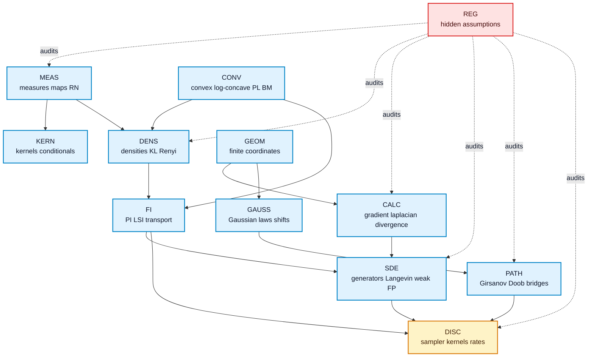

## Root Matrix

| Chapter | MEAS | KERN | DENS | CONV | CALC | GAUSS | FI | SDE | PATH | DISC | REG |
|---|---|---|---|---|---|---|---|---|---|---|---|
| 1 Langevin diffusion | Y |  | Y | Y | Y | Y | Y | Y |  |  | Y |
| 2 Functional inequalities | Y |  | Y | Y |  |  | Y | Y |  |  | Y |
| 3 Stochastic analysis | Y |  | Y |  |  | Y |  | Y | Y |  | Y |
| 4 LMC | Y | Y | Y | Y | Y | Y | Y | Y | Y | Y | Y |
| 5 Faster low-accuracy | Y | Y |  |  | Y | Y |  | Y | Y | Y | Y |
| 6 Renyi convergence | Y | Y | Y |  |  | Y | Y | Y | Y | Y | Y |
| 7 High-accuracy | Y | Y | Y | Y |  | Y |  |  |  | Y | Y |
| 8 Proximal sampler | Y | Y | Y | Y |  | Y | Y | Y | Y | Y | Y |
| 9 Lower bounds | Y |  | Y | Y |  | Y |  |  |  | Y | Y |
| 10 Structured sampling | Y | Y | Y | Y | Y |  |  | Y |  | Y | Y |
| 11 Non-log-concave | Y |  | Y |  | Y |  | Y | Y |  | Y | Y |
| 12 Diffusion models | Y | Y | Y |  | Y | Y | Y | Y | Y | Y | Y |

## Theorem-To-Leaf Pipeline

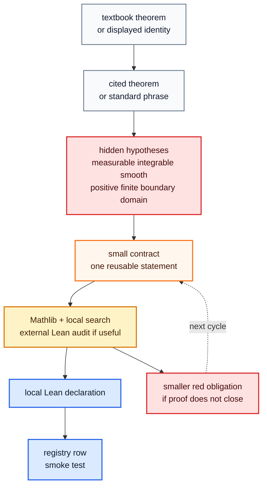

Blue requires all three gates:

| Gate | Requirement |
|---|---|
| compile | `lake build Tests` succeeds |
| discover | declaration is recorded in `AutoSamplingTheory/TechnicalLemmas/Registry.lean` |
| explain | assumptions and exclusions are recorded in the DAG/README/JSONL memory |

## Chapter 1 Proof Chain

The active chain is the continuous-time Langevin route toward the Gibbs
invariant law.  The blue work is finite-dimensional finite-box analytic
infrastructure.  It is not yet a whole-space IBP theorem, generator-domain
theorem, semigroup theorem, invariant-measure theorem, or reversibility theorem.

| Textbook anchor | Textbook step | Lean status |
|---|---|---|
| Example 1.2.8 | compute the Langevin adjoint; the second equality is attributed to integration by parts | pointwise algebra and finite-box cancellation are blue; whole-space passage is red |
| Corollary 1.2.9 | conclude that the stationary density is proportional to `exp(-V)` | red until weighted IBP and generator/semigroup domain contracts are blue |
| Section 1.2 warning | generator domains and symmetric/self-adjoint operator distinctions are deliberately brushed over | tracked as separate red contracts, not hidden inside the IBP theorem |

The source and background-textbook audit is recorded in
`research-wiki/cited-results/log_concave_sampling_chapter1_background.md`.

```mermaid
flowchart TD
  Gibbs[Gibbs target<br/>pi(dx) proportional to exp(-V) dx]:::goal
  Norm[normalization / withDensity<br/>probability wrappers]:::blue
  Gen[pointwise generator display<br/>Lf = Delta f - <grad V, grad f>]:::blue
  Weight[weighted algebra<br/>exp(-V) Lf]:::blue
  Div[coordinate divergence<br/>trace convention]:::blue
  Box[finite-box divergence theorem<br/>with signed face terms]:::blue
  Cut[local smooth cutoff<br/>support handoffs]:::blue
  Exact[exact open-box support<br/>and positivity]:::blue
  Plateau[compact-in-open / Pi-box<br/>plateau = 1]:::blue
  Radial[radial cutoff family<br/>compact support + pointwise limit]:::blue
  Zero[zero-face wrappers<br/>support or boundary cancellation]:::blue
  Deriv1[scale-uniform cutoff fderiv<br/>O(R^-1)]:::blue
  DZero[closed outer region<br/>totalized fderiv = 0]:::blue
  PiBridge[PiLp cutoff derivative<br/>and smulRight trace]:::blue
  Deriv2[Hessian/Laplacian cutoff<br/>O(R^-2)]:::red
  Tail[L1 cutoff-gradient tail<br/>from Integrable field]:::red
  IBP[weighted IBP<br/>integral Lf d pi = 0]:::red
  Domain[generator/semigroup<br/>domain contracts]:::red
  Inv[invariant Gibbs law]:::red
  Rev[reversibility<br/>KL/FI dissipation]:::red

  Gibbs --> Norm --> Inv
  Gen --> Weight --> Div --> Box --> Zero --> Tail --> IBP --> Inv --> Rev
  Cut --> Zero
  Exact --> Zero
  Exact --> Plateau
  Radial --> Deriv1 --> PiBridge --> Tail
  Radial --> DZero
  Radial --> Deriv2
  Domain --> Inv

  classDef goal fill:#f8fafc,stroke:#475569,color:#0f172a,stroke-width:2px;
  classDef blue fill:#dbeafe,stroke:#2563eb,color:#0f172a,stroke-width:2px;
  classDef red fill:#fee2e2,stroke:#dc2626,color:#450a0a,stroke-width:2px;
```

### Finite-Box Zoom

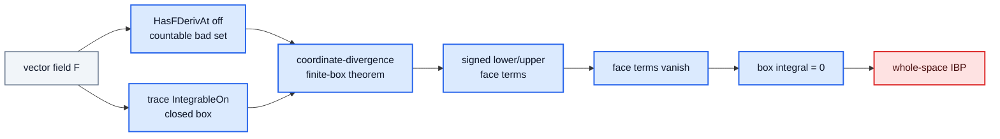

### Cutoff-Smul Zoom

```mermaid
flowchart TD
  Local[pointwise smooth cutoff<br/>tsupport inside open box]:::blue
  Supp[Function.support<br/>inside open box]:::blue
  Exact[exact Function.support<br/>= open box]:::blue
  Pos[strict positivity<br/>on open box]:::blue
  Plateau[compact/open plateau<br/>Pi-box specialization]:::blue
  Radial[radial family<br/>tsupport in closed ball<br/>pointwise tends to 1]:::blue
  Smul[cutoff-smul support<br/>field vanishes on faces]:::blue
  Reg[cutoff-smul regularity<br/>ContinuousOn + fderiv off countable]:::blue
  Trace[cutoff-smul trace<br/>ContinuousOn + IntegrableOn]:::blue
  Zero[finite-box divergence<br/>integral = 0]:::blue
  Deriv1[radial cutoff fderiv<br/>O(R^-1)]:::blue
  DZero[closed outer region<br/>totalized fderiv = 0]:::blue
  PiBridge[PiLp derivative +<br/>smulRight trace]:::blue
  Deriv2[Hessian/Laplacian cutoff<br/>O(R^-2)]:::red
  Tail[L1 cutoff-gradient tail<br/>from Integrable field]:::red
  IBP[weighted Gibbs IBP]:::red

  Local --> Supp --> Smul --> Zero
  Exact --> Pos
  Exact --> Plateau
  Exact --> Smul
  Plateau --> Smul
  Radial --> Deriv1 --> PiBridge
  Radial --> DZero
  Radial --> Deriv2
  Reg --> Zero
  Trace --> Zero
  Deriv1 --> Reg
  PiBridge --> Tail
  Zero --> Tail --> IBP

  classDef blue fill:#dbeafe,stroke:#2563eb,color:#0f172a,stroke-width:2px;
  classDef red fill:#fee2e2,stroke:#dc2626,color:#450a0a,stroke-width:2px;
```

### Chapter 1 Leaf Groups

| Group | Owner module | Blue examples | Red exclusion |
|---|---|---|---|
| generator display | `StochasticProcesses.Langevin` | finite Euclidean/Pi displays of `Delta f - <grad V, grad f>` | no semigroup-generator semantics |
| Gibbs density | `Measure.Gibbs`, `Measure.GibbsIntegral`, `Measure.GibbsLogConcavity` | normalized withDensity wrappers, real-density bridges | no invariant-law statement |
| regularity | `Analysis.Calculus.*`, `StochasticProcesses.Langevin` | gradient continuity, Laplacian continuity, canonical `fderiv` trace handoffs | no whole-space domination |
| finite boxes | `Analysis.Calculus.Divergence` | trace-to-coordinate transfer, a.e. bridge, signed face terms | no tail limit |
| reusable smooth cutoffs | `Analysis.Calculus.Cutoff` | unit/radial cutoffs, closed-ball support/`tsupport`, compact support, pointwise exhaustion, generic compact-in-open plateau, one-constant-for-all-scales `O(R^-1)` first-derivative control, and closed outer-region derivative zero | `L¹` tail passage remains; second-order bounds wait for a named consumer |
| finite-box cutoffs | `Analysis.Calculus.Divergence` | local Pi-open-box cutoffs, exact plain support and positivity, one compactly supported cutoff equal to `1` on an entire inner closed Pi-box | no derivative-controlled box exhaustion or whole-space limit |
| cutoff-smul | `Analysis.Calculus.Divergence` | support, face cancellation, regularity, trace integrability wrappers, radial-cutoff PiLp derivative producer, and `smulRight` basis-trace identity | no integral tail limit |

## Other Theorem Subtrees

Every major theorem should get a smaller tree like the Ch.1 tree, while
reusing the same root labels.

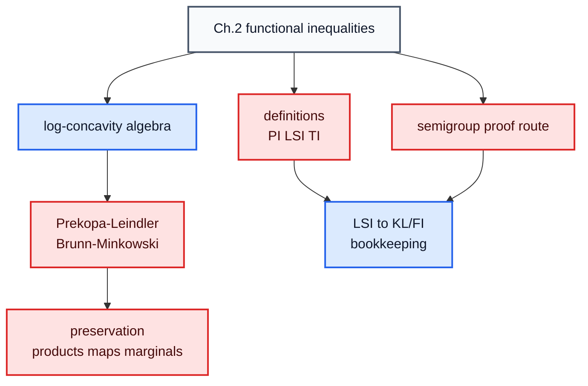

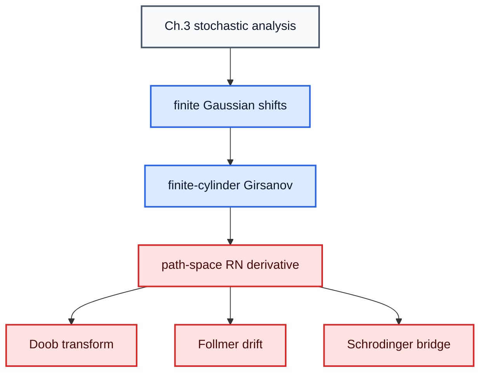

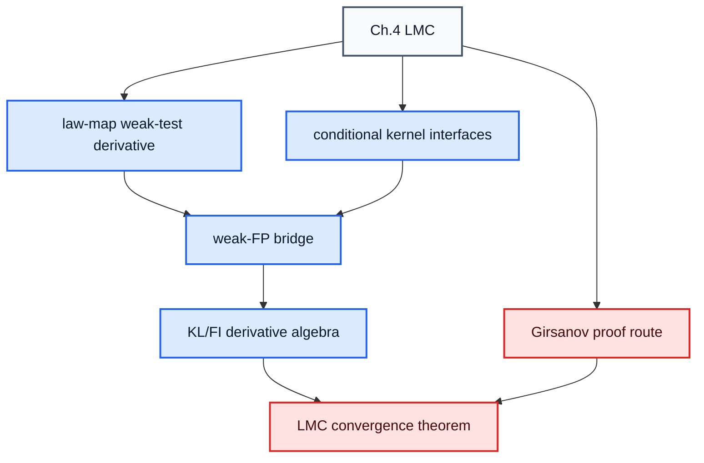

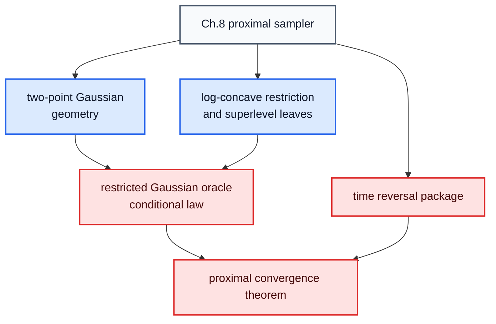

## Current Red Queue

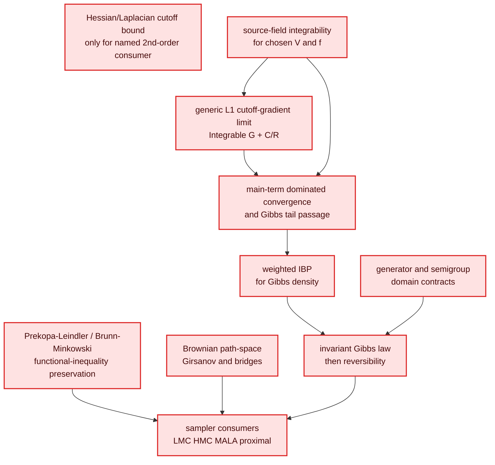

Next work should close one red prerequisite at a time.  It should not state an
invariant-law theorem until weighted IBP and generator-domain contracts are
blue.

## File Map

| Need | File |
|---|---|
| chapter-to-Lean route | `research-wiki/sampling-sde-library/roadmap/log_concave_sampling_to_lean_tree.md` |
| master blue/red DAG | `research-wiki/lemma-dags/log_concave_sampling_foundation.md` |
| Lean module atlas | `research-wiki/sampling-sde-library/README.md` |
| generated module graph | `research-wiki/sampling-sde-library/lean-leaf-module-graph.md` |
| one-card-per-module summaries | `research-wiki/sampling-sde-library/cards/` |
| compiled declarations | `AutoSamplingTheory/TechnicalLemmas/Registry.lean` |
| smoke count | `Tests/Basic.lean` |
| external Lean references | `research-wiki/external-lean-libraries/` |
| source/citation obligations | `research-wiki/source-index/`, `research-wiki/cited-results/` |
| next six-hour run packet | `agent-briefs/log_concave_sampling_6h_execution_pack.md` |

## ASTIS Run Loop

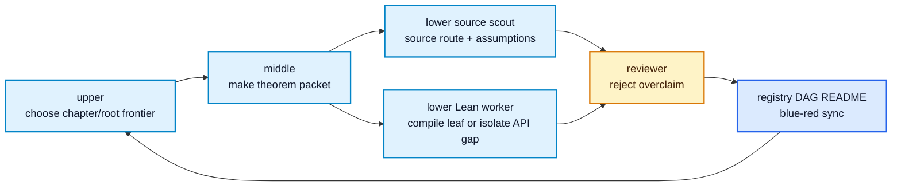

Manual cycle gate:

```bash
lake build Tests
python3 tools/astis.py check
python3 tools/astis.py module-graph-refresh
python3 tools/astis.py lemma-dag-refresh
python3 tools/astis.py blueprint-refresh ASTIS-CHEWI-001
python3 tools/astis.py memory-refresh ASTIS-CHEWI-001 --cycle <n> --run-id <run-dir>
```

Six-hour console run:

```bash
python3 tools/astis.py launch-log-concave-6h --hours 6 --wall-hours 24 --lower-count 3
```

The diagrams are navigation.  Lean, tests, and the registry decide blue status.
