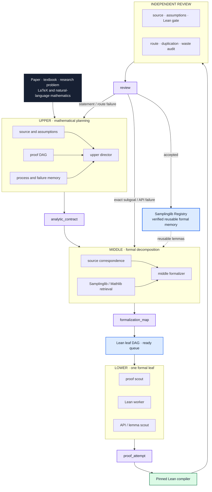

<div align="center">

# Auto-Sampling-Theory-In-Sleep

### A Hierarchical Automated Theorem Proving System for Sampling Theory


[](https://dakebu.github.io/Auto-Sampling-Theory-In-Sleep/)
[](https://lean-lang.org/)
[](https://mathlib.org/)
[](https://github.com/DakeBU/Auto-Sampling-Theory-In-Sleep/actions/workflows/blueprint-site.yml)

[**Samplinglib**](https://dakebu.github.io/Auto-Sampling-Theory-In-Sleep/)
· [**Lean Registry**](AutoSamplingTheory/TechnicalLemmas/Registry.lean)
· [**System Architecture**](docs/multi_agent_orchestration.md)

</div>

ASTIS represents mathematical proofs as source-backed, reusable dependency
DAGs. Specialized agents coordinate mathematical planning, formal
decomposition, Lean implementation, and independent verification. The first
major program reconstructs Sinho Chewi's
[*Log-Concave Sampling*](https://chewisinho.github.io/main.pdf) while building
reusable formal memory for future sampling-theory problems.

---

## News 🔥

- **July 2026** — Released the first user-facing version of
  [**Samplinglib**](https://dakebu.github.io/Auto-Sampling-Theory-In-Sleep/),
  connecting the textbook route, rigorous analytic details, Lean declarations,
  and source-backed verification.
- **June 2026** — Completed the first version of
  **Auto-Sampling-Theory-In-Sleep (ASTIS)**, the hierarchical automated theorem
  proving system for sampling theory.

---

## Core Contributions ◆

### 1. Hierarchical Automated Theorem Proving Harness

ASTIS is not a single model writing tactics. It maintains a typed proof state
across four cooperating levels:

- **Upper** audits sources, assumptions, state spaces, measures, regularity,
  boundaries, failed routes, and the shared proof DAG.
- **Middle** is the natural-mathematics ↔ Lean boundary. It fixes statements,
  hypotheses, source anchors, local lemmas, Mathlib candidates, rejected API
  matches, and a ready Lean leaf DAG.
- **Lower** separates proof-route scouting, Lean implementation, and focused
  local/Mathlib retrieval for one leaf at a time.
- **Reviewers** independently check source fidelity, hidden assumptions,
  statement drift, fake closure, Lean evidence, and repeated low-value work.

The deterministic harness preserves typed artifacts, immutable proof branches,
cross-process locks, exact-field memory, interrupted-run recovery, route
fingerprints, and compiler feedback.

### 2. Samplinglib: Verified Memory for Sampling Theory

**Samplinglib** is the public Lean library, learning environment, and
verification surface produced and maintained by ASTIS. It begins with a
formal reconstruction of *Log-Concave Sampling*, but organizes the resulting
measure theory, probability, functional inequalities, stochastic processes,
SDE, Langevin, and sampler interfaces for reuse beyond one textbook.

---

## System Architecture ◇



The conversion window is bidirectional:

```text
natural mathematics  ⇄  typed formalization state  ⇄  verified Lean
```

Compiled declarations, exact residual obligations, and reviewer verdicts flow
back into source correspondence, the proof DAG, run capsules, and human-facing
status. Lean compilation never substitutes for semantic review.

---

## Samplinglib Learning Surface 📚

<p align="center">
  
</p>

Readers can move through the library at three linked depths:

1. **Calculation Route** — formulas, intuition, and the textbook proof route.
2. **Rigorous Details** — measurability, integrability, representatives,
   approximation, limits, boundaries, regularity, and operator domains.
3. **Lean Foundations** — exact declarations, imports, dependencies, source
   lines, Registry evidence, tests, and the current Lean gate.

The [Live Formalization workspace](https://dakebu.github.io/Auto-Sampling-Theory-In-Sleep/live/)
adds reviewed examples, LaTeX rendering, Samplinglib/Mathlib retrieval, local
Lean diagnostics, and export to ASTIS typed packets. Candidate translation,
compilation, semantic review, proof, and reviewer acceptance remain separate
states.

---

## Organizers ✦

**Dake Bu, Ji Cheng, Atsushi Nitanda, Hau-San Wong, and Qingfu Zhang**

## Citation 📝

```bibtex
@misc{bu2026astis,
  title        = {Auto-Sampling-Theory-In-Sleep: A Hierarchical Automated
                  Theorem Proving System for Sampling Theory},
  author       = {Dake Bu and Ji Cheng and Atsushi Nitanda and
                  Hau-San Wong and Qingfu Zhang},
  year         = {2026},
  howpublished = {GitHub repository and Samplinglib formalization website},
  url          = {https://github.com/DakeBU/Auto-Sampling-Theory-In-Sleep}
}
```

ASTIS is the research system and proving harness. Samplinglib is its public
Lean library and learning interface. External libraries, textbooks, papers,
and repositories are cited as mathematical or design provenance and do not
imply endorsement.
