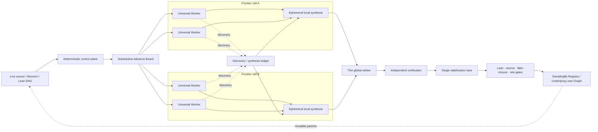

# ASTIS Harness vNext.1: Substantive-Advance Frontier Mesh

ASTIS formalizes sampling theory as a source-backed Lean dependency graph. Its
control plane must optimize **mathematical graph progress**, not the number of
agents, role handoffs, prompts, files, or locally green wrappers.

The active unit is a **Substantive Advance Unit (SAU)**: one bounded mathematical
delta in the live theorem DAG, owned end to end by one Universal Worker. Harness
vNext.1 keeps that unit and removes the next bottleneck: a monolithic Master
should not have to ingest and re-synthesize every Worker transcript.

The resulting architecture is a **frontier mesh**:

1. deterministic code maintains the board, ownership, state machine, duplicate
   suppression, checkpoints, and stabilization lock;
2. Universal Workers solve theorem-sized deltas and may temporarily synthesize
   one connected frontier cell;
3. a thin global arbiter reads bounded cell syntheses and resolves only
   cross-cell priority, conflict, and stabilization decisions.

Fixed Upper/Middle/Lower responsibilities are no longer the organizational
skeleton. Their old typed artifacts remain readable historical memory.

## 1. What the log audit showed

The change is based on ASTIS's own execution history rather than on an abstract
preference for flatter teams.

### 1.1 The old role ladder paid the same context repeatedly

The post-cycle-98 SALD audit recorded a recurring pattern: broad source
contracts, route reminders, trial memory, and current blockers were separately
loaded by Upper, Middle, Lower, and Reviewer prompts even after the true residual
problem had become narrow. Each role could return a locally valid artifact while
the same mathematical edge remained open.

The important diagnosis is not “specialization is always bad”. It is that the
**handoff was smaller than the useful unit of mathematical progress**. A source
reader could identify a decisive regularity issue but not repair the Lean
statement; a Lean worker could discover a better theorem decomposition but be
asked to touch one script; a reviewer could diagnose wrapper churn only after a
whole cycle had consumed context.

### 1.2 The Brenier branch exposed integration and synthesis cost

The Brenier/Rockafellar work before Harness vNext produced many useful verified
leaves, often as a theorem commit plus a focused smoke-check commit. The
mathematics advanced, but the global operator repeatedly had to reconstruct how
local blocks, common-mass slicing, product laws, cost bookkeeping, optimality,
closed-chain algebra, and the Rockafellar potential fit together. Shared import,
test, Registry, and PR work also became a serial queue.

After the SAU control plane landed, the next work naturally split into independent
theorem deltas: the proper Rockafellar root, relation-point support, effective
-domain convexity, open-domain a.e. differentiability, and marginal a.e. pullback.
Each packet explicitly named its DAG role and truth boundary. This is evidence
that end-to-end generalist ownership is the correct direction.

The remaining bottleneck moved upward: if one Master must read every SAU report,
reconcile all discoveries, and decide every local join, its own generation speed
becomes the serial limit. vNext.1 therefore distributes **local synthesis**
without reintroducing permanent roles.

ASTIS does **not** claim a 30× speedup from this redesign. That number has been
reported informally for other math-harness settings, but ASTIS will only make an
efficiency claim after measuring theorem-DAG delta per token and active-agent
hour under comparable workloads.

## 2. Canonical architecture



The checked-in diagram is
`docs/assets/substantive-advance-architecture.mmd`.

## 3. Deterministic control plane

The control plane should do what code can do more reliably and cheaply than an
LLM:

- recover append-only state after interruption;
- enforce legal lifecycle transitions;
- assign and preserve SAU ownership;
- normalize and reject duplicate active theorem targets;
- keep source anchors, truth boundaries, DAG parents, target declarations, and
  focused checks explicit;
- group nearby advances into named frontier cells;
- count unchanged route/progress checkpoints;
- freeze repeated no-progress routes;
- expose a bounded synthesis-first capsule;
- enforce one stabilization owner.

The implementation is `tools/astis_advance.py`. Its durable I/O continues to use
`tools/astis_harness.py`, so old role artifacts and interrupted JSONL remain
readable.

The control plane must not invent proof strategy, paraphrase exact assumptions,
or decide that a plausible report is mathematically true.

## 4. Substantive Advance Board

A proposal records:

- `advance_id`, task id, and frontier cell;
- exact goal and source anchor;
- explicit theorem delta and target declaration names;
- current truth boundary;
- DAG parents/inputs;
- proposed owned files;
- focused acceptance checks;
- temporary Worker modes;
- priority.

The semantic fingerprint excludes the Worker and branch name. It normalizes
harmless presentation differences and fingerprints the mathematical target. A
matching active proposal is rejected rather than assigned twice.

The board is pull-friendly. The arbiter may propose high-value cells, but a
Universal Worker may also surface a dependency-ready SAU or a validated discovery
that should become one. The deterministic board—not a long Master monologue—owns
identity, status, and conflicts.

## 5. Universal Workers

One Worker owns one SAU **end to end**. It may switch among:

- source and assumption audit;
- natural-language proof design;
- Samplinglib/Mathlib retrieval;
- counterexample or boundary search;
- Lean theorem design and implementation;
- focused compiler diagnosis;
- local refactoring and exposition;
- local frontier synthesis.

These are modes, not permissions. A Worker that discovers a better decomposition
may use it; a Worker that sees a source flaw must record it; a Worker that closes
a reusable API may publish the interface. The Worker does not stop merely because
an older role boundary has been reached.

A `PROVED_LOCAL` result must be one of:

1. `theorem-edge` — a source-backed theorem edge was compiled;
2. `reusable-interface` — a general interface needed by multiple consumers was
   compiled;
3. `integration-node` — several verified parents were joined into a higher DAG
   node.

It must name the declaration, files, focused checks, and remaining truth
boundary. A helper that simply restates an assumption does not qualify.

## 6. Strict obstructions are progress; vague blockers are not

Some mathematically useful runs do not close the original theorem. They still
count only when the result changes the proof graph or future scheduling.

A `BLOCKED` packet therefore records:

- blocker class;
- exact residual statement/error;
- strict reduction achieved;
- at least one smaller next delta, retired route, counterexample, or minimal
  reproducer.

This lets the system preserve genuine negative knowledge while rejecting
“failed to solve” handoffs that consume context without narrowing the problem.

## 7. NoProgressGuard

Every bounded checkpoint records:

```text
route_fingerprint
progress_signature
mathematical_delta
exact_residual
context_characters
```

The first occurrence is normal. Two unchanged repeats after it flag the route
for diagnosis. A fourth identical checkpoint is rejected until the Worker:

- changes the mathematical route;
- returns a strict obstruction or counterexample;
- or produces a new theorem/interface delta.

This is analogous to FrontierAgent's coordinator-side no-progress protection,
but the signal is ASTIS-specific: unchanged formal target, route, and residual
proof state rather than repeated generic tool calls.

The guard prevents a run from looking active merely because agents continue to
edit or re-prompt around the same Lean goal.

## 8. Frontier cells and ephemeral local synthesis

A **frontier cell** is a connected local neighborhood of the live proof graph.
Advances may be grouped because they share source statements, DAG parents,
interfaces, theorem declarations, owned modules, or a later integration node.
The grouping is dynamic and may change as the graph advances.

When a cell has several active SAUs, any Universal Worker can temporarily produce
a `synthesis` discovery containing:

- the verified/blocked graph delta in that cell;
- shared parents and consumers;
- conflicts or duplicate routes;
- reusable discoveries;
- retired paths;
- next independent SAUs and the eventual join condition.

Another Worker validates the synthesis. It then appears ahead of raw discoveries
in the coordinator capsule. This removes most local recomposition work from the
global Master while avoiding a permanent “middle manager” whose role could
suppress ideas outside a fixed responsibility box.

A cell requests synthesis when it contains multiple active advances with no
validated synthesis, or when one of its Workers hits the no-progress guard.

## 9. Thin global arbiter

The global arbiter performs only decisions requiring cross-cell understanding:

- choose among competing high-value frontier cells;
- resolve overlapping ownership or shared-file conflicts;
- decide whether a validated discovery should become a new SAU;
- schedule joins whose parents live in different cells;
- order the verified stabilization queue;
- retire stale global routes.

It reads the bounded output of:

```bash
python3 tools/astis_advance.py capsule
```

The capsule is cell-synthesis-first, includes omission counts and
no-progress flags, and explicitly excludes raw Worker transcripts. The arbiter
opens deeper evidence only for a named unresolved conflict or admission audit.

This is the main answer to the Master bottleneck: distribute local synthesis,
make bookkeeping deterministic, and reserve scarce global reasoning for true
cross-cell decisions.

## 10. Independent verification

The proving Worker cannot publish `VERIFIED`. An independent verifier records:

- verifier identity;
- exact checked commit;
- Lean/focused gate output;
- source/assumption audit;
- fake-closure scan.

`PROVED_LOCAL` is weaker than `VERIFIED`, and `VERIFIED` remains weaker than
`MERGED`. Vocabulary may not turn branch-local compilation into public truth.

## 11. Single stabilization lane

Mathematical work can be parallel; **shared repository truth is serialized**.
Exactly one integration owner may occupy `STABILIZING`.

That owner may:

- clean-port a verified theorem onto current `main`;
- resolve theorem/import collisions;
- edit shared parent imports and root tests;
- update the Samplinglib Registry;
- update source correspondence and completion matrices;
- update Underlying Lean Graph evidence;
- update public site status;
- publish the canonical PR/merge commit.

Workers should own isolated theorem modules and focused tests during exploration.
They should not concurrently edit root aggregators, Registry tables, source
matrices, or public truth surfaces.

## 12. Discovery and synthesis ledger

Workers often find useful facts outside the assigned theorem: a reusable measure
interface, a missing Mathlib bridge, a counterexample, a source ambiguity, a
refactor, a conjecture, or a better process rule. These must survive Worker
termination without becoming unverifiable lore.

Supported kinds are:

- lemma;
- interface;
- counterexample;
- source gap;
- refactor;
- conjecture;
- process improvement;
- frontier synthesis.

The lifecycle is `raw -> validated -> scheduled -> merged` (or `rejected`).
Semantic duplicates are suppressed so later Workers retrieve one canonical
record rather than repeatedly rediscovering it.

## 13. Relation to FrontierAgent

FrontierAgent provides useful generic control-plane lessons:

- coordinator plus task board;
- bounded parallel sub-agents;
- structured report collection;
- checkpoint/resume;
- fanout/depth/time guards;
- a coordinator-specific no-progress guard;
- optional lightweight final reporting.

ASTIS adopts those principles selectively. Its unit of truth is not a generic
file task or plausible report. It is a source-backed theorem-DAG delta with Lean
evidence, explicit truth boundary, reusable discovery provenance, and serialized
admission to Samplinglib.

ASTIS also differs in where hierarchy is allowed. Deterministic state and
frontier-cell aggregation may be hierarchical for efficiency; mathematical
capability is not. Every Worker remains generalist, and local synthesis is an
ephemeral action rather than a permanent role.

## 14. Efficiency metrics

Harness vNext.1 should be judged by output, not activity. Long-run reports should
track:

- merged theorem edges, reusable interfaces, and integration nodes;
- strict obstructions and routes retired;
- validated discoveries later reused by another SAU;
- Worker input/output context characters;
- global-arbiter capsule characters;
- repeated route/progress checkpoints and freeze events;
- duplicate proposal/discovery rejections;
- stabilization wait time and shared-file conflict count;
- theorem-DAG delta per million tokens;
- theorem-DAG delta per active-agent hour.

The main token-efficiency ratio is:

```text
global-arbiter context / total Worker context
```

It should fall as validated cell syntheses become reusable. A smaller ratio is
not sufficient by itself: theorem-DAG progress and source fidelity must remain
stable or improve.

## 15. Compatibility with the original typed harness

No historical migration is required. `tools/astis_harness.py` still provides:

- canonical-path locking;
- fsync-backed append-only JSONL;
- interrupted-tail recovery;
- canonical JSON and hashes;
- typed legacy role artifacts;
- immutable route and proof-branch memory.

Old `upper`, `middle`, `lower_*`, and `reviewer` profile keys may remain as
execution slots. They no longer define what an agent is allowed to think about,
and a new theorem should not be forced through every slot.

## 16. Operational checks

```bash
python3 -m unittest tools.tests.test_astis_advance
python3 -m unittest tools.tests.test_harness_vnext
python3 tools/astis_advance.py capsule
python3 tools/astis.py check
```

The tests cover:

- normalized duplicate target suppression;
- Worker-lane ownership;
- substantive `PROVED_LOCAL` evidence;
- independent verification evidence;
- strict `BLOCKED` evidence;
- no-progress route freezing;
- discovery/synthesis persistence and duplicate suppression;
- frontier-cell capsule construction;
- single stabilization ownership;
- interrupted JSONL recovery;
- public removal of the old fixed-role scheduler.

## 17. Success criterion

A successful ASTIS run is explainable as verified graph change:

```text
existing verified parents
    -> one substantive theorem delta or strict obstruction
    -> focused evidence
    -> optional validated local-cell synthesis
    -> independent verification
    -> current-main stabilization
    -> reusable Samplinglib node / corrected proof plan
```

That sequence is the object ASTIS will later compress and visualize. It is also
the right granularity for deciding whether new work adds a marginal leaf,
creates a new formal-graph connection, or introduces a genuinely new proof
technique.
