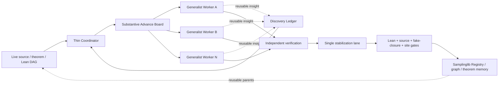

# ASTIS Harness vNext: Substantive-Advance Orchestration

ASTIS formalizes sampling theory as a source-backed Lean dependency graph. The
control plane must therefore optimize **mathematical graph progress**, not the
number of agent handoffs, prompts, files, or locally green wrappers.

The active unit of work is now a **Substantive Advance Unit (SAU)**: one bounded
mathematical delta in the live theorem DAG, owned end to end by one generalist
worker. The earlier Upper/Middle/Lower/Reviewer artifacts remain readable and
useful as durable memory, but they are no longer the scheduler's organizational
skeleton.

## 1. Why the fixed role ladder was changed

The earlier harness successfully added several pieces of infrastructure that we
keep: exact source contracts, immutable proof branches, typed memory, route
fingerprints, file locks, interrupted-run recovery, and deterministic Lean
checks. Its weakness was the **unit of delegation**.

A theorem obligation could move from source auditor to formalizer to Lean
worker to reviewer while remaining mathematically unchanged. That creates four
failure modes:

1. **Handoff tax.** Every boundary repeats assumptions, notation, failed API
   candidates, and local proof state.
2. **Local optimum bias.** A role can produce a correct artifact without asking
   whether the global theorem graph actually advanced.
3. **Duplicate frontier work.** Two agents can attack differently named packets
   that represent the same mathematical delta.
4. **Integration contention.** Independently useful branches can all edit root
   imports, Registry metadata, tests, and site evidence at once.

Harness vNext separates *parallel mathematical exploration* from *serialized
repository stabilization*.

## 2. Canonical architecture



The corresponding checked-in diagrams are:

- `docs/assets/substantive-advance-architecture.mmd`;
- `docs/assets/substantive-advance-lifecycle.mmd`;
- `docs/assets/samplinglib-vnext-architecture.mmd`.

## 3. Thin Coordinator

The coordinator is deliberately small. It does not reproduce the mathematical
proof. It reads the live theorem DAG plus a bounded state capsule and decides
**which independent theorem deltas are worth owning next**.

A proposal records:

- `advance_id` and task id;
- exact goal and source anchor;
- explicit theorem delta;
- current truth boundary;
- DAG parents/inputs;
- proposed owned files;
- focused acceptance checks;
- temporary worker modes;
- priority.

The semantic fingerprint excludes the worker/id and fingerprints the
mathematical content. While a matching advance is active, a second proposal is
rejected as a duplicate even if it has another branch name or agent label.

The coordinator capsule is bounded structured state, not a transcript summary.
It contains the most relevant advances and validated discoveries together with
explicit omission counts and serialized size.

## 4. Generalist Substantive-Advance Worker

One worker owns one theorem delta **end to end**. The canonical worker packet is
`.agents/skills/astis-substantive-advance/SKILL.md`.

The worker may switch among temporary modes such as:

- source audit;
- mathematical proof design;
- Samplinglib/Mathlib retrieval;
- counterexample search;
- Lean implementation;
- focused compiler diagnosis;
- local proof review.

These are capabilities, not handoff boundaries. The worker should stop only
when the proposed theorem edge is locally proved or when the remaining blocker
has been strictly reduced and evidenced.

A `PROVED_LOCAL` result must name:

1. the theorem delta actually obtained;
2. the Lean files containing it;
3. focused checks that exercised it;
4. the remaining truth boundary.

A green helper that merely restates a supplied assumption is not a substantive
advance.

### File ownership

Parallel workers own isolated theorem modules and focused tests. They do **not**
edit shared aggregation surfaces during exploration, including the root
`Analysis.lean`, `Measure.lean`, `Tests.lean`, Registry tables, source/status
matrices, or public site evidence. This sharply reduces branch conflicts.

## 5. State machine

```text
PROPOSED
  -> CLAIMED
  -> EXPLORING
  -> PROVED_LOCAL
  -> VERIFIED
  -> STABILIZING
  -> MERGED
```

Two non-success states preserve honest boundaries:

- `BLOCKED`: the route is still potentially useful, but an exact mathematical,
  source, or API blocker remains;
- `QUARANTINED`: the route should not currently influence scheduling or library
  truth.

`PROVED_LOCAL` is intentionally weaker than `VERIFIED`; `VERIFIED` is weaker
than `MERGED`. This prevents branch-local compilation from becoming public
truth by vocabulary drift.

The deterministic implementation is `tools/astis_advance.py`.

## 6. Discovery Ledger

Workers often discover something valuable that is not the theorem they were
assigned: a reusable measure interface, a missing Mathlib bridge, a
counterexample to an overstrong conjecture, a source ambiguity, or a graph
refactor. These facts should not disappear when the worker terminates, and they
should not silently become verified library facts either.

The Discovery Ledger is a separate append-only bus with explicit provenance.
Supported discovery kinds include:

- lemma;
- interface;
- counterexample;
- source gap;
- refactor;
- conjecture;
- process improvement.

Its lifecycle is `raw -> validated -> scheduled -> merged` (or `rejected`). A
validated discovery can inform future coordinator choices without reopening the
original worker transcript.

## 7. Single stabilization lane

Mathematical work can be parallel; **shared repository stabilization is
serialized**. Exactly one integration owner may occupy `STABILIZING` at a time.
That owner may:

- clean-port a verified theorem onto current `main`;
- resolve theorem-name or import collisions;
- update parent imports and root tests;
- update Samplinglib Registry entries;
- update source correspondence and completion matrices;
- update Underlying Lean Graph evidence;
- update public site status.

This is the key distinction between *proof concurrency* and *repository
concurrency*. It lets workers be aggressive without turning shared files into a
merge-conflict queue.

## 8. Deterministic gates and truth boundary

Harness vNext does not weaken the existing ASTIS truth contract. Admission to
Samplinglib still requires the relevant combination of:

- pinned Lean/Mathlib compilation;
- focused theorem tests;
- no `sorry`, `admit`, new axiom, or fake `True` closure;
- source statement and assumption audit;
- explicit integrability/measurability/domain obligations where applicable;
- current-main compatibility;
- public-site evidence only after the formal/source route is actually closed.

The worker packet therefore carries `truth_boundary` as a first-class field.
When the source omits a proof, ASTIS records it as omitted/inherited; it does not
invent prose and present it as source text.

## 9. Compatibility with the original typed harness

`tools/astis_harness.py` remains the durable low-level substrate and legacy
memory reader. In particular, vNext reuses its:

- canonical-path `flock`;
- `fsync`-backed append-only JSONL;
- interrupted-tail recovery;
- canonical JSON and hashes;
- typed historical role artifacts;
- immutable proof-branch and route memory.

No migration is required to read prior cycles. The conceptual change is that
those artifacts are now **evidence available to an SAU worker**, not mandatory
stages through which every new theorem must travel.

## 10. Relation to other agent systems

General agent-team systems demonstrate that a thin coordinator, bounded
parallel workers, task boards, resumable state, and explicit report collection
can outperform a single monolithic loop on long-horizon work. ASTIS adopts that
control-plane lesson but its unit of truth is different: a source-backed theorem
DAG edge with Lean evidence.

Accordingly:

- worker success is theorem progress, not a plausible report;
- side discoveries have mathematical provenance and validation states;
- the coordinator schedules DAG deltas, not arbitrary file tasks;
- one stabilization lane owns public library truth;
- source/Lean/fake-closure gates remain authoritative.

This is why the system is not simply a generic agent team wrapped around Lean.
The formal graph is both the work queue and the accumulating scientific memory.

## 11. Operational checks

Harness vNext contracts are exercised directly by CI:

```bash
python3 -m unittest tools.tests.test_astis_advance
python3 -m unittest tools.tests.test_harness_vnext
python3 tools/astis_advance.py capsule
```

The tests cover semantic duplicate suppression, state transitions,
`PROVED_LOCAL` evidence, single stabilization ownership, discovery persistence,
and interrupted JSONL recovery. The website test additionally fails if the
public workflow still exposes the old fixed-role scheduler tokens.

## 12. Success criterion

A successful ASTIS run should be explainable as a sequence of verified graph
changes:

```text
existing verified parents
    -> one substantive theorem delta
    -> focused evidence
    -> independent verification
    -> current-main stabilization
    -> reusable Samplinglib node
```

That sequence is the object we later want to compress and visualize. It is also
the right granularity for deciding whether a new result adds a marginal leaf or
creates a genuinely new formal-graph connection and mathematical technique.
