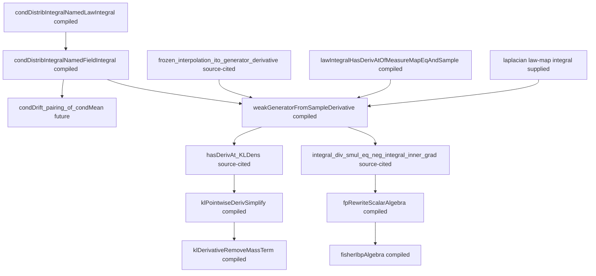

# Pro-Assimilated SDE/Sampling Leaf Targets

This file compresses the external proof-engineering advice packet into ASTIS
leaf targets.  It is meant for upper and middle agents before the next 6h run.
Do not paste the long advice packet into every prompt; retrieve this compact
DAG instead.

## Main Route

## Directly Provable Lean Leaves

| Leaf | Intended shape | First search area |
|---|---|---|
| `condDistribIntegralNamedFieldIntegral` | Named conditional-integral version integrates to the original joint-law integral. | ASTIS conditional-kernel module, `integral_congr_ae`. |
| `condDrift_pairing_of_condMean` | Conditional mean version using Bochner integral and continuous linear maps. | Bochner integral continuous-linear-map APIs. |
| `weakGeneratorFromSampleDerivative` | HasDerivAt law-level weak-generator form from supplied Ito/sample derivative and pairings. | ASTIS law-map derivative rewrite. |
| `klPointwiseDerivSimplify` | Real algebra for derivative of `q * log (q / p)`. | `field_simp`, `ring`. |
| `klDerivativeRemoveMassTerm` | Remove the mass-conservation derivative term. | `simpa`, commutative additive rewrites. |
| `fpRewriteScalarAlgebra` | Rewrite `-div(q b) + a lap q` into `a div(q A) + div(q V)`. | `ring`. |
| `fisherIbpAlgebra` | Combine two IBP identities into the Fisher/cross term. | `ring`. |
| `covariance_contracts_bilinear_form` | Covariance contracts a bilinear form to the coordinate trace. | Finite sums over `Fin d`, coordinate moments. |

## Source-Cited Or Isolated Analytic Contracts

| Contract | Why it is isolated |
|---|---|
| `frozen_interpolation_ito_generator_derivative` | Requires finite-dimensional Ito formula and martingale expectation zero. |
| `hasDerivAt_KLDens` | Requires local dominated derivative structure for a parameter integral. |
| `integral_div_smul_eq_neg_integral_inner_grad` | Requires compact-support, torus, or decay/no-boundary assumptions. |
| `taylor_second_order_remainder_bound` | Requires high-order finite-dimensional Taylor theorem with explicit remainder. |
| `frozen_gaussian_one_step_generator` | Backup Markov-kernel route; useful only if the Ito route is unusable. |

## Hidden Contracts To Expose

- `State d = EuclideanSpace R (Fin d)` or an explicitly equivalent state
  type.
- Probability or finite measure assumptions on the sample space.
- Measurability/a.e. measurability of `hatX`, frozen drift `B`, tests, gradient,
  and Laplacian fields.
- Integrability of `B`, pairings, Laplacian test, and KL/FI quantities.
- Eventual law identity `hatRho s = mu.map (hatX s)` near the derivative point.
- Conditional drift representative
  `barB = ae[mu.map (hatX s0)] condMean (hatX s0) B`.
- Positivity and domination assumptions for KL density derivatives.
- Compact support, periodicity, or decay/no-boundary assumptions for IBP.

## Next-Run Directive

The next lower batch should not redo `condDistribIntegralNamedFieldIntegral`,
`weakGeneratorFromSampleDerivative`, `klPointwiseDerivSimplify`,
`klDerivativeRemoveMassTerm`, `fpRewriteScalarAlgebra`, or `fisherIbpAlgebra`;
these leaves now compile locally.  The next real targets are the conditional
mean form if it is still needed, the dominated KL-density derivative contract,
the no-boundary IBP contract, and the covariance-to-trace Gaussian fallback.
Do not send lower agents back to the whole SALD theorem, and do not ask them
to formalize the full Ito formula unless the compiled weak-generator bridge is
shown insufficient.
