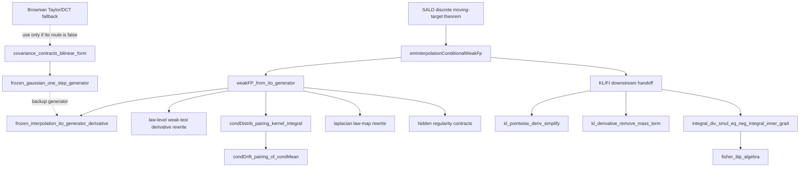

# SALD Weak-Fokker--Planck Leaf DAG

This graph records the current reusable technical-lemma route for the SALD
Euler--Maruyama interpolation / conditional weak Fokker--Planck backend.  It
is deliberately smaller than the whole SALD proof.  The purpose is to stop
lower agents from replaying broad SALD routes when one weak-test bridge is the
real blocker.

## Current Leaf Priorities

| Priority | Leaf | Status | Route |
|---|---|---|---|
| 1 | `condDistrib_pairing_kernel_integral` | directly provable target | Use `ProbabilityTheory.condDistrib`/conditional expectation bridge plus integral-map. Avoid vector conditional mean at first. |
| 2 | `weakFP_from_ito_generator` | directly provable target | Rewrite sample-space Ito derivative into law-level weak FP using law identity, conditional pairing, and Laplacian map rewrite. |
| 3 | `condDrift_pairing_of_condMean` | technical lemma after priority 1 | Pull inner product through Bochner integral with a continuous linear map. |
| 4 | `lawLevelDerivative_of_sampleDerivative` | technical lemma | Use eventual equality of law integrals and `HasDerivAt.congr_of_eventuallyEq`. |
| 5 | `laplacianLawMapIntegral` | technical lemma | Rewrite law integral of Laplacian/test function under endpoint map. |
| 6 | `kl_pointwise_deriv_simplify` and `kl_derivative_remove_mass_term` | directly provable algebra | Keep KL analytic domination as a separate contract; close only the algebra leaf locally. |
| 7 | `fp_rewrite_scalar_algebra` and `fisher_ibp_algebra` | directly provable algebra | Use only after IBP identities are supplied. |

## Non-Goals For The Next Lower Packet

- Do not reprove the whole SALD theorem.
- Do not add same-shape theorem wrappers.
- Do not switch back to Brownian Taylor/DCT unless the Ito-generator bridge is
  shown false or missing a necessary assumption.
- Do not mark external SLT or Mathlib-inspired facts as callable until they
  are ASTIS-owned compiled declarations.

## Source-Cited Analytic Contracts

These are intentionally isolated.  They can become future local SDE library
theorems, but they should not block the directly provable measure-rewrite and
algebra leaves.

| Contract | Why source-cited first |
|---|---|
| `frozen_interpolation_ito_generator_derivative` | Finite-dimensional Ito formula plus martingale expectation zero is real stochastic-analysis infrastructure. |
| `hasDerivAt_KLDens` | Requires dominated differentiation under the KL-density integral.  Pointwise algebra is small, domination is not. |
| `integral_div_smul_eq_neg_integral_inner_grad` | Whole-space no-boundary IBP needs compact-support, periodic, or decay hypotheses. |
| `taylor_second_order_remainder_bound` | High-order Frechet Taylor theorem with explicit remainder is a separate calculus block. |

## Human Reading Guide

The remaining issue is not that the VA-SALD idea is unclear.  The paper uses
standard stochastic-analysis language.  Lean needs the exact bridge from a
sample-path generator statement to a law-level weak equation, including the
conditional-law representative and regularity assumptions.  That bridge is a
reusable SDE/Sampling technical lemma, so ASTIS should grow it in technical
lemma memory and not hide it inside a SALD-specific proof block.
