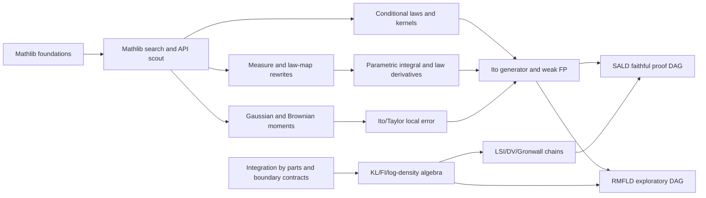

# SDE/Sampling Technical Lemma Skill Tree

This is the reusable lemma network ASTIS should grow beyond SALD.  The aim is
not only to reproduce one paper, but to build a Mathlib-ready path for common
Sampling/SDE proof blocks.

## Skill Blocks

| Block | Typical leaf size | Mathlib-ready target |
|---|---|---|
| Mathlib search | One API packet. | Find existing lemma before porting. |
| Measure/law map | One rewrite theorem. | Integral of a test function under a map/law. |
| Conditional laws | One pairing identity. | `condDistrib` kernel pairing, then optional conditional-mean form. |
| Parametric integral | One derivative transfer. | Move sample-space derivative to law-level weak-test derivative under domination. |
| Ito/weak FP | One weak-test identity. | Derive law-level weak FP from a source-cited Ito generator theorem plus law rewrites. |
| Ito/Taylor | One local expansion or bound. | Backup Gaussian one-step generator, covariance trace, or Taylor remainder bound. |
| KL/FI | One algebraic derivative/integrability fact. | KL pointwise derivative, mass-term removal, or Fisher-information rewrite. |
| LSI/DV/Gronwall | One inequality handoff. | Donsker--Varadhan, LSI-to-KL/FI, or scalar Gronwall block. |
| IBP | One boundary contract plus identity. | Integration-by-parts identity with explicit decay/compact support. |

## Current Pro-Assimilated Leaf Families

These are the concrete leaf families extracted from the external proof-engineering
advice packet.

| Family | First leaf | Keep source-cited? | Why |
|---|---|---|---|
| Conditional pairing | `condDistrib_pairing_kernel_integral` | no | Directly prove from `ProbabilityTheory.condDistrib` and integral-map APIs. |
| Conditional mean | `condDrift_pairing_of_condMean` | no | Use Bochner integral and continuous linear maps after the kernel form. |
| Weak FP bridge | `weakFP_from_ito_generator` | no | Small rewriting theorem once Ito derivative, conditional pairing, and law-map rewrites are supplied. |
| Frozen Ito generator | `frozen_interpolation_ito_generator_derivative` | yes, initially | This is the analytic Ito theorem; isolate and cite until a local SDE library exists. |
| KL density derivative | `hasDerivAt_KLDens` | yes/local structure | Requires local dominated derivative structure; prove pointwise algebra separately. |
| KL algebra | `kl_pointwise_deriv_simplify`, `kl_derivative_remove_mass_term` | no | Small real algebra leaf. |
| IBP theorem | `integral_div_smul_eq_neg_integral_inner_grad` | yes, initially | Whole-space boundary conditions are substantial; use explicit compact-support/decay contract. |
| Fisher algebra | `fp_rewrite_scalar_algebra`, `fisher_ibp_algebra` | no | Small algebra once analytic IBP identities are supplied. |
| Gaussian fallback | `covariance_contracts_bilinear_form`, `frozen_gaussian_one_step_generator` | maybe | Backup route if Ito generator source theorem is not usable. |

## Agent Routing

- `upper_proof_dag` chooses which skill block is the true bottleneck.
- `middle_technical_lemma` searches Mathlib and ASTIS memory before assigning
  lower work.
- `lower_1` writes the natural-language proof and hidden regularity list.
- `lower_2` implements the smallest Lean theorem.
- `lower_3` searches APIs and external reference projects.
- `reviewer_gate` rejects broad wrappers and missing regularity.
