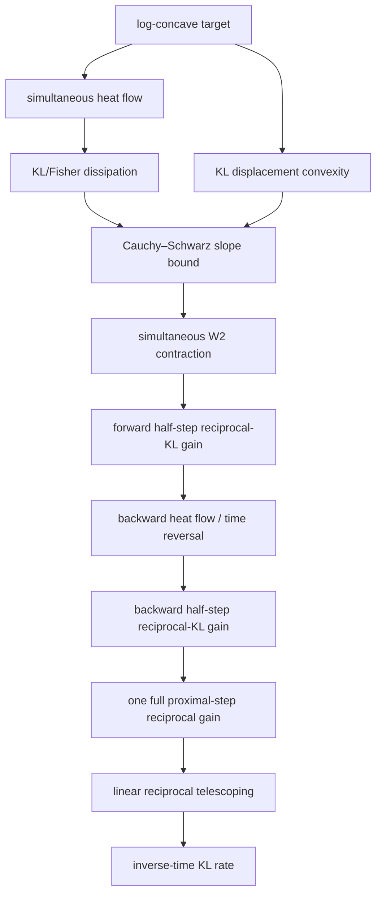

# SampleWiki row-level case triage

This file is the human-owned dependency view for the generated SampleWiki case
manifest.  The generated source manifest owns source IDs, row fingerprints,
short result metadata, and source links.  This file owns ASTIS decisions about
what a row means for the Lean graph.

Latest GitHub-hosted probe at bootstrap:

- 7 canonical setting pages;
- 34 comparison-table result rows;
- case-tree fingerprint
  `6c4a330582f6525ea3bede37fdeb9f60a40b0196c9876cd8e33c47d94aab8e02`.

These numbers are a pinned probe result, not a promise that the live upstream
will remain unchanged.  `tools/samplewiki_cases.py` is the source of truth for
future row-level diffs.

## Status vocabulary

- **active** — ASTIS has started a source-facing formalization.
- **ready-root-audit** — useful canonical roots already exist on `main`; inspect
  exact theorem interfaces before adding new leaves.
- **shared-root-blocked** — the case should reuse a root currently being closed
  in the Chapter 1 lanes rather than create a local duplicate.
- **new-foundation-needed** — the result needs a substantial new reusable model
  (oracle, algorithm, divergence, geometry, or complexity layer) not yet owned
  by the canonical graph.
- **source-review-needed** — the row is a cited result, but ASTIS must read the
  exact source theorem/proof before choosing a Lean target.
- **literature-open** — SampleWiki itself records the matching result as unknown
  or without a primary source.  This is an open-problem node, not a theorem to
  manufacture in Lean.

No status below means `sourceReviewed` or `assimilated` unless explicitly stated.

## Existing canonical roots we should reuse

`main` already exposes useful infrastructure including:

- `TechnicalLemmas.StochasticProcesses.MarkovSemigroup`, `FellerSemigroup`,
  `OperatorGenerator`, `OperatorGeneratorDomain`, `Reversibility`,
  `CarreDuChamp`, `LangevinGenerator`, and `LangevinCarreDuChamp`;
- generator formulations of Poincaré and log-Sobolev inequalities in
  `TechnicalLemmas.FunctionalInequalities.Generator`;
- KL / Donsker–Varadhan / Rényi leaves under
  `TechnicalLemmas.InformationTheory`;
- Gaussian and measure-theoretic infrastructure;
- the canonical transport / Wasserstein / displacement-interpolation tree
  already identified by the Chapter 1.2–1.3 audit.

PR #11 owns the still-open finite-dimensional Itô/SDE source bridge.  PR #12
owns the parallel process-independent semigroup/measure-evolution and
Section 1.3 completion frontier.  Example Cases must import those canonical
roots after merge rather than fork their APIs.

---

## 1. Convex body + membership oracle — 4 cases

This setting is mostly **new-foundation-needed** for ASTIS.  It requires a
formal convex-body sampling/oracle layer: membership-query semantics, warm
starts in Rényi divergence, restricted-Gaussian/proximal access, annealing
schedules, and query accounting.

| Case | ASTIS status | Lean-tree decision |
|---|---|---|
| `...BEST-UPPER-PROXIMAL-IN-AND-OUT-WITH-RESTART` | source-review-needed · new-foundation-needed | Build membership-oracle + Rényi warm-start contracts before the source theorem. |
| `...LOWER-UNKNOWN-GENERAL-SAMPLING-LOWER-BOUND` | **literature-open** | Keep as an open lower-bound node; do not create a fake lower-bound theorem. |
| `...UPPER-R-NYI-PRESERVING-ANNEALING` | source-review-needed · new-foundation-needed | Reuse the same Rényi/oracle layer and add annealing-composition leaves. |
| `...UPPER-CONSTRAINED-PROXIMAL-SAMPLER` | source-review-needed · new-foundation-needed | Natural first published comparator once constrained proximal/RGO semantics exist. |

Suggested graph root:

`ConvexBody → MembershipOracle → WarmStart/Renyi → RestrictedGaussianOracle → ProximalKernel → Annealing/Restart → QueryComplexity`.

---

## 2. Log-smooth + PI or LSI — 5 cases

This is a **high-priority ASTIS lane** because the canonical generator PI/LSI
interfaces already exist.  Missing work is primarily the bridge from those
functional inequalities to quantitative divergence decay and then to concrete
algorithm/discretization complexity.

| Case | ASTIS status | Lean-tree decision |
|---|---|---|
| `...BEST-UPPER-IMPLEMENTED-PROXIMAL-SAMPLER` | ready-root-audit · shared-root-blocked | Reuse PI/LSI, KL/Rényi and proximal-chain roots; implementation layer comes after ideal contraction. |
| `...LOWER-UNKNOWN-MATCHING-PI-LSI-ORACLE-LOWER-BOUND` | **literature-open** | Open lower-bound node; no primary-source theorem currently pinned by SampleWiki. |
| `...UPPER-LMC` | ready-root-audit · shared-root-blocked | Reuse Langevin generator + LSI decay; needs LMC discretization/error accumulation. |
| `...UPPER-LMC-R-NYI-INTERPOLATION` | ready-root-audit · shared-root-blocked | Reuse `InformationTheory.Renyi`; needs Rényi interpolation + LMC discretization bridge. |
| `...UPPER-ULMC-WARM-START-CONSTRUCTION` | source-review-needed · new-foundation-needed | Needs underdamped phase-space dynamics and warm-start construction; share strong-convexity/LSI roots. |

Core technique spine to purify:

`LSI/PI → entropy/variance dissipation → exponential decay → discretization bias → accuracy/query conversion`.

---

## 3. Weakly smooth log-concave — 4 cases

This setting needs a reusable nonsmooth/Hölder regularity layer rather than
hard-coding one algorithm proof.

| Case | ASTIS status | Lean-tree decision |
|---|---|---|
| `...BEST-UPPER-FORS-PROXIMAL-SAMPLER` | source-review-needed · new-foundation-needed | Define Hölder-gradient regularity and FORS/exact-diffusion implementation interfaces; reuse proximal/KL/W₂ roots. |
| `...LOWER-UNKNOWN-MATCHING-H-LDER-MODEL-LOWER-BOUND` | **literature-open** | Open minimax/oracle-complexity node. |
| `...UPPER-AVERAGED-LMC` | ready-root-audit · new-foundation-needed | Classical convex/Lipschitz LMC case; needs averaged-KL analysis and nonsmooth drift interface. |
| `...UPPER-NONSMOOTH-MIRROR-LANGEVIN` | source-review-needed · new-foundation-needed | Add norm/dual-norm, strongly convex mirror map, and Bregman-divergence graph before source theorem. |

Reusable roots should separate:

`RegularityModel (smooth/Hölder/Lipschitz)`, `GeometryModel (Euclidean/mirror)`,
and `AlgorithmKernel`.

---

## 4. Log-concave + log-smooth — 5 cases

This is the **first active setting** because it connects directly to the Chewi
book and to the Chapter 1 semigroup/Wasserstein graph.

| Case | ASTIS status | Lean-tree decision |
|---|---|---|
| `...BEST-UPPER-IMPLEMENTED-PROXIMAL-SAMPLER` | shared-root-blocked · source-review-needed | Build on the ideal proximal chain, then formalize implementation cost separately. |
| `...LOWER-UNKNOWN-MATCHING-FIRST-ORDER-LOWER-BOUND` | **literature-open** | Preserve as an explicit missing frontier. |
| `...UPPER-FORS-IMPLEMENTED-PROXIMAL-SAMPLER` | source-review-needed · new-foundation-needed | Reuse ideal proximal theorem; FORS implementation is a distinct algorithmic subtree. |
| `...UPPER-AVERAGED-LMC` | ready-root-audit · shared-root-blocked | Reuse KL/W₂ and Langevin roots; add averaged discretization proof. |
| `...UPPER-IDEAL-PROXIMAL-CHAIN` | **active** | First source case.  Final reciprocal-KL telescoping segment is already encoded in Lean; analytic heat-flow/W₂ spine remains open. |

### Active case: ideal proximal chain

Case ID:

`ASTIS-SW-SETTING-LOG-CONCAVE-SMOOTH-UPPER-IDEAL-PROXIMAL-CHAIN`

Source row points to Chewi, *Log-Concave Sampling*, Theorem 8.4.1.

Current proof DAG:

Lean status:

- `TechnicalLemmas.Algebra.linear_growth_of_step_growth` — implemented;
- `TechnicalLemmas.Algebra.reciprocal_growth_implies_inverse_time_bound` — implemented;
- `ExampleCases.SampleWiki.Cases.IdealProximalChain.kl_rate_from_reciprocal_step` — implemented source-facing proof tail;
- `STEP` is deliberately an explicit hypothesis of that proof segment;
- `DISS/GEO/W2/REV` remain the real mathematical frontier and must be discharged
  from canonical shared roots before the complete source theorem can be called
  `sourceReviewed` or `assimilated`.

---

## 5. Smooth non-log-concave + Fisher accuracy — 5 cases

This setting needs a first-class **relative Fisher information + query
complexity** tree.  It should not be encoded as ad hoc real-valued placeholders
inside each paper theorem.

| Case | ASTIS status | Lean-tree decision |
|---|---|---|
| `...BEST-UPPER-EXACT-ULD-FORS` | source-review-needed · new-foundation-needed | Define relative Fisher target, exact ULD/FORS contract, and initial-KL parameterization. |
| `...BEST-LOWER-GENERAL-FIRST-ORDER-FISHER-LOWER-BOUND` | source-review-needed · new-foundation-needed | Requires an oracle decision-tree/minimax lower-bound framework. |
| `...UPPER-LOWER-AVERAGED-LMC` | source-review-needed · new-foundation-needed | Split checked upper theorem from any unreviewed auxiliary lower-bound note; never conflate their evidence. |
| `...LOWER-ONE-DIMENSIONAL-FIRST-ORDER-FISHER-LOWER-BOUND` | source-review-needed · new-foundation-needed | Good small-dimensional test case for the future oracle lower-bound library. |
| `...LOWER-LARGE-INITIAL-GAP-QUERY-COMPLEXITY` | source-review-needed · new-foundation-needed | Reuse the same Fisher/oracle layer with dimension/initial-gap regime predicates. |

Suggested roots:

`RelativeFisher → FisherDissipation → FirstOrderOracle → AdaptiveQueryAlgorithm → HardInstanceFamily → MinimaxReduction`.

---

## 6. Stochastic and finite-sum oracles — 5 cases

This setting needs the cleanest **oracle model abstraction** in the entire
SampleWiki lane because several rows differ precisely by noise tails, variance,
component access, and what counts as one query.

| Case | ASTIS status | Lean-tree decision |
|---|---|---|
| `...BEST-UPPER-HIGH-ACCURACY-STOCHASTIC-GRADIENT-SAMPLER` | source-review-needed · new-foundation-needed | Build unbiased stochastic-gradient + Orlicz/sub-exponential tail contract. |
| `...BEST-LOWER-BOUNDED-VARIANCE-STOCHASTIC-GRADIENT-LOWER-BOUND` | source-review-needed · new-foundation-needed | Same stochastic-oracle API, but bounded-variance minimax lower-bound branch. |
| `...UPPER-VARIANCE-REDUCED-HIGH-ACCURACY-SAMPLER` | source-review-needed · new-foundation-needed | Add finite-sum component oracle and variance-reduction state. |
| `...UPPER-FINITE-SUM-RM-ULMC` | source-review-needed · new-foundation-needed | Reuse finite-sum model; add underdamped/randomized-midpoint kernel. |
| `...LOWER-FINITE-SUM-ZEROTH-ORDER-LOWER-BOUND` | source-review-needed · new-foundation-needed | Separate value-query oracle from stochastic-gradient and component-gradient models. |

The graph should make the separation visible:

`Oracle → {value, gradient, stochastic gradient, component gradient} → Noise/Tail Contract → Algorithm → Query Counter → Guarantee`.

---

## 7. Strongly log-concave + log-smooth — 6 cases

This is the second high-priority lane.  Strong-convexity geometry and transport
roots can be shared, but MALA, ULMC, Gaussian Krylov methods, and oracle lower
bounds belong to different algorithmic subgraphs.

| Case | ASTIS status | Lean-tree decision |
|---|---|---|
| `...BEST-UPPER-EXACT-ULD-FORS` | source-review-needed · shared-root-blocked | Reuse strong convexity, KL/Rényi, W₂ roots; exact path-space rejection/FORS is new. |
| `...BEST-LOWER-GENERAL-FIRST-ORDER-ORACLE-LOWER-BOUND` | source-review-needed · new-foundation-needed | Requires first-order oracle/minimax lower-bound tree; Gaussian subclass should be a reusable hard-instance family. |
| `...UPPER-MALA` | ready-root-audit · new-foundation-needed | Strong-convexity roots exist; add proposal/acceptance kernel, reversibility, conductance/mixing analysis. |
| `...UPPER-RANDOMIZED-MIDPOINT-ULMC` | source-review-needed · new-foundation-needed | Needs underdamped phase-space and randomized-midpoint discretization. |
| `...UPPER-BLOCK-KRYLOV-GAUSSIAN-SAMPLER` | source-review-needed · new-foundation-needed | Isolate Gaussian matrix-function/Krylov sublibrary; do not treat as a general-target sampler theorem. |
| `...LOWER-MALA-LOWER-BOUND` | source-review-needed · new-foundation-needed | Algorithm-specific lower bound; reuse the MALA kernel model but add hard target family. |

---

## Execution order

The dependency-aware order is:

1. **Finish the active ideal proximal-chain case** from the analytic side:
   KL/Fisher heat-flow dissipation → displacement convexity → W₂ contraction →
   time reversal → reciprocal one-step gain → already-formalized algebra tail.
2. **Functional-inequality LMC/LSI cases**, because the PI/LSI and Langevin
   generator roots are already closest to usable.
3. **Strongly log-concave cases**, sharing convexity/transport roots while
   introducing algorithm kernels one at a time.
4. **Fisher-accuracy cases**, first building a canonical relative-Fisher layer.
5. **Stochastic/finite-sum cases**, building a reusable oracle/query model.
6. **Weakly smooth/mirror cases**, adding regularity and mirror geometry.
7. **Convex-body membership cases**, adding the constrained/membership oracle
   universe as a deliberately separate major branch.

The three `lower unknown` rows stay visible throughout as open frontier nodes.
Their value to the purified ASTIS graph is precisely to show where the field has
no verified matching theorem, rather than filling those holes with invented
claims.
