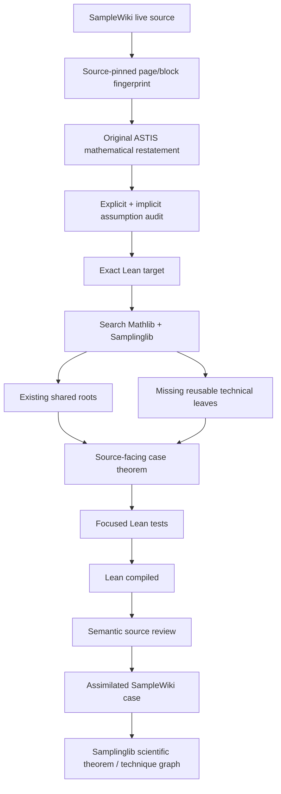

# SampleWiki Example Cases — assimilation DAG

This graph describes how a live SampleWiki source item becomes reusable ASTIS
mathematics.  It is a verification workflow graph, not a claim that every
SampleWiki page has already been crawled or formalized.

## Edge meanings

### Source → source pin

The watcher records URL-level and semantic-block fingerprints.  A fingerprint
is provenance evidence only; it is not a theorem certificate.

### Source pin → restatement

ASTIS writes its own mathematical statement.  The restatement must preserve the
source conclusion while making hidden hypotheses explicit enough for Lean.

### Restatement → assumption audit

Separate:

- assumptions stated by the source;
- assumptions mathematically used by the source proof;
- assumptions required only because of a particular Lean/Mathlib interface.

Interface assumptions should be minimized rather than silently promoted into
the mathematical theorem.

### Lean target → search

Search before proving.  A source-facing theorem should reuse existing
Samplinglib/Mathlib roots whenever possible.  This is where Example Cases feed
the compressed ASTIS graph instead of growing an isolated forest of duplicate
lemmas.

### Search → reusable leaves

If a needed fact is genuinely absent and reusable, it belongs under the normal
ASTIS technical-lemma ownership tree, not inside a one-off case proof.  The case
module should assemble those leaves.

### Compile → source review

Compilation certifies the Lean proposition only.  The reviewer must separately
check that the proposition and assumptions still match the pinned source item.
This edge is enforced conceptually and mirrored by
`SampleWiki.VerificationStage` in Lean.

### Assimilation → scientific graph

On acceptance, record:

- theorem node;
- reusable lemma nodes;
- proof-technique nodes;
- dependencies;
- downstream consumers;
- source case ID and fingerprints.

A later source change can reopen source review without deleting the already
valid Lean theorem: ASTIS then knows whether the theorem remains a useful local
result but no longer matches the new upstream statement.

## Parallel-lane rule

The SampleWiki lane may advance whenever a case depends only on `main` or on
stable Mathlib interfaces.  If it reaches a root currently being built in the
Chapter 1.1 or Chapter 1.2–1.3 lanes, the case remains an explicit blocked node
until that shared root merges.  No local duplicate is introduced merely to
remove the block.
