# Log-Concave Sampling Foundation DAG

Generated: `2026-07-02 02:55:25`

Primary source: `https://chewisinho.github.io/main.pdf`

Local source: `/home/nitanda_sub/mark/repos/outer_papers/sampling_theory_sde/Chewi-Log-Concave-Sampling/main.pdf`

This is the master visualization ledger for `ASTIS-CHEWI-001`.  The goal is
to avoid one oversized graph: every chapter or major theorem should point
to shared root nodes and then have its own smaller subtree.  Shared labels make
common Lean leaves reusable across chapters, SALD, RMFLD, and future papers.

## Global Spine

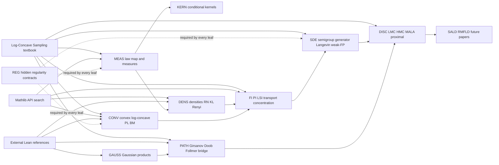

## Blue/Red Lean Tree Status

Blue nodes are compiled local ASTIS declarations or modules covered by
`lake build`.  Red nodes are the todo branches I can keep driving with
Mathlib-first leaves and explicit source/regularity contracts.

Rendered status tree:
`docs/assets/log_concave_sampling_status.svg`

```mermaid
flowchart TD
  Root[ASTIS-CHEWI-001<br/>Log-concave sampling Lean tree]
  MEAS[MEAS/KERN<br/>measure and kernels]
  DENS[DENS/CONV<br/>densities and convexity]
  GAUSS[GAUSS<br/>Gaussian infrastructure]
  FI[FI<br/>functional inequalities]
  SDE[SDE/PATH<br/>continuous-time and transforms]
  DISC[DISC<br/>sampling algorithms]

  Root --> MEAS
  Root --> DENS
  Root --> GAUSS
  Root --> FI
  Root --> SDE
  Root --> DISC

  MEAS --> LawMap[Probability.LawMap]
  MEAS --> CondKernel[Probability.ConditionalKernel]
  MEAS --> Transport[Measure.Transport]

  DENS --> LogConcavity[Geometry.LogConcavity]
  DENS --> LogConcavityTensor[Log-concavity algebra/tensorization]
  DENS --> LogConcavityMaps[Log-concavity under maps]
  DENS --> LogConcavityLevels[Log-concavity level sets]
  DENS --> NegLogPotential[Negative-log potential geometry]
  DENS --> GibbsQuadLogConcavity[Quadratic Gibbs log-concavity]
  DENS --> ShiftedGibbsQuad[Shifted quadratic Gibbs geometry]
  DENS --> PairKernelGeometry[Two-point Gaussian/proximal kernel geometry]
  DENS --> RN[Measure.RadonNikodym]
  DENS --> PiDensity[Measure.pi withDensity product]
  DENS --> Gibbs[Measure.Gibbs]
  DENS --> GibbsPotentialEnv[Potential lower-bound envelope]
  DENS --> GibbsFiniteEnv[Finite-measure Gibbs envelope]
  DENS --> GibbsQuadEnv[Quadratic Lebesgue Gibbs envelope]
  DENS --> KLDV[InformationTheory.KLDensity/DV]
  DENS --> PLBM[Prekopa/Brunn/Convex]
  DENS --> GibbsEnv[General coercivity Gibbs envelope]
  DENS --> Renyi[Renyi density calculus]

  GAUSS --> Gaussian[ProbabilityDistributions.Gaussian]
  GAUSS --> GaussianLinear[Product Gaussian linear forms]
  GAUSS --> GaussianMGF[Product Gaussian MGF / normalizer]
  GAUSS --> GaussianScalarShift[Scalar Gaussian Esscher shift]
  GAUSS --> GaussianProductShift[Product Gaussian shifted density]
  GAUSS --> GaussianCOM[Product Gaussian change of measure]
  GAUSS --> GaussianEuclidean[EuclideanSpace Gaussian pushforward]
  GAUSS --> GaussianStd[stdGaussian inner-product change of measure]
  GAUSS --> GaussianPath[Full path-space Gaussian / Girsanov]

  FI --> LSI[FunctionalInequalities.LogSobolev]
  FI --> PITI[PI/TI/Isoperimetry]
  FI --> Preserve[Preservation/tensorization]

  SDE --> WeakGen[StochasticProcesses.WeakGenerator]
  SDE --> FP[StochasticProcesses.FokkerPlanckAlgebra]
  SDE --> GirsanovFinite[StochasticProcesses.Girsanov finite cylinder]
  SDE --> Langevin[MarkovSemigroup/Langevin/Ito]
  SDE --> Path[Girsanov/Doob/Follmer]

  DISC --> LMC[LMC interpolation]
  DISC --> HMC[HMC/underdamped/RM]
  DISC --> MALA[MALA/proximal/high-accuracy]

  classDef root fill:#f8fafc,stroke:#475569,color:#0f172a,stroke-width:2px;
  classDef compiled fill:#dbeafe,stroke:#2563eb,color:#0f172a,stroke-width:2px;
  classDef todo fill:#fee2e2,stroke:#dc2626,color:#450a0a,stroke-width:2px;
  class Root,MEAS,DENS,GAUSS,FI,SDE,DISC root;
  class LawMap,CondKernel,LogConcavity,LogConcavityTensor,LogConcavityMaps,LogConcavityLevels,NegLogPotential,GibbsQuadLogConcavity,ShiftedGibbsQuad,PairKernelGeometry,RN,PiDensity,Gibbs,GibbsPotentialEnv,GibbsFiniteEnv,GibbsQuadEnv,KLDV,Renyi,Gaussian,GaussianLinear,GaussianMGF,GaussianScalarShift,GaussianProductShift,GaussianCOM,GaussianEuclidean,GaussianStd,LSI,WeakGen,FP,GirsanovFinite compiled;
  class Transport,PLBM,GibbsEnv,GaussianPath,PITI,Preserve,Langevin,Path,LMC,HMC,MALA todo;
```

| Family | Branch/leaf | Target | Color status | Role |
| --- | --- | --- | --- | --- |
| MEAS/KERN | Probability.LawMap | TechnicalLemmas/Probability/LawMap.lean | compiled-blue | law-map and weak-test integral rewrites |
| MEAS/KERN | Probability.ConditionalKernel | TechnicalLemmas/Probability/ConditionalKernel.lean | compiled-blue | condDistrib and conditional-integral representatives |
| MEAS/KERN | Measure.Transport | TechnicalLemmas/Measure/Transport.lean | todo-red | transport/coupling/Wasserstein interfaces |
| DENS/CONV | Geometry.LogConcavity | TechnicalLemmas/Geometry/LogConcavity.lean | compiled-blue | positive log-concavity, norm-square convexity, and convex-potential Gibbs shape |
| DENS/CONV | Log-concavity algebra/tensorization | TechnicalLemmas/Geometry/LogConcavity.lean | compiled-blue | pointwise products, nonnegative real powers, and Cartesian-product density factors preserve log-concavity |
| DENS/CONV | Log-concavity under maps | TechnicalLemmas/Geometry/LogConcavity.lean | compiled-blue | linear and affine precomposition preserve log-concavity on preimage domains |
| DENS/CONV | Log-concavity level sets | TechnicalLemmas/Geometry/LogConcavity.lean | compiled-blue | positive log-concave functions are quasiconcave; convex superlevel restrictions remain log-concave |
| DENS/CONV/SDE | Negative-log potential geometry | TechnicalLemmas/Geometry/LogConcavity.lean | compiled-blue | positive log-concave densities have convex negative-log potentials and convex energy sublevels |
| DENS/CONV | Quadratic Gibbs log-concavity | TechnicalLemmas/Geometry/LogConcavity.lean | compiled-blue | nonnegative quadratic norm potentials and explicit normalized quadratic Gibbs densities are log-concave |
| DENS/CONV/GAUSS | Shifted quadratic Gibbs geometry | TechnicalLemmas/Geometry/LogConcavity.lean | compiled-blue | shifted potentials `a‖x-m‖^2+b` and explicit shifted quadratic densities are log-concave |
| DENS/CONV/GAUSS/DISC | Two-point Gaussian/proximal kernel geometry | TechnicalLemmas/Geometry/LogConcavity.lean | compiled-blue | two-point potentials `a‖x-y‖^2+b` and Gaussian-kernel shapes are log-concave on product space |
| DENS/CONV | Measure.RadonNikodym | TechnicalLemmas/Measure/RadonNikodym.lean | compiled-blue | withDensity, reciprocal-lintegral normalization, RN wrappers |
| DENS/MEAS | Measure.pi withDensity product | TechnicalLemmas/Measure/RadonNikodym.lean | compiled-blue | finite-product ENNReal Fubini and coordinatewise density-tilt decomposition |
| DENS/CONV | Measure.Gibbs | TechnicalLemmas/Measure/Gibbs.lean | compiled-blue | Gibbs ENNReal density, measurability, envelope comparison, and normalization |
| DENS/CONV | Potential lower-bound envelope | TechnicalLemmas/Measure/Gibbs.lean | compiled-blue | `W ≤ V` a.e. and finite `∫ exp(-W)` imply finite `∫ exp(-V)` and normalized Gibbs law |
| DENS/CONV | Finite-measure Gibbs envelope | TechnicalLemmas/Measure/Gibbs.lean | compiled-blue | finite base measure plus a.e. constant lower bound on `V` gives finite Gibbs normalizer and normalized target law |
| DENS/CONV/ANALYSIS | Quadratic Lebesgue Gibbs envelope | TechnicalLemmas/Analysis/Integrability.lean | compiled-blue | finite-dimensional Lebesgue quadratic tails have exact ENNReal normalizers, and quadratic lower bounds give normalized Gibbs target laws |
| DENS/CONV | InformationTheory.KLDensity/DV | TechnicalLemmas/InformationTheory/{KLDensity,DonskerVaradhan}.lean | compiled-blue | KL pointwise algebra and DV energy leaves |
| DENS/CONV | Prekopa/Brunn/Convex | TechnicalLemmas/Geometry/{Convex,PrekopaLeindler,BrunnMinkowski}.lean | todo-red | finite-dimensional PL/BM and convex-measure preservation |
| DENS/CONV | Concrete Gibbs envelope | TechnicalLemmas/Measure/Gibbs.lean or Analysis/Integrability.lean | todo-red | general nonquadratic Lebesgue coercivity/growth assumptions supply a tail-integrable lower-potential envelope |
| DENS/CONV | Renyi density calculus | TechnicalLemmas/InformationTheory/Renyi.lean | compiled-blue | Renyi integrand positivity, measurability, finite-envelope, and pointwise derivative leaves |
| GAUSS | ProbabilityDistributions.Gaussian | TechnicalLemmas/ProbabilityDistributions/Gaussian.lean | compiled-blue | Gaussian moments, coordinate laws, finite linear forms, MGF normalizers, shifted densities, and variance packaging |
| GAUSS | Product Gaussian linear forms | TechnicalLemmas/ProbabilityDistributions/Gaussian.lean | compiled-blue | finite product-Gaussian linear-form integrability and zero mean |
| GAUSS | Product Gaussian MGF / normalizer | TechnicalLemmas/ProbabilityDistributions/Gaussian.lean | compiled-blue | finite product-Gaussian linear-form MGF and centered Esscher mass-one normalizer |
| GAUSS | Scalar Gaussian Esscher shift | TechnicalLemmas/ProbabilityDistributions/Gaussian.lean | compiled-blue | one-dimensional Gaussian exponential tilt shifts the mean |
| GAUSS | Product Gaussian shifted density | TechnicalLemmas/ProbabilityDistributions/Gaussian.lean | compiled-blue | finite product standard Gaussian withDensity tilt equals shifted product Gaussian |
| GAUSS | Product Gaussian change of measure | TechnicalLemmas/ProbabilityDistributions/Gaussian.lean | compiled-blue | finite shifted product-Gaussian integrals rewrite as centered weighted integrals |
| GAUSS | EuclideanSpace Gaussian pushforward | TechnicalLemmas/ProbabilityDistributions/Gaussian.lean | compiled-blue | transport finite product-Gaussian Esscher change-of-measure through `WithLp.toLp 2` |
| GAUSS | stdGaussian inner-product change of measure | TechnicalLemmas/ProbabilityDistributions/Gaussian.lean | compiled-blue | rewrite the Euclidean change-of-measure against Mathlib `stdGaussian` with inner-product/norm exponent |
| GAUSS | Full path-space Gaussian / Girsanov | TechnicalLemmas/ProbabilityDistributions/Gaussian.lean | todo-red | Brownian/path-space RN derivative beyond finite-dimensional cylinders |
| FI | FunctionalInequalities.LogSobolev | TechnicalLemmas/FunctionalInequalities/LogSobolev.lean | compiled-blue | LSI to KL/FI bookkeeping and sqrt-density handoffs |
| FI | PI/TI/Isoperimetry | TechnicalLemmas/FunctionalInequalities/{Poincare,Transport,Isoperimetry}.lean | todo-red | Poincare, transport inequalities, concentration, isoperimetry |
| FI | Preservation/tensorization | TechnicalLemmas/FunctionalInequalities/Preservation.lean | todo-red | tensorization and preservation under log-concavity operations |
| SDE/PATH | StochasticProcesses.WeakGenerator | TechnicalLemmas/StochasticProcesses/WeakGenerator.lean | compiled-blue | sample-to-law weak-generator rewrite |
| SDE/PATH | StochasticProcesses.FokkerPlanckAlgebra | TechnicalLemmas/StochasticProcesses/FokkerPlanckAlgebra.lean | compiled-blue | weak-FP and Fisher/IBP scalar algebra |
| SDE/PATH | StochasticProcesses.Girsanov finite cylinder | TechnicalLemmas/StochasticProcesses/Girsanov.lean | compiled-blue | finite-dimensional cylindrical Gaussian Girsanov weight, RN density, and integral change-of-measure |
| SDE/PATH | MarkovSemigroup/Langevin/Ito | TechnicalLemmas/StochasticProcesses/{MarkovSemigroup,Langevin,Ito}.lean | todo-red | semigroup domains, invariant Gibbs law, Ito interfaces |
| SDE/PATH | Girsanov/Doob/Follmer | TechnicalLemmas/StochasticProcesses/{Girsanov,DoobTransform,FollmerDrift}.lean | todo-red | path-space RN derivatives and bridge transforms |
| DISC | LMC interpolation | SamplingAlgorithms/LangevinMonteCarlo.lean | todo-red | LMC interpolation, coupling, KL/FI derivative consumers |
| DISC | HMC/underdamped/RM | SamplingAlgorithms/{HamiltonianMonteCarlo,UnderdampedLangevin,RandomizedMidpoint}.lean | todo-red | faster low-accuracy sampler transition/generator contracts |
| DISC | MALA/proximal/high-accuracy | SamplingAlgorithms/{MetropolisAdjustedLangevin,ProximalSampler}.lean | todo-red | acceptance kernels, detailed balance, restricted Gaussian oracles |

## Shared Root Nodes

| Label | Shared root | Target module/root | Role | Status |
| --- | --- | --- | --- | --- |
| MEAS | measure-space and law transport | TechnicalLemmas/Probability/LawMap.lean | push forward laws, weak-test integrals, map/withDensity/RN bridges | partial-compiled-local |
| KERN | conditional kernels and representatives | TechnicalLemmas/Probability/ConditionalKernel.lean | condDistrib pairings, conditional drifts, a.e. representative discipline | partial-compiled-local |
| DENS | densities, RN derivative, KL/Renyi integrands | TechnicalLemmas/Geometry/LogConcavity.lean; Measure/{Gibbs,RadonNikodym}.lean; InformationTheory/* | positive density APIs, density-to-potential extraction, log-concavity algebra/tensorization, level-set quasiconcavity/restriction, linear/affine precomposition, centered/shifted/two-point quadratic Gibbs log-concavity, Gibbs ENNReal density, finite-measure and exact quadratic Lebesgue normalization, absolute continuity, withDensity, pointwise entropy algebra | partial-compiled-local |
| GAUSS | Gaussian and product Gaussian infrastructure | TechnicalLemmas/ProbabilityDistributions/Gaussian.lean | standard Gaussian laws, moments, MGF, finite-dimensional tilts, shifted and two-point quadratic density geometry | partial-compiled-local |
| CONV | convex and log-concave geometry | TechnicalLemmas/Geometry/{Convex,LogConcavity,PrekopaLeindler}.lean | convex functions/sets, negative-log potentials, log-concave superlevels, quadratic norm potentials, log-concavity products/powers and linear/affine pullbacks, Prekopa-Leindler, Brunn-Minkowski | partial-compiled-local |
| FI | functional inequalities | TechnicalLemmas/FunctionalInequalities/* | PI, LSI, transport, concentration, isoperimetry, preservation | planned-plus-LSI-bookkeeping-compiled |
| SDE | semigroup, generator, weak-FP, Langevin | TechnicalLemmas/StochasticProcesses/* | Markov semigroups, invariant Gibbs law, generator/KL dissipation | partial-compiled-local |
| PATH | path-space change of measure | TechnicalLemmas/StochasticProcesses/{Girsanov,DoobTransform,FollmerDrift}.lean | Girsanov, Doob transform, Follmer drift, Schrodinger bridge | planned |
| DISC | algorithm discretization layer | SamplingAlgorithms/* | LMC, randomized midpoint, HMC, underdamped, MALA, proximal sampler | planned-consumer |
| REG | hidden regularity contracts | research-wiki/technical-lemmas/hidden_regularities.md | measurability, integrability, domination, smoothness, boundary, positivity | protocol |

## Chapter And Theorem Subtree Registry

| Chapter/topic | Shared labels | Subtree to draw/formalize | First lower-agent leaf | Status |
| --- | --- | --- | --- | --- |
| 1.1 stochastic calculus | MEAS, GAUSS, REG | Ito/quadratic-variation/Taylor local-error subtree | quadratic variation normalization and finite-dimensional Ito test identity | partial-local-compiled |
| 1.2 Markov semigroups | MEAS, SDE, REG | semigroup -> generator-domain -> weak-test derivative subtree | semigroup test-function pairing under generator-domain hypotheses | planned |
| 1.3 optimal transport geometry | MEAS, CONV, REG | couplings -> Wasserstein distance -> geodesic convexity subtree | law-map/coupling measurable pushforward interface | planned |
| 1.4 Langevin as gradient flow | DENS, FI, SDE, REG | Gibbs density -> generator -> KL/FI dissipation -> WGF contract | finite-measure bounded-below, finite-dimensional quadratic-Lebesgue Gibbs normalization, explicit centered/shifted quadratic normalized-density log-concavity, and negative-log potential extraction compiled; Langevin generator invariant Gibbs law contract remains | quadratic-gibbs-envelope-compiled |
| 2 functional inequalities | CONV, DENS, FI, REG | PI/LSI/TI/isoperimetry plus preservation-operation subtrees | log-concavity products, nonnegative powers, product-domain tensorization, linear/affine precomposition, negative-log potential convexity, superlevel convexity, plus Prekopa-Leindler preservation audit | partial-local-compiled |
| 3 stochastic analysis topics | PATH, DENS, SDE, REG | Girsanov -> Doob transform -> Follmer drift -> Schrodinger bridge | finite-dimensional Gaussian Esscher density, stdGaussian inner-product form, cylindrical Girsanov integral, and RN/withDensity identity compiled; full Brownian path packaging remains | finite-girsanov-rn-cylinder-compiled |
| 4 Langevin Monte Carlo | MEAS, KERN, SDE, DENS, REG, DISC | coupling/interpolation/convex-optimization/Girsanov proof subtrees | LMC interpolation weak-test law derivative under domination; two-point Gaussian transition-kernel geometry compiled | partial-local-compiled |
| 5 faster low-accuracy samplers | GAUSS, SDE, DISC, REG | randomized midpoint, HMC, underdamped generator subtrees | Hamiltonian/underdamped transition-kernel regularity contract | planned |
| 6 Renyi divergence | DENS, FI, SDE, REG | Renyi density algebra -> interpolation/Girsanov derivative subtrees | Renyi density algebra with positivity and finite-integral contracts | first algebra leaves compiled |
| 7 high-accuracy samplers | KERN, DENS, DISC, REG | rejection/MH/MALA kernels, detailed balance, warm-start subtrees | proposal/acceptance Markov-kernel mass and reversibility contract | planned |
| 8 proximal sampler | CONV, GAUSS, KERN, DISC, REG | restricted Gaussian oracle -> conditional laws -> proximal transition subtree | two-point Gaussian/proximal kernel log-concavity and log-concave superlevel restriction compiled; restricted Gaussian conditional law remains | kernel-geometry-compiled |
| 9-12 lower bounds, structure, non-log-concave, diffusion models | MEAS, DENS, SDE, PATH, DISC, REG | consumer subtrees after core log-concave foundation stabilizes | source-specific leaf only after shared roots are compiled | deferred-consumer |

## Chapter 1 Langevin Continuous-Time Subtree

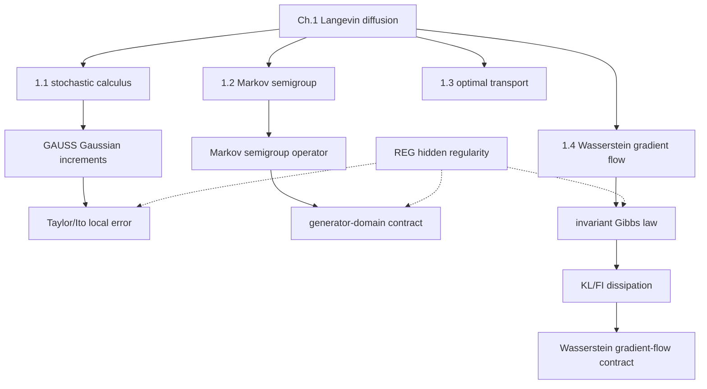

## Chapter 2 Functional-Inequality Subtree

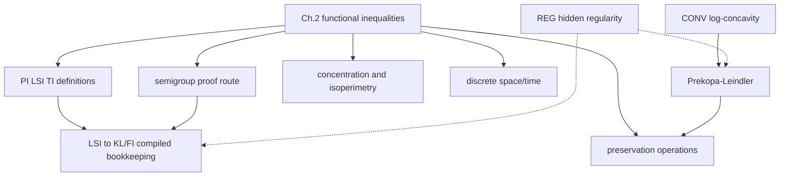

## Chapter 4 LMC Interpolation Subtree

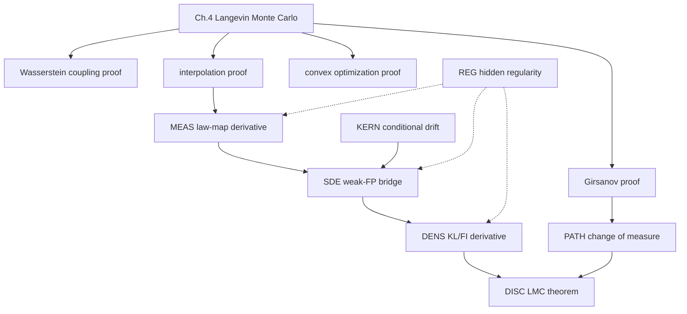

## Chapter 3 Path-Space Stochastic Analysis Subtree

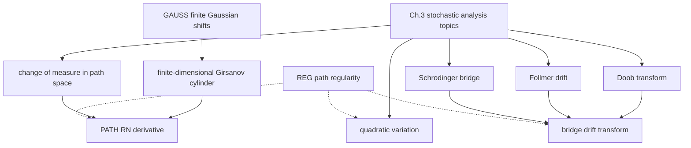

## Chapter 5 Faster Low-Accuracy Samplers Subtree

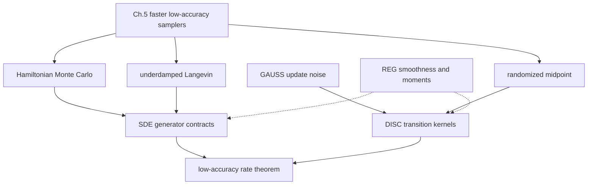

## Chapter 6 Renyi Divergence Subtree

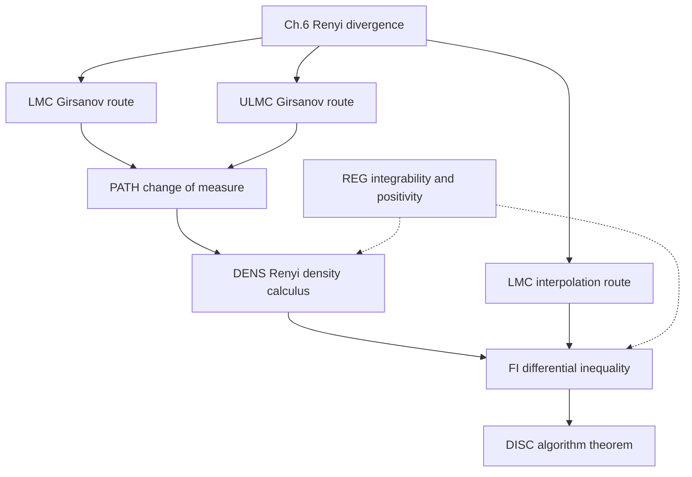

## Chapter 7 High-Accuracy Samplers Subtree

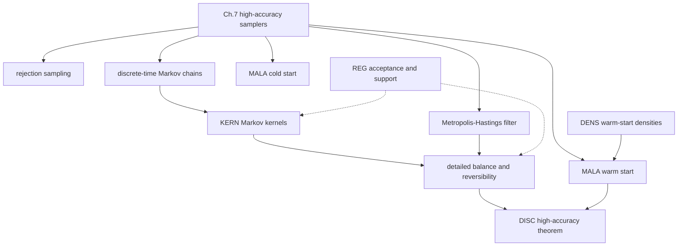

## Chapter 8 Proximal Sampler Subtree

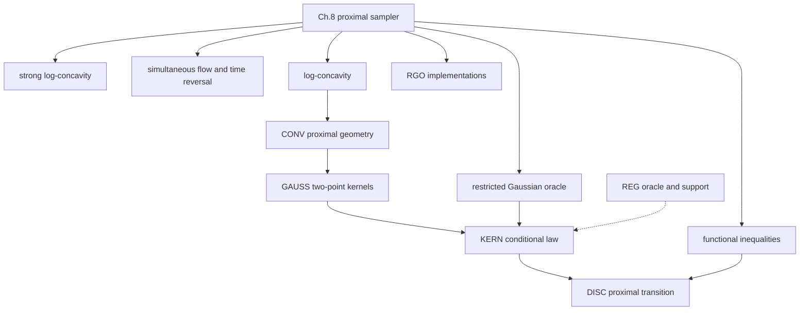

## Chapter 9 Lower-Bound Subtree

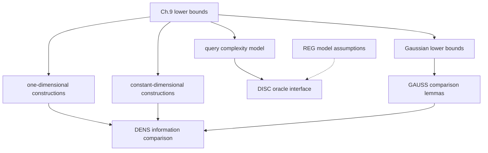

## Chapter 10 Structured-Sampling Subtree

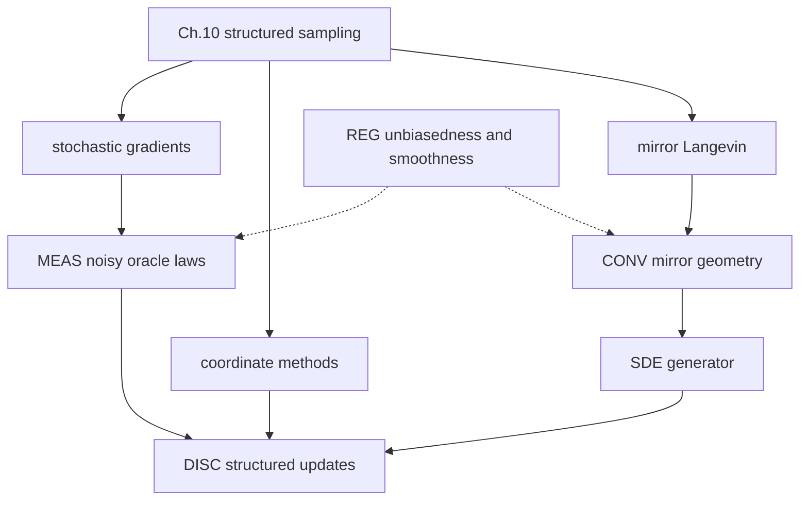

## Chapter 11 Non-Log-Concave Sampling Subtree

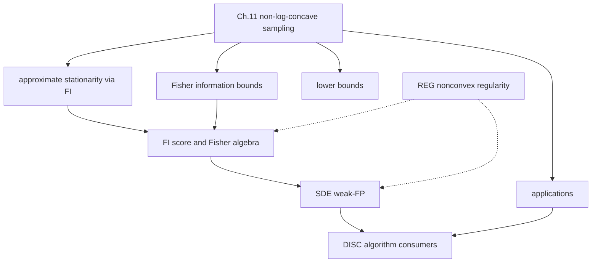

## Chapter 12 Diffusion-Generative-Models Subtree

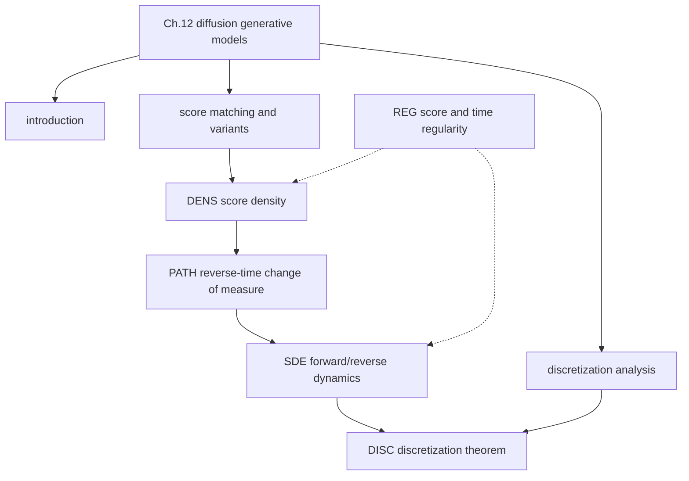

## Open Leaf Queue

| Open leaf | Label | Target file | Mathlib/external borrow plan | Status |
| --- | --- | --- | --- | --- |
| logConcaveOn_density_def | CONV/DENS | TechnicalLemmas/Geometry/LogConcavity.lean | Mathlib `ConcaveOn`, `ConcaveOn.subset`, `strictConcaveOn_log_Ioi`; AST Prekopa files for next statement style | core API, negative-log potential extraction, quasiconcavity/superlevel convexity and restriction, linear/affine precomposition, product/power/product-domain tensorization, norm-square convexity, centered/shifted/two-point quadratic Gibbs log-concavity, and Gibbs positive-rescale leaves compiled; next Prekopa/RN integration |
| prekopaLeindler_finiteDimensional | CONV/MEAS | TechnicalLemmas/Geometry/PrekopaLeindler.lean | external `AsymptoticStatistics/ForMathlib/PrekopaLeindler.lean`; Mathlib lacks direct PL package | external-port-audit |
| brunnMinkowski_oneDim_outerMeasure | CONV/MEAS | TechnicalLemmas/Geometry/BrunnMinkowski.lean | external `Brunn1D.lean`; Mathlib convex/volume APIs | external-port-audit |
| gibbsDensity_withDensity_normalized | DENS/CONV | TechnicalLemmas/Geometry/LogConcavity.lean; then TechnicalLemmas/Measure/{Gibbs,RadonNikodym}.lean | compiled `logConcaveOn_const_mul_exp_neg_of_convexOn`, log-concavity linear/affine precomposition and product/rpow/tensorization leaves, centered/shifted/two-point quadratic normalized-density log-concavity, `gibbsDensityENNReal`, nonzero/finite envelope leaves, finite-measure lower-bound normalization, and `Analysis.Integrability` exact quadratic Lebesgue Gibbs normalizers from Mathlib Gaussian Fourier tails; next generalize beyond quadratic/coercive tails | convex shape plus map pullbacks, product/power tensorization, centered/shifted/two-point quadratic Gibbs log-concavity, Gibbs density, measurability, nonzero integral, finite-by-envelope, finite-measure lower-bound envelope, exact quadratic Lebesgue normalizer, and normalized withDensity probability bridges compiled; nonquadratic coercivity envelopes remain |
| langevinGenerator_invariant_gibbs_weak | SDE/DENS/FI | TechnicalLemmas/StochasticProcesses/Langevin.lean | ASTIS WeakGenerator/FokkerPlanckAlgebra plus Mathlib calculus/integration APIs | source-contract |
| lsi_tensorization_or_preservation_contract | FI/CONV | TechnicalLemmas/FunctionalInequalities/Preservation.lean | Mathlib convex/Jensen APIs; SLT/AST reference style for functional inequality statements | planned |
| gaussianEsscher_shift_density | GAUSS/PATH | TechnicalLemmas/ProbabilityDistributions/Gaussian.lean | external `GaussianMGF.lean`, `PiWithDensity.lean`, `GaussianShift.lean` | formalized-local-density-half |
| gaussianShift_change_of_measure | GAUSS/PATH | TechnicalLemmas/ProbabilityDistributions/Gaussian.lean | external `GaussianShift.lean`; local `stdGaussianPi_withDensity_exp_shift` | formalized-local-product-measure |
| gaussianShift_euclidean_pushforward | GAUSS/PATH | TechnicalLemmas/ProbabilityDistributions/Gaussian.lean | Mathlib `EuclideanSpace`/`WithLp.toLp`; local `stdGaussianPi_shift_integral` | formalized-local-euclidean-pushforward |
| gaussianShift_stdGaussian_inner | GAUSS/PATH | TechnicalLemmas/ProbabilityDistributions/Gaussian.lean | Mathlib `map_pi_eq_stdGaussian`, `PiLp.inner_apply`, `EuclideanSpace.real_norm_sq_eq` | formalized-local-stdGaussian-inner |
| finiteGaussianGirsanov_cylinder | PATH/GAUSS | TechnicalLemmas/StochasticProcesses/Girsanov.lean | compiled `stdGaussian_shift_integral_map_toLp`; finite-dimensional cylindrical path-coordinate packaging | formalized-local-cylinder |
| finiteGaussianGirsanov_rn_density | PATH/MEAS/GAUSS | TechnicalLemmas/StochasticProcesses/Girsanov.lean | compiled `measurableEquiv_map_withDensity`, product Gaussian withDensity shift, and `map_pi_eq_stdGaussian` | formalized-local-rn-density |
| lmcInterpolation_weakGenerator | DISC/SDE/KERN | SamplingAlgorithms/LangevinMonteCarlo.lean | ASTIS LawMap/ConditionalKernel/WeakGenerator; SALD weak-FP as consumer pressure test | planned-generalization |
| renyiDensity_pointwiseDerivative | DENS/FI | TechnicalLemmas/InformationTheory/Renyi.lean | compiled `renyiIntegrand`, positivity, measurability, finite-envelope, and `HasDerivAt` rpow-product leaves; next add full divergence/log-normalization and path derivative contracts | first-leaves-compiled |
| mhKernel_detailedBalance | DISC/KERN | SamplingAlgorithms/MetropolisAdjustedLangevin.lean | Mathlib probability kernels/Markov-chain APIs if present; otherwise local kernel contracts | mathlib-search-required |

## Mathlib And External API Audit

| Area | Mathlib surface | External reference | Gap / next action |
| --- | --- | --- | --- |
| convex/log-concave base | `Analysis/Convex/*`, `ConvexOn`, `ConcaveOn`, log convexity examples | `ForMathlib/PrekopaLeindler.lean`, `Brunn1D.lean`, `Anderson.lean` | No direct Mathlib Prekopa-Leindler/Brunn-Minkowski package observed. |
| density/RN/withDensity | `Probability/Density.lean`, `Measure/Decomposition/*`, `withDensity`, `rnDeriv` | `RnDerivSqrt.lean`, `HellingerProduct.lean`, `L2.lean` | Gibbs nonzero, finite-by-envelope, finite-measure bounded-below, and exact quadratic Lebesgue normalization contracts are compiled; need general nonquadratic coercivity/growth leaves proving tail-integrable envelopes. |
| Gaussian/product Gaussian | `Probability.Distributions.Gaussian.Real`, CLT/charFun support | `PiGaussian.lean`, `GaussianMGF.lean`, `GaussianShift.lean`, `PiWithDensity.lean` | Product Gaussian MGF, normalizer, shifted withDensity identity, product integral change-of-measure, EuclideanSpace pushforward bridge, and stdGaussian inner-product form are compiled; Brownian/path packaging remains. |
| conditional kernels | `Probability.Kernel.CondDistrib`, conditional expectation APIs | `CondExpL2.lean`, Markov-kernel/selection files | Need fixed representative policy for conditional drifts in algorithm proofs. |
| SDE/semigroup/Langevin | general topology/calculus/integration; no full finite-dimensional Ito/SDE library observed | ASTIS WeakGenerator/FokkerPlanckAlgebra, source-cited textbook route | Finite-dimensional cylindrical Girsanov integral and RN/withDensity identity are compiled; Ito, generator domains, invariant Gibbs proof, and full Brownian path-space change of measure remain real analytic leaves. |
| information theory | `InformationTheory/KullbackLeibler/KLFun.lean`, convexity of KL integrand | ASTIS `KLDensity`, `DonskerVaradhan`, external Hellinger/RN files | Renyi divergence and derivative identities need new local leaves. |
| algorithms | kernel/measure infrastructure; search per algorithm before local coding | SALD weak-FP as pressure test, AST Gaussian/conditional references | LMC/HMC/MALA/proximal trees should be consumers until shared roots compile. |

## Review Rule

Every subtree edge must eventually be one of:

- a compiled ASTIS-owned Lean declaration;
- a Mathlib theorem/API name used directly;
- an external reference theorem with a local port plan;
- a source-cited `ProofObligation` whose hidden regularity is explicit.

Do not add a chapter theorem node unless it reuses the shared roots above or
creates a new shared root with a label and reviewer contract.
