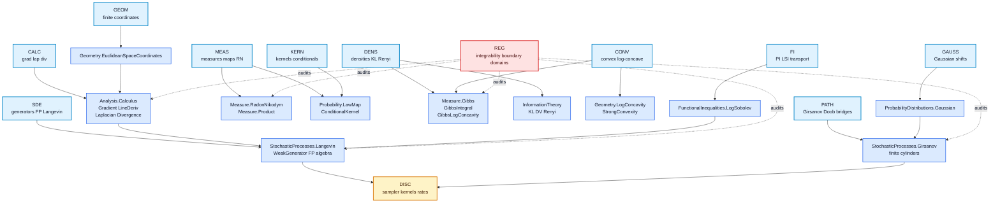

# Sampling/SDE Lean Library Atlas

This atlas shows which Lean files own the reusable roots for the
`Log-Concave Sampling` reconstruction.  It is a file-level map, not a second
project scope.  The theorem route is still the textbook route; this page only
answers where each reusable leaf should live and which chapters consume it.

## Quick Map

```mermaid
flowchart LR
  Textbook[textbook theorem]:::gray
  Root[shared root label]:::root
  Module[owning Lean module]:::blue
  Card[module card]:::blue
  Registry[registry entry]:::blue
  Consumer[chapter theorem<br/>or sampler package]:::consumer
  Red[missing leaf<br/>or hypothesis package]:::red

  Textbook --> Root --> Module --> Card --> Registry --> Consumer
  Root --> Red
  Red -. next ASTIS packet .-> Module

  classDef gray fill:#f8fafc,stroke:#64748b,color:#0f172a,stroke-width:1.5px;
  classDef root fill:#e0f2fe,stroke:#0284c7,color:#0f172a,stroke-width:2px;
  classDef blue fill:#dbeafe,stroke:#2563eb,color:#0f172a,stroke-width:2px;
  classDef consumer fill:#dcfce7,stroke:#16a34a,color:#052e16,stroke-width:2px;
  classDef red fill:#fee2e2,stroke:#dc2626,color:#450a0a,stroke-width:2px;
```



| Question | First file |
|---|---|
| Which chapter needs which roots? | `roadmap/log_concave_sampling_to_lean_tree.md` |
| What is the current theorem DAG? | `../lemma-dags/log_concave_sampling_foundation.md` |
| Which Lean file owns a leaf family? | `lean-leaf-module-graph.md`, `cards/` |
| Which declarations are blue? | `../../AutoSamplingTheory/TechnicalLemmas/Registry.lean` |

## Root-To-File Ownership



## Module Surface

| Root | Main compiled modules | What they currently provide | Red obligations |
|---|---|---|---|
| `MEAS/KERN` | `Probability.LawMap`, `Probability.ConditionalKernel`, `Measure.Product`, `Measure.RadonNikodym` | map/withDensity/RN rewrites, finite product and conditional-law interfaces | richer transition kernels, coupling/transport APIs |
| `DENS/CONV` | `Measure.Gibbs`, `GibbsIntegral`, `GibbsLogConcavity`, `Geometry.LogConcavity`, `StrongConvexity` | normalized Gibbs wrappers, density-to-potential geometry, products, powers, pullbacks, level sets | general coercive Gibbs envelopes, Prekopa-Leindler, Brunn-Minkowski |
| `GEOM/CALC` | `EuclideanSpaceCoordinates`, `Analysis.Calculus.{Cutoff,Gradient,LineDeriv,Laplacian,Divergence}` | coordinate conventions, gradient/laplacian displays, finite-box divergence, compact-in-open and Pi-box plateaus, radial compactly supported exhaustion, scale-uniform `O(R^-1)` first-derivative control, closed outer-region derivative zero, PiLp cutoff derivative and cross-term trace bridges | generic `L¹` cutoff-gradient tail, Gibbs domination, whole-space IBP; second-order cutoff bounds only for named consumers |
| `GAUSS/PATH` | `ProbabilityDistributions.Gaussian`, `StochasticProcesses.Girsanov` | finite Gaussian linear forms, Esscher shifts, finite-cylinder Girsanov | Brownian path-space Girsanov, Doob/Follmer/bridge transforms |
| `FI` | `FunctionalInequalities.LogSobolev` | KL/FI bookkeeping for LSI-style statements | PI, transport inequalities, tensorization, preservation |
| `SDE/DISC` | `WeakGenerator`, `FokkerPlanckAlgebra`, `Langevin` | weak-test rewrites, FP algebra, pointwise Langevin generator displays | invariant Gibbs law, semigroup domains, algorithm rates |

## Chapter Consumer Matrix

| Chapter theorem family | Needs first | Then consumes | Current status |
|---|---|---|---|
| Ch.1 invariant Langevin law | `DENS`, `CALC`, `SDE`, `REG` | `FI` for dissipation/reversibility | finite-box calculus blue, IBP/domain red |
| Ch.2 functional inequalities | `CONV`, `DENS`, `FI`, `REG` | `SDE` for semigroup proofs | log-concavity algebra blue, PL/BM red |
| Ch.3 stochastic analysis | `MEAS`, `GAUSS`, `PATH`, `REG` | `SDE` for drift/generator packages | finite-cylinder Girsanov blue, path-space red |
| Ch.4 LMC | `KERN`, `SDE`, `DENS`, `GAUSS`, `PATH`, `REG` | `DISC` rate statements | weak-test and Gaussian geometry partial blue |
| Ch.5-8 samplers | `GAUSS`, `SDE`, `PATH`, `FI`, `KERN`, `DISC`, `REG` | chapter-specific algorithms | kept as consumers |
| Ch.9-12 extensions | whatever shared roots are already blue | source-specific leaves only | deferred |

## Active Chapter 1 File Path

```mermaid
flowchart TD
  A[Langevin<br/>pointwise generator display]:::blue
  B[Gradient/Laplacian<br/>coordinate calculus]:::blue
  C[Divergence<br/>coordinateDivergence + trace]:::blue
  D[Divergence<br/>finite closed-box theorem]:::blue
  E[Divergence<br/>signed face terms]:::blue
  F[Divergence<br/>support/face cancellation]:::blue
  G[Divergence<br/>local smooth cutoff in Pi-open box]:::blue
  H[Divergence<br/>cutoff-smul support and trace wrappers]:::blue
  N[Divergence<br/>exact open-box support + positivity]:::blue
  I[Cutoff/Divergence<br/>compact/open and Pi-box plateau]:::blue
  R[Cutoff<br/>radial compact support + pointwise limit]:::blue
  J1[Cutoff<br/>fderiv O(R^-1)]:::blue
  J2[REG<br/>Hessian/Laplacian O(R^-2)]:::red
  K[REG<br/>tail passage]:::red
  L[Langevin<br/>weighted IBP]:::red
  M[Langevin<br/>invariant Gibbs law]:::red

  A --> B --> C --> D --> E --> F --> K --> L --> M
  G --> H --> F
  N --> F
  N --> I
  I --> H
  R --> J1 --> K
  R --> J2

  classDef blue fill:#dbeafe,stroke:#2563eb,color:#0f172a,stroke-width:2px;
  classDef red fill:#fee2e2,stroke:#dc2626,color:#450a0a,stroke-width:2px;
```

The blue path is finite-box infrastructure.  The red path is where the
textbook-style no-boundary phrase must become precise Lean hypotheses and
lemmas.

## Local Cutoff Subtree

```mermaid
flowchart LR
  Open[finite Pi-open box]:::gray
  Point[x in inner closed box]:::gray
  Local[pointwise smooth cutoff<br/>value 1 at x]:::blue
  Supp[tsupport/support<br/>inside outer open box]:::blue
  Exact[exact plain support<br/>= open box]:::blue
  Pos[strict positivity<br/>on open box]:::blue
  Smul[cutoff-smul field<br/>zero on faces]:::blue
  BoxZero[finite-box integral zero]:::blue
  Plateau[compact/open plateau<br/>Pi-box specialization]:::blue
  Radial[radial family<br/>compact support + tends to 1]:::blue
  Deriv1[first derivative<br/>O(R^-1)]:::blue
  Deriv2[Hessian/Laplacian<br/>O(R^-2)]:::red
  Whole[whole-space IBP]:::red

  Open --> Local
  Point --> Local
  Local --> Supp --> Smul --> BoxZero --> Whole
  Exact --> Pos
  Exact --> Smul
  Exact --> Plateau
  Plateau --> Smul
  Radial --> Deriv1 --> Whole
  Radial --> Deriv2

  classDef gray fill:#f8fafc,stroke:#64748b,color:#0f172a,stroke-width:1.5px;
  classDef blue fill:#dbeafe,stroke:#2563eb,color:#0f172a,stroke-width:2px;
  classDef red fill:#fee2e2,stroke:#dc2626,color:#450a0a,stroke-width:2px;
```

## Card Index

| Need | Card/file |
|---|---|
| reusable smooth and radial cutoffs | `cards/AutoSamplingTheory.TechnicalLemmas.Analysis.Calculus.Cutoff.md` |
| finite-box divergence and cutoffs | `cards/AutoSamplingTheory.TechnicalLemmas.Analysis.Calculus.Divergence.md` |
| generator displays | `cards/AutoSamplingTheory.TechnicalLemmas.StochasticProcesses.Langevin.md` |
| Gibbs densities | `cards/AutoSamplingTheory.TechnicalLemmas.Measure.Gibbs.md` |
| Gibbs integrals | `cards/AutoSamplingTheory.TechnicalLemmas.Measure.GibbsIntegral.md` |
| log-concavity geometry | `cards/AutoSamplingTheory.TechnicalLemmas.Geometry.LogConcavity.md` |
| Gaussian infrastructure | `cards/AutoSamplingTheory.TechnicalLemmas.ProbabilityDistributions.Gaussian.md` |
| finite-cylinder Girsanov | `cards/AutoSamplingTheory.TechnicalLemmas.StochasticProcesses.Girsanov.md` |
| LSI bookkeeping | `cards/AutoSamplingTheory.TechnicalLemmas.FunctionalInequalities.LogSobolev.md` |
| registry overview | `cards/AutoSamplingTheory.TechnicalLemmas.Registry.md` |

## Refresh Commands

```bash
python3 tools/astis.py module-graph-refresh
python3 tools/astis.py lemma-dag-refresh
python3 tools/astis.py blueprint-refresh ASTIS-CHEWI-001
python3 tools/astis.py memory-refresh ASTIS-CHEWI-001 --cycle <n> --run-id <run-dir>
```

Generated graphs are navigation.  A node is blue only when the local Lean
declaration builds and is recorded in the registry.
